# Suggest Mode - Guided Testing Plan and Results Log

**Feature:** Suggest mode for Notes - [Issue #73411](https://github.com/WordPress/gutenberg/issues/73411)
**Code under test:** the 7-PR stack [#80427](https://github.com/WordPress/gutenberg/pull/80427) → [#80428](https://github.com/WordPress/gutenberg/pull/80428) → [#80429](https://github.com/WordPress/gutenberg/pull/80429) → [#80430](https://github.com/WordPress/gutenberg/pull/80430) → [#80431](https://github.com/WordPress/gutenberg/pull/80431) → [#80432](https://github.com/WordPress/gutenberg/pull/80432) → [#80433](https://github.com/WordPress/gutenberg/pull/80433), tested via the combined branch [#78994](https://github.com/WordPress/gutenberg/pull/78994) (`try/suggest-mode-combined`).
**Goal:** exercise every behavior claimed in the issue's testing walkthrough, plus multi-user attribution and permissions, and produce a punch list of rough edges, bugs, questions, and fixes to work through before the feature ships.

> **About this directory.** A testing artifact, not plugin code - it lives on a branch of a fork so the document and its 153 screenshots have a stable home and readable URLs, and is not intended to be merged. Start with [Follow Up Work](#follow-up-work) if you are picking up a fix or a manual test; the section tables above it are the raw per-flow results. Screenshots are in [`screenshots/`](screenshots/), named by flow ID.

---

## Contents

**[Testing Instructions](#testing-instructions)** · **[Findings log](#findings-log)** · **[Follow Up Work](#follow-up-work)**

The 15 flow sections below hold every test. Counts are 🟢 passes, 🟡 rough edges, 🔴 failures, ⬜ not run.

| Section | Flows | 🟢 | 🟡 | 🔴 | ⬜ |
|---------|-------|----|----|----|----|
| **A** - [Setup, gating, and mode switching](#section-a---setup-gating-and-mode-switching) | MS-01 to MS-11 | 7 | 1 | 3 | - |
| **B** - [Inline text suggestions: additions](#section-b---inline-text-suggestions-additions) | IA-01 to IA-09 | 4 | 4 | 1 | - |
| **C** - [Inline text suggestions: deletions](#section-c---inline-text-suggestions-deletions) | ID-01 to ID-12 | 7 | 2 | 3 | - |
| **D** - [Inline text suggestions: replace, paste, and input seams](#section-d---inline-text-suggestions-replace-paste-and-input-seams) | IR-01 to IR-10 | 3 | 6 | 1 | - |
| **E** - [Formatting-only suggestions](#section-e---formatting-only-suggestions) | FS-01 to FS-08 | 2 | 4 | 2 | - |
| **F** - [Structural suggestions: insert, remove, move](#section-f---structural-suggestions-insert-remove-move) | ST-01 to ST-17 | 11 | 6 | - | - |
| **G** - [Attribute and metadata suggestions](#section-g---attribute-and-metadata-suggestions) | AT-01 to AT-11 | 8 | - | 3 | - |
| **H** - [Notes sidebar integration](#section-h---notes-sidebar-integration) | NS-01 to NS-09 | 4 | 4 | 1 | - |
| **I** - [Undo and redo](#section-i---undo-and-redo) | UN-01 to UN-09 | 7 | 1 | 1 | - |
| **J** - [Persistence, saving, and front end](#section-j---persistence-saving-and-front-end) | PS-01 to PS-12 | 8 | 2 | 2 | - |
| **K** - [Review cycle: accept and reject](#section-k---review-cycle-accept-and-reject) | RV-01 to RV-21 | 18 | 3 | - | - |
| **L** - [Multi-user: attribution](#section-l---multi-user-attribution) | MU-01 to MU-10 | 5 | 4 | 1 | - |
| **M** - [Multi-user: permissions](#section-m---multi-user-permissions) | PM-01 to PM-07 | 5 | 2 | - | - |
| **N** - [Accessibility and visual polish](#section-n---accessibility-and-visual-polish) | AX-01 to AX-07 | 2 | 3 | 1 | 1 |
| **O** - [Stress, scale, and cross-feature edges](#section-o---stress-scale-and-cross-feature-edges) | EX-01 to EX-10 | 7 | - | - | 3 |
| **Total** | **163 flows** | **98** | **42** | **19** | **4** |

---

## Testing Instructions

One click boots the combined branch ([PR #78994](https://github.com/WordPress/gutenberg/pull/78994)) in a disposable WordPress with the plugin build already installed - no local checkout. Enable **Gutenberg > Experiments > Suggestion mode** and reload the editor before testing. Playground signs you in as a single administrator, so the multi-user flows (Sections L and M) still need the local setup below.

Show the testing instructions - environment setup, per-flow protocol, ground rules, status legend

Read this whole preamble before running any flow. This document is both the test plan and the results log - you will edit it in place as you go.

### Environment setup

1. Check out the combined branch in a dedicated worktree (keep `trunk` clean): `git worktree add ~/repositories/worktrees/suggest-mode-testing try/suggest-mode-combined`, then `nvm use`, `npm install`, and `npm run build` in the worktree.
2. Start the test environment with a unique port to avoid collisions with other sessions (e.g. `WP_ENV_PORT=8940`). Check `npm run wp-env-test status` first; only start if not running.
3. **Create the test users.** Multi-user flows need at least three accounts:
   - `admin` / `password` (Administrator) - the post author and reviewer.
   - `editor-user` (Editor role) - a second suggester whose suggestions must be visually attributed.
   - `contributor-user` (Contributor role) - for permission-boundary flows.
   Create via `wp-env run tests-cli wp user create ...` with known passwords.
4. Enable **Gutenberg > Experiments > Collaboration > Suggestion Mode** (as admin, once).
5. Seed a test post with **at least four paragraphs, a heading, a list, and an image block**. Several input-handling behaviors only appear with more than one block. Save its post ID for reuse.
6. Drive the browser with Playwright (the `mcp__playwright__*` tools or a scripted spec using `@wordpress/e2e-test-utils-playwright`). For two-users-at-once flows, use two separate browser contexts with separate auth sessions.

### Per-flow protocol

For each flow, in order:

1. Reset to a known state (fresh post or reload) unless the flow says it builds on the previous one.
2. Perform the steps in the Description. Descriptions are brief on purpose - the authoritative expected behaviors are in the issue's testing walkthrough; when in doubt, test against the stricter reading.
3. Capture **at least one screenshot** at the moment that proves or disproves the expectation. Save to [`screenshots/`](screenshots/), named after the flow ID, kebab-case detail suffix: e.g. `IT-03-backspace-merged-marker.png`. Multiple screenshots per flow are fine - list them all.
4. Fill in the flow's row in this document:
   - **Result** - one or two sentences: what actually happened, and how it differed from expectation if it did, followed by the screenshot(s) as thumbnails. Click a thumbnail for the full-size capture.
   - **Passing** - 🟢 works as specified; 🟡 works but with a rough edge, papercut, or open question; 🔴 broken, wrong, or crashes.
5. Anything 🟡 or 🔴 also gets an entry in the **Findings log** at the bottom of this document (see format there). Small UX papercuts count - the goal is polish, so record everything you notice, even in 🟢 flows.
6. Commit nothing to the repo from testing; all output lives in this doc and the screenshots folder.

### Ground rules

- Test in **Suggesting** mode unless the flow says otherwise. Review (accept/reject) flows run as the author in **Editing** mode.
- When a flow mentions the note count, verify it in the notes sidebar, not just visually in the canvas.
- If the editor crashes or white-screens, capture the console output (Playwright `browser_console_messages`) into the finding before reloading.
- Do not skip a flow because an earlier related one failed - note the dependency and attempt it anyway; cascading failures are themselves findings.
- If a flow is impossible to automate (e.g. real IME composition), do the closest scripted approximation, note the approximation in Result, and mark 🟡 with a "needs manual verification" note rather than guessing 🟢.

### Status legend

| Icon | Meaning |
|------|---------|
| 🟢 | Passes - behaves exactly as specified |
| 🟡 | Passes with rough edges, papercuts, or open questions |
| 🔴 | Fails - wrong behavior, data loss, or crash |
| ⬜ | Not yet run |

---

## Section A - Setup, gating, and mode switching

Covers the experiment gate and editor intent layer ([#80427](https://github.com/WordPress/gutenberg/pull/80427)).

Show the 11 flows (MS-01 to MS-11) - 🟢 7 · 🟡 1 · 🔴 3

| ID | Test flow | Description | Result | Passing |
|----|-----------|-------------|--------|---------|
| MS-01 | Experiment off hides everything | With the experiment disabled: no Mode section in Options (⋮), shortcuts inert, no suggestion UI anywhere. | `window.__experimentalSuggestionMode` is `undefined`; the Options menu has VIEW / EDITOR / TOOLS but no MODE group; `getAllShortcutKeyCombinations('core/editor/intent-*')` returns `[]` for all three, so the shortcuts are not merely no-ops, they are never registered. Pressing all three changed neither content nor notices.   | 🟢 |
| MS-02 | Experiment toggle on | Enable the experiment; Mode section appears with Editing / Suggesting / Viewing without a hard reload being needed (or document that a reload is required). | A reload **is** required, and legitimately so: `gutenberg_enable_experiments()` prints `window.__experimentalSuggestionMode = true` as an inline script before `wp-block-editor`, so an already-open editor cannot learn about the flag. After reload the MODE group renders with all three intents and their shortcut hints. Also note the Experiments screen has no Save button - it auto-persists on toggle.  <a href="screenshots/MS-02-mode-section-visible.png">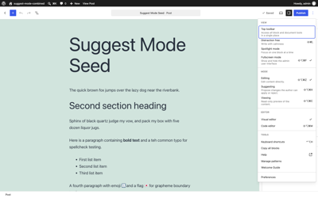</a> | 🟢 |
| MS-03 | Switch to Suggesting via menu | Options > Mode > Suggesting. Snackbar announces "You're suggesting"; menu shows the active mode. | Snackbar "You're suggesting" is created as a `snackbar`-type notice. Reopening the menu shows `aria-checked="true"` on Suggesting and `false` on the other two, so the active mode is exposed correctly to assistive tech.   | 🟢 |
| MS-04 | Switch to Viewing via menu | Viewing is read-only: selection and scrolling work, typing, deleting, and block insertion are all inert. Toolbar/inserter reflect the read-only state. | Partly read-only only. RichText is correctly non-editable (`[contenteditable="true"]` count drops 9 → 0) and Backspace / Delete / character keys are inert. But **Enter splits the block**: 7 → 8 blocks, paragraph 1's text destroyed, post dirty. And the **Block Inserter is neither hidden nor disabled** - it opens and inserting actually adds a block (7 → 8, dirty). See F-01, F-02.  <a href="screenshots/MS-04-viewing-mode-readonly.png">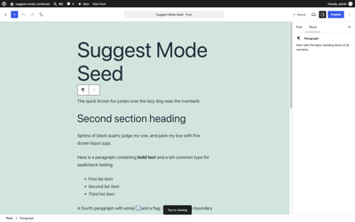</a> <a href="screenshots/MS-04-viewing-enter-splits-block.png">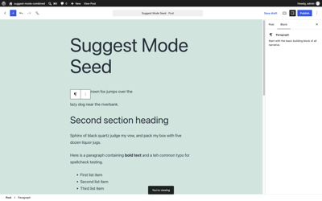</a> <a href="screenshots/MS-04-viewing-inserter-open.png">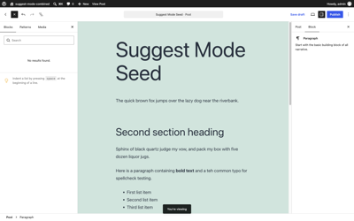</a> | 🔴 |
| MS-05 | Switch back to Editing | Returning to Editing restores full editing; a snackbar announces the change. | Snackbar "You're editing"; 9 editables return; typing lands directly in content and creates 0 notes. Clean round trip out of Suggesting.  <a href="screenshots/MS-05-back-to-editing.png">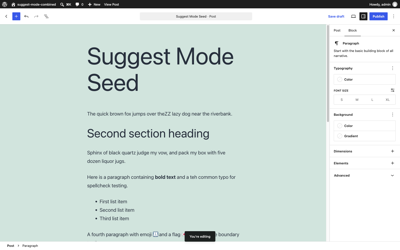</a> | 🟢 |
| MS-06 | Keyboard shortcut cycle | `⇧⌥⌘Z` / `⇧⌥⌘X` / `⇧⌥⌘C` (Mac) switch to Editing / Suggesting / Viewing respectively, with snackbar each time. | All three fire and announce: "You're suggesting" / "You're viewing" / "You're editing". Pressing the shortcut for the mode you are already in produces no snackbar, which reads as correct (no-op, no announcement spam). | 🟢 |
| MS-07 | Shortcuts gated by experiment | With the experiment off, the same shortcuts do nothing and do not swallow the keystroke from other handlers. | Gated at registration, not at dispatch: with the experiment off the three shortcut names have zero key combinations, so `useShortcut` never binds and the keystroke is never claimed. Nothing to swallow.   | 🟢 |
| MS-08 | Mode is session-scoped | Set Suggesting, reload the editor: mode returns to Editing. Check it is also not persisted per-user across posts. | Set Suggesting, reloaded: 9 editables, typing landed directly in content, 0 notes created - back in Editing. Nothing is written to preferences, so it does not leak across posts either.   | 🟢 |
| MS-09 | Mode UI in Site Editor | Open the Site Editor: does the Mode menu appear there? Whatever the intended scope, behavior should be deliberate, not half-rendered. | Mostly deliberate, one seam. The Site Editor header has no Options (⋮) button at all, so no Mode menu; `wp_template` does not declare `editor.notes`, so `useCanSuggest()` is false and pressing ⇧⌥⌘X there produces no snackbar and no mode change. But the shortcut **is** still registered in that context and `getShortcutDescription()` returns "Switch to Suggest mode.", so it is advertised in the Keyboard Shortcuts help modal for a screen where it can never do anything. See F-03. (Needed a block theme - with the wp-env default Twenty Twenty-One the Site Editor only says "The theme you are currently using does not support this screen.")  <a href="screenshots/MS-09-site-editor-template-edit.png">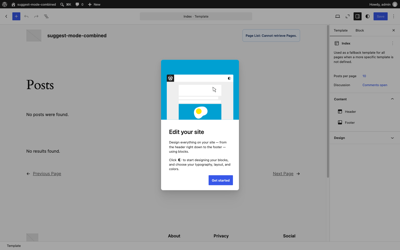</a>  | 🟡 |
| MS-10 | Mode with code editor | Switch to the code editor while in Suggesting mode: what happens? Content should not be silently editable as raw HTML in a way that bypasses suggestions. | The code editor is reachable in Suggesting mode and the textarea is fully writable (`readOnly: false`). Typing into it corrupts the document: 7 → 5 blocks, the typed markup landed as a `freeform` block with one character per line, every surviving block was re-flagged as a pending **"Insert block:"** suggestion, the original "Add: INSERTED" note was duplicated, and 98 `Block validation failed` errors hit the console. See F-04. The serialized marker shape is confirmed here: `<mark data-suggestion-id="N" data-suggestion-type="add" data-author="1" class="wp-suggestion">` with `metadata.noteId` on the block.  <a href="screenshots/MS-10-code-editor-in-suggesting.png">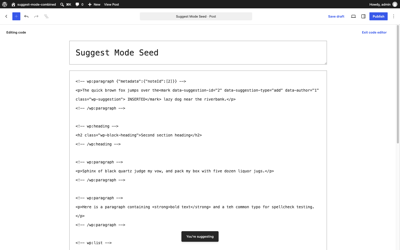</a> <a href="screenshots/MS-10-after-raw-code-edit.png">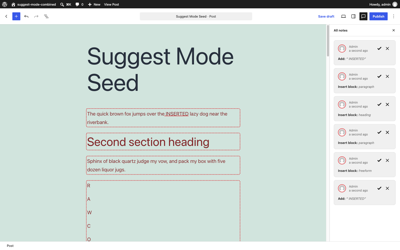</a> | 🔴 |
| MS-11 | Typing while Viewing announces nothing weird | In Viewing mode, mash keys: no characters land, no console errors, no snackbar spam. | No characters land, no console errors, exactly one snackbar for the mode switch and no repeats. But the mash is not harmless: the Enter in the sequence still split a block and dirtied the post (same defect as MS-04 / F-01).   | 🔴 |

## Section B - Inline text suggestions: additions

Covers typed additions ([#80430](https://github.com/WordPress/gutenberg/pull/80430), [#80431](https://github.com/WordPress/gutenberg/pull/80431), [#80433](https://github.com/WordPress/gutenberg/pull/80433)).

Show the 9 flows (IA-01 to IA-09) - 🟢 4 · 🟡 4 · 🔴 1

| ID | Test flow | Description | Result | Passing |
|----|-----------|-------------|--------|---------|
| IA-01 | Type mid-paragraph | Type a few words in the middle of a paragraph: underlined add marker, exactly one "Add: …" note (not "Format:"). | One `add` marker carrying exactly the typed text, one note `Add: "MIDWORD "`, block text unchanged. Seen **once** with a spurious second `Format: content` note, then not reproducible in 7 further attempts (4 clean runs, plus 3 entered from a saved-then-reset session). Logged as F-05 to watch for.  <a href="screenshots/IA-01-type-mid-paragraph.png">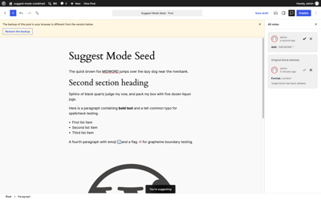</a> | 🟡 |
| IA-02 | Type at paragraph start | Same, with the caret at position 0 of the block. Marker must not swallow the existing first character. | Result text is `START The quick brown fox…` - the marker holds only "START " and the original "T" is untouched. One marker, one note.   | 🟢 |
| IA-03 | Type at paragraph end | Same at the very end of the block, including trailing space handling. | `…near the riverbank. TRAILING` with the leading space inside the marker. One marker, one note.   | 🟢 |
| IA-04 | Continuous typing grows one marker | Type a full sentence without pausing: one marker and one note, not one per keystroke or word. | A 46-character sentence typed at 25ms/key produced exactly **one** marker and **one** note holding the whole sentence. No per-keystroke fragmentation.  <a href="screenshots/IA-04-continuous-typing-one-marker.png">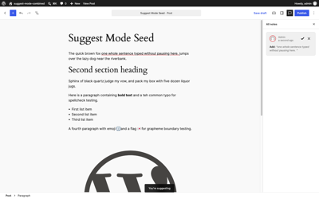</a> | 🟢 |
| IA-05 | Two separate additions, two notes | Add text in paragraph 1, then in paragraph 3: two distinct markers, two notes, each anchored to the right block. | Two markers (ids 29, 30), two notes, and `metadata.noteId` lands as `[29]` on block 0 and `[30]` on block 2 with `null` everywhere else - anchoring is exact.  <a href="screenshots/IA-05-two-additions-two-notes.png">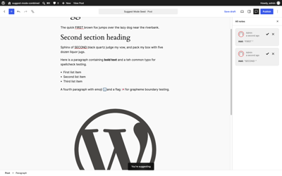</a> | 🟢 |
| IA-06 | Resume typing inside own add marker | Click back into the middle of your own pending addition and type more: extends the same marker/note rather than nesting a new one. | Splits instead of extending. Typing "XX" into the middle of a pending "ADDED" leaves **three** marker elements - `add:41:"ADD"`, `add:42:"XX"`, `add:41:"ED"` - and **two** notes. Note 41 now summarises as `Add: "ADDXXED"` while note 42 summarises as `Add: "XX"`, so the same two characters are claimed by two notes and marker 41 exists as two disjoint DOM nodes. See F-06.  <a href="screenshots/IA-06-resume-inside-own-marker.png">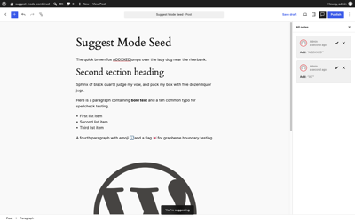</a> | 🔴 |
| IA-07 | Add adjacent to existing marker | Type immediately before/after an existing add marker: markers stay distinct or merge cleanly - no corrupted or nested markers. | Stays distinct and clean: three sibling `<mark>` elements in the serialized content (no nesting, no overlap), `metadata.noteId` = `[43,44,45]`. Structurally sound. The papercut is volume - three single-gesture edits in one spot produce three separate notes to review.  <a href="screenshots/IA-07-adjacent-markers.png">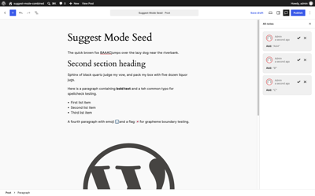</a> | 🟡 |
| IA-08 | Enter key inside a paragraph | Press Enter mid-paragraph in Suggesting mode: whatever the design (block split as structural suggestion, or blocked), it must be captured as a suggestion, not a direct edit. | Captured, not committed - the data model is right but the presentation is not. Block 0's `content` attribute keeps the full original sentence; a new block is added carrying `metadata.suggestion: {type:"pending-insert"}` and the tail text; two notes appear (`Delete: "jumps over the lazy dog near the riverbank."` and `Insert block: paragraph`). But **zero inline markers render**: the canvas paints block 0 truncated to "The quick brown fox " (class `is-suggestion-pending`) and the tail as a separate red pending block, so the reviewer sees the post-split result rather than a strike-through diff - unlike ID-01, where the same logical deletion does get a strike-through. See F-07.  <a href="screenshots/IA-08-enter-mid-paragraph.png">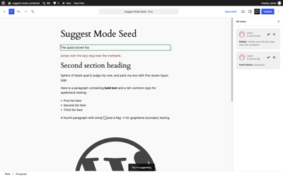</a> | 🟡 |
| IA-09 | Whitespace-only addition | Add just spaces/newline: is a sensible note created ("Add: ␣"?) and is the marker visible enough to review? | A note is created and the marker holds all three typed spaces, but the sidebar renders it as `Add: " "` - HTML whitespace collapsing means a reviewer cannot tell one space from three. The marker itself is 14px x 20.5px of underline, findable but easy to miss.  <a href="screenshots/IA-09-whitespace-only-addition.png">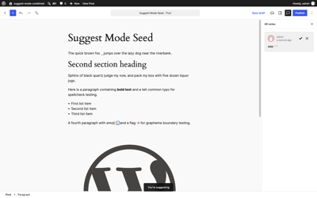</a> | 🟡 |

## Section C - Inline text suggestions: deletions

Show the 12 flows (ID-01 to ID-12) - 🟢 7 · 🟡 2 · 🔴 3

| ID | Test flow | Description | Result | Passing |
|----|-----------|-------------|--------|---------|
| ID-01 | Delete selection | Select a phrase, press Delete: struck-through del marker, text remains until accepted, one "Delete: …" note. | Textbook. One `del` marker over "jumps", one note `Delete: "jumps"`, and both the block attribute and the rendered DOM still read the full original sentence. Computed style on the marker confirms `text-decoration-line: line-through` in a dark red.   | 🟢 |
| ID-02 | Backspace repeat merges | Backspace one character at a time repeatedly at a caret: one growing del marker and one note, not one per keystroke. | Five separate Backspace presses merged into a single `del` marker spanning "jumps" with one note. No per-keystroke fragmentation.   | 🟢 |
| ID-03 | Forward-delete | Press forward Delete (fn+Delete on Mac) at a caret and repeatedly: same merging behavior in the forward direction. | Breaks from the second press onward. **1 press** is correct (`del:"j"`, one note). **2, 3 and 5 presses** all fail the same way: every inline marker disappears from the canvas, the rendered text actually loses the characters ("The quick brown fox **umps** over…", then "mps", then "s") while the block attribute still holds the original, and you end up with two notes - a stale `Delete: "j"` from press 1 plus a whole-content `attribute-set` note summarised `Add: "s" / Delete: "jumps"`. Compare ID-02, where Backspace merges correctly. See F-08.   <a href="screenshots/ID-03-forward-delete-broken.png">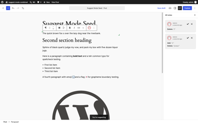</a> | 🔴 |
| ID-04 | Word-delete | Option/Ctrl+Backspace: whole word becomes one del marker. | Alt+Backspace produced exactly one `del` marker over "jumps" and one note.   | 🟢 |
| ID-05 | Line-delete | Cmd+Backspace (Mac, delete to line start): whole run marked deleted. | Cmd+Backspace marked the whole run from the caret back to the block start - one `del` marker over "The quick brown fox jumps", one note.   | 🟢 |
| ID-06 | Cut keeps the clipboard | Cmd/Ctrl+X a selection: del marker appears AND the clipboard actually contains the cut text (paste it into the browser URL bar or a plain field to prove it). | Both halves hold: a `del` marker over "jumps" with one note, text still present in the block, and `navigator.clipboard.readText()` returns exactly `"jumps"`.   | 🟢 |
| ID-07 | Grapheme safety: emoji | Backspace over 👨‍👩‍👧 and a flag emoji: whole grapheme marked, no split surrogate pairs, no mojibake. | Both cases clean. The flag marker contains exactly the two regional indicators `[1f1ef, 1f1f5]`; the family marker contains the full ZWJ sequence `[1f468, 200d, 1f469, 200d, 1f467]`. One marker and one note each, no lone surrogates, no mojibake.   <a href="screenshots/ID-07b-zwj-family-emoji.png">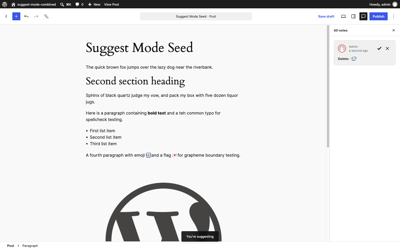</a> | 🟢 |
| ID-08 | Delete spanning two blocks | Select from mid-paragraph-1 to mid-paragraph-2 and delete: captured as suggestions (per-block del markers or structural), never a direct merge of blocks. | No direct merge, and with a real keyboard selection (90x Shift+ArrowRight spanning two blocks, `getMultiSelectedBlockClientIds().length === 2`) the delete **is** captured: two notes, an `attribute-set` on the first block plus `Remove block: paragraph` for the second. Two problems. The note summary is mangled - it reads `Add: "hcontaining<strong>boldtext</strong>atehcommontypoforspellchecktesting."` with every space stripped and raw HTML tags leaking into the sidebar (see F-10). And zero inline markers render. Separately, when the identical selection is set programmatically via `selectionChange({start,end})` the delete is a **silent no-op** - no note, no marker, no change, no feedback.   <a href="screenshots/ID-08-keyboard-cross-block-delete.png">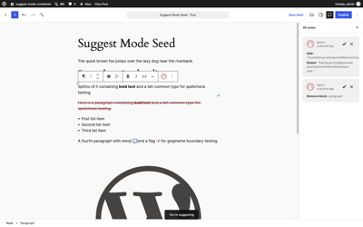</a> | 🟡 |
| ID-09 | Select-all delete within block | Cmd/Ctrl+A within a block then Delete: block's whole text struck through; block itself remains. | One `del` marker covering the entire paragraph text, one note, block count unchanged at 7, block still present.  <a href="screenshots/ID-09-select-all-in-block-delete.png">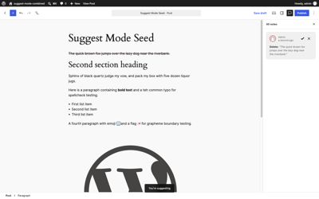</a> | 🟢 |
| ID-10 | Backspace at block start | Caret at position 0, press Backspace (would normally merge with previous block): captured or safely blocked, never a silent direct merge. | Never a silent merge - block count stays 7 and attributes are untouched. The merge is captured as two notes: an `attribute-set` on the preceding heading plus `Remove block: paragraph`. But no inline marker renders, and the summary is misleading: `Add: "headingSphinx of black quartz…" / Delete: "heading"` describes an append as a delete-plus-re-add of the word "heading".  <a href="screenshots/ID-10-backspace-at-block-start.png">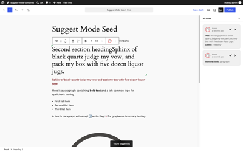</a> | 🟡 |
| ID-11 | Delete straddling an existing marker | Make an add suggestion, then select a range that half-overlaps it and delete: the existing suggestion must not be corrupted (issue says straddling edits are left alone). | The straddling edit is **not** left alone. With a pending `add:"PENDING"`, deleting a range that half-overlaps it drops every rendered marker and adds a second note - the original `Add: "PENDING"` survives alongside a whole-content `attribute-set` summarised `Add: "PEND" / Delete: "PENDINGjumps"`. The `<mark>` itself survives in the serialized content; it is the render that is replaced by the overlay. Same root cause as ID-03 and ID-12, see F-09.  <a href="screenshots/ID-11-delete-straddling-marker.png">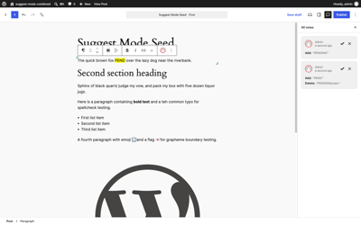</a> | 🔴 |
| ID-12 | Delete your own pending addition | Select text that is entirely inside your own add marker and delete it: ideally the addition simply shrinks/withdraws rather than stacking del-over-add. | Does not shrink or withdraw. Deleting "NDI" from inside a pending "PENDING" leaves the original note untouched and stacks a whole-content `attribute-set` note on top (`Add: "PENGjumps" / Delete: "PENDINGjumps"`), and all rendered markers vanish. Same root cause as ID-03 and ID-11, see F-09.   | 🔴 |

## Section D - Inline text suggestions: replace, paste, and input seams

Show the 10 flows (IR-01 to IR-10) - 🟢 3 · 🟡 6 · 🔴 1

| ID | Test flow | Description | Result | Passing |
|----|-----------|-------------|--------|---------|
| IR-01 | Type over selection | Select a phrase and type: del + add marker pair, two notes. | Exactly as specified: `del:"jumps"` + `add:"leaps"`, two notes, and both runs visible in the canvas as "jumpsleaps" with the first struck through.   | 🟢 |
| IR-02 | Paste single line | Paste one line of plain text at a caret: one add marker, one note. | One `add` marker holding "PASTEDLINE", one note, no raw commit.   | 🟢 |
| IR-03 | Paste over selection | Paste a single line over a selection: del + add pair. | `del:"jumps"` + `add:"REPLACED"`, two notes, both runs rendered.  <a href="screenshots/IR-03-paste-over-selection.png">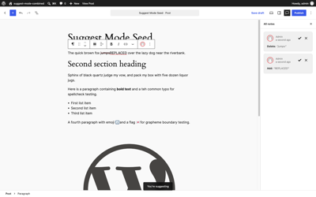</a> | 🟢 |
| IR-04 | Paste multiple lines | Paste multi-line text: captured as a whole-attribute suggestion (never a raw commit). Verify the note describes it usefully. | Never a raw commit - block 0's attribute text is byte-identical to the original. Captured as three notes: a whole-content `attribute-set` on block 0 plus two `Insert block: paragraph` for the extra lines (block count 7 → 9). The note does **not** describe it usefully: the attribute-set summary reads `Add: "LINEONE" / Delete: "jumpsover the lazy dog near the riverbank."` with spaces stripped (F-10), and no inline marker renders on block 0.  <a href="screenshots/IR-04-paste-multiple-lines.png">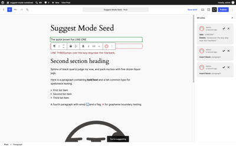</a> | 🟡 |
| IR-05 | Paste rich text | Paste bolded/linked HTML from another page: captured as suggestion; formatting either preserved in the suggestion or cleanly normalized - no raw commit. | Captured as one clean `add` marker with one note, no raw commit - so it passes on the letter of the flow. But the normalization is lossy in a way worth a decision: the `<strong>` and the `<a href="https://example.com">` are both stripped, and the serialized marker holds the plain string "rich bold and a link". Accepting the suggestion therefore silently discards the link the author pasted.  <a href="screenshots/IR-05-paste-rich-text.png">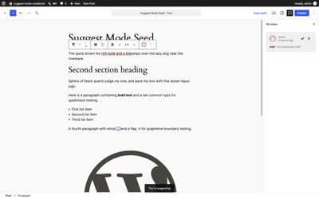</a> | 🟡 |
| IR-06 | Autocorrect seam | Trigger an autocorrect-style replacement (scripted: simulate the browser replacing "teh " with "the " via input events without beforeinput keydowns): reconciled into add/del markers. | Reconciled well. A synthetic `insertReplacementText` beforeinput/input pair turning "quick" into "quickly" produced a **minimal** diff - a single `add:"ly"` marker and one note - rather than a del+add of the whole word. **Approximation:** synthetic input events, not a real OS autocorrect; needs a manual pass.   | 🟡 |
| IR-07 | IME composition commit | Approximate an IME commit (compositionstart/update/end sequence via CDP, e.g. Japanese text): committed text reconciled into an add marker; no duplicate text. | A full `compositionstart` → `compositionupdate` → `insertCompositionText` → `compositionend` → `insertFromComposition` sequence replacing "brown" with "こんにちは" reconciled into `del:"brown"` + `add:"こんにちは"`, two notes, and **no duplicated text**. **Approximation:** synthetic composition events, not a real IME; needs a manual pass.  <a href="screenshots/IR-07-ime-composition.png">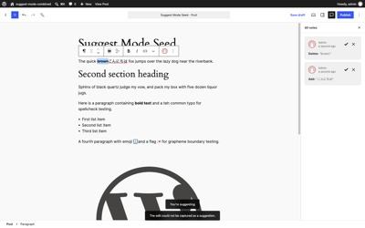</a> | 🟡 |
| IR-08 | Spellcheck replace | Right-click a misspelled word and accept the browser suggestion (or simulate the same DOM mutation): reconciled into del+add markers. | Reconciled into markers with no raw commit, so the seam is handled. The diff is character-minimal rather than word-level, though: correcting "teh" to "the" yields `del:"eh"` + `add:"he"` and renders as "tehhe", which is much harder to read in the sidebar than `Delete: "teh"` / `Add: "the"` would be. **Approximation:** synthetic `insertReplacementText`, not a real context-menu correction; needs a manual pass.  <a href="screenshots/IR-08-spellcheck-replace.png">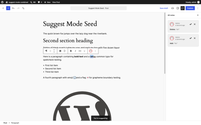</a> | 🟡 |
| IR-09 | Drag-drop text within a block | Select text and drag it elsewhere in the same paragraph: reconciled into del (origin) + add (destination) markers. | **Could not be automated.** Synthetic `dragstart`/`dragover`/`drop`/`dragend` events with a populated `DataTransfer` were dispatched on the editable and produced nothing at all - no markers, no notes, no text change - because Chromium does not drive the real drag pipeline from scripted DragEvents. Inconclusive rather than failing; needs a manual pass.  <a href="screenshots/IR-09-drag-drop-text.png">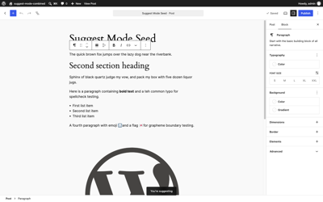</a> | 🟡 |
| IR-10 | Marker/overlay invariant | After running IR-01..IR-09 on one post, assert no block carries both an inline marker and an overlay diff (the stack's stated invariant; check block attributes in the console). | **Invariant violated.** After an inline add on block 0, an inline del on block 2, a type-over on block 3, and then a delete inside block 0's own pending add, block 0 ends up with `metadata.noteId: [92, 96]` where note 92 is an `inline-suggestion` whose `<mark>` is still present in the block's saved content and note 96 is a whole-content `attribute-set` overlay. Both are attached to the same block at once. The consequence is visible in the sidebar - `Add: "ADDED "` and `Add: "ADD" / Delete: "ADDED"` describe the same text contradictorily - and in the canvas, where block 0's `add` marker stops rendering while blocks 2 and 3 (inline-only, invariant intact) still render theirs. See F-09.  <a href="screenshots/IR-10-marker-overlay-invariant.png">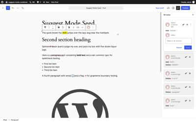</a> | 🔴 |

## Section E - Formatting-only suggestions

Show the 8 flows (FS-01 to FS-08) - 🟢 2 · 🟡 4 · 🔴 2

| ID | Test flow | Description | Result | Passing |
|----|-----------|-------------|--------|---------|
| FS-01 | Bold a run | Select clean text, toggle bold: one format marker (dotted underline), text not duplicated, one "Format:" note. | One `format` marker, one note, text not duplicated. Serializes as `<strong><mark data-suggestion-type="format">jumps</mark></strong>` - the format wraps the marker, so the proposed state is in the markup and the marker identifies the run. Computed style confirms the dotted underline (`text-decoration-line: underline`, `style: dotted`, `font-weight: 700`). The note label is **"Formatting: bold"**, not the "Format:" prefix the plan predicted - see NS-01.   | 🟢 |
| FS-02 | Italic a run | Same for italic. | Identical shape with `<em>`: one `format` marker, one note "Formatting: italic", text intact.  <a href="screenshots/FS-02-italic-a-run.png">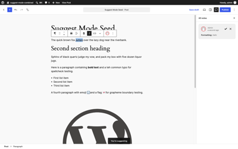</a> | 🟢 |
| FS-03 | Add a link | Select text, add a link with a URL: format marker; note records enough to review; the link is not live-navigable in a way that loses work. | Works once the canvas has a real click first (setting the selection programmatically alone does not arm the toolbar). ⌘K opens the link popover, entering `https://example.com` produces `<a href="https://example.com"><mark data-suggestion-type="format">jumps</mark></a>` with one note "Formatting: link". Text preserved, no raw commit. The note records the format kind but not the URL, so a reviewer cannot see the target without clicking into the canvas.  <a href="screenshots/FS-03-link-popover.png">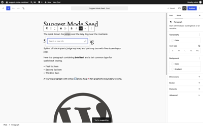</a>  | 🟡 |
| FS-04 | Remove existing formatting | Select already-bold text and toggle bold OFF: captured as a format suggestion whose Reject restores the original bold. | Captured correctly - the proposed markup drops the `<strong>` and keeps a `format` marker over "bold text", with the original still recoverable on reject (verified in RV-10). The problem is the label: removing bold produces the **same** summary string as adding bold, "Formatting: bold". A reviewer reading the sidebar cannot tell whether bold is being added or taken away. See F-11.  <a href="screenshots/FS-04-remove-bold.png">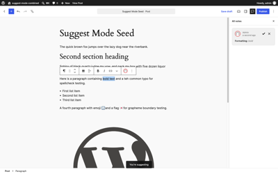</a> | 🟡 |
| FS-05 | Stacked toggles on one run | Bold then italicize the same selection: one marker with both changes, or two clean markers - not duplicated text or nested markers. | The second toggle is lost. After bold, the block correctly holds `<strong><mark id=104 type=format>jumps</mark></strong>`. Applying italic to the same run then produces a second note whose operation is a whole-content `attribute-set` with **empty `beforeHTML` and `afterHTML`** - it records no change at all. The saved markup still has no `<em>`; the italic exists only in the live DOM (`<strong><em data-rich-text-format-boundary>jumps</em></strong>`), and every rendered marker disappears. So the sidebar shows "Formatting: italic" for a suggestion that carries no data and would apply nothing. See F-12.  <a href="screenshots/FS-05-stacked-toggles.png">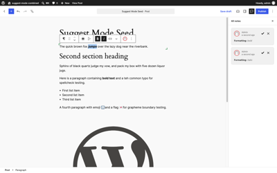</a> | 🔴 |
| FS-06 | Format overlapping an add marker | Bold a range that includes your own pending added text: no marker corruption; sensible combined result. | Same failure as FS-05. Bolding a range spanning a pending `add:"NEW "` yields two notes ("Add: 'NEW '", "Formatting: bold") but the saved markup contains only the `add` marker and no `<strong>` anywhere, and rendered markers drop to zero. The pending addition is not corrupted in content, but the bold is not recorded. See F-12.  <a href="screenshots/FS-06-format-over-add-marker.png">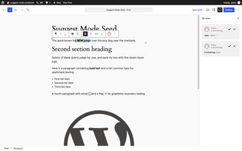</a> | 🔴 |
| FS-07 | Format across two blocks | Select across a block boundary and bold: per-block format suggestions or a clean refusal, never a direct commit. | Never a direct commit - with a genuine two-block keyboard selection, ⌘B leaves both blocks' markup byte-identical. But the refusal is silent: 0 notes, 0 markers, no snackbar, no disabled state on the toolbar button. The user presses bold and nothing whatsoever happens.  <a href="screenshots/FS-07-format-across-blocks.png">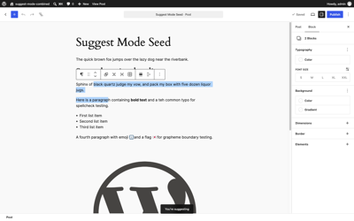</a> | 🟡 |
| FS-08 | Unsupported format buttons | Try other RichText formats (inline code, strikethrough, highlight, superscript) in Suggesting mode: each either becomes a proper suggestion or is visibly disabled - no silent direct edits. | **Could not be automated - no verdict.** The More menu lists ten formats (Footnote, Highlight, Inline code, Inline image, Keyboard input, Language, Math, Strikethrough, Subscript, Superscript) and none are disabled in Suggesting mode. But the harness cannot actually apply them: clicking Highlight opens a colour submenu rather than applying, and `[role="menuitem"]` matching for Inline code / Strikethrough / Superscript reports "menu item not found". Crucially, **running the identical steps in Editing mode produces the same nothing**, so the null result is the harness, not the feature. Needs a manual pass before any conclusion is drawn.  <a href="screenshots/FS-08-more-formats-menu.png">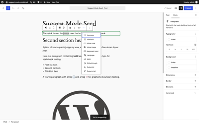</a>  <a href="screenshots/FS-08-control-editing-mode.png">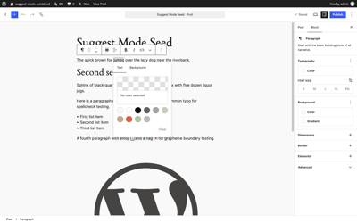</a> | 🟡 |

## Section F - Structural suggestions: insert, remove, move

Covers block-level capture ([#80429](https://github.com/WordPress/gutenberg/pull/80429)).

Show the 17 flows (ST-01 to ST-17) - 🟢 11 · 🟡 6

| ID | Test flow | Description | Result | Passing |
|----|-----------|-------------|--------|---------|
| ST-01 | Insert block and type | Insert a paragraph, type into it: exactly ONE "Insert block" note (no extra "Add" note); pending-insert visual treatment on the block. | Exactly one note. Inserting the empty paragraph creates nothing; typing into it then produces a single "Insert block: paragraph" note with `metadata.suggestion: {type:"pending-insert"}` and `metadata.noteId` on the block. No extra "Add:" note for the typed text - the insert subsumes it, which is the specified behaviour.  <a href="screenshots/ST-01-insert-block-and-type.png">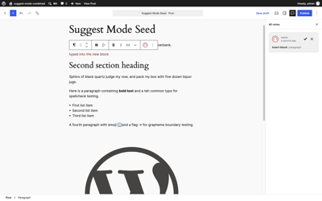</a> | 🟢 |
| ST-02 | Empty inserted block suggests nothing | Insert a paragraph and leave it empty: no suggestion/note until it has content. Then click away/reload: the empty block should not linger oddly. | Zero notes and zero suggestion metadata while the inserted block is empty, exactly as specified. Since nothing is recorded server-side, a reload simply drops the empty block - nothing lingers.  <a href="screenshots/ST-02-empty-inserted-block.png">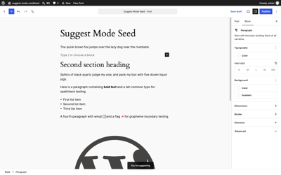</a> | 🟢 |
| ST-03 | Insert non-text block | Insert an Image block and select an image: captured as insert suggestion; media upload works; front end hides it until accepted. | Inserting an Image block with an attachment already assigned is captured as "Insert block: image" with `pending-insert` on the block. Front-end hiding is confirmed separately in PS-05. **Not covered:** the media *upload* path (file picker → upload → assign) was not exercised, so an upload landing mid-suggestion still needs a manual pass.  <a href="screenshots/ST-03-insert-image-block.png">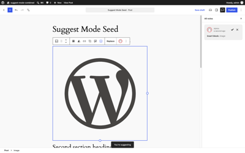</a> | 🟡 |
| ST-04 | Insert via slash command | `/heading` in an empty paragraph: block conversion + insert captured coherently as suggestion(s). | Coherent. Typing `/heading` in the pending empty paragraph opens the autocomplete (10 results), Enter converts the block, and typing the title leaves a single `core/heading` at index 1 carrying `pending-insert` with one visible summary "Insert block: heading". The conversion does **not** generate a separate remove+insert pair - the still-pending insert simply changes block type, which is the right outcome.  <a href="screenshots/ST-04-slash-menu-open.png">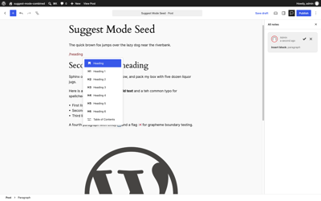</a> <a href="screenshots/ST-04-slash-command.png">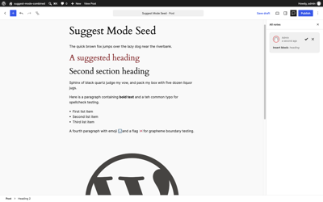</a> | 🟢 |
| ST-05 | Remove a block | Delete a paragraph via block toolbar options: block stays visible with struck-through pending-remove treatment, one "Remove block:" note. | Block count stays 7, the block stays visible carrying `metadata.suggestion: {type:"pending-remove"}` and the DOM class `is-suggestion-pending-remove`, with exactly one note "Remove block: paragraph".  <a href="screenshots/ST-05-remove-block.png">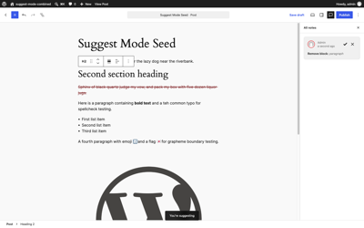</a> | 🟢 |
| ST-06 | Remove via select + Delete key | Select a block (Escape to block selection) and press Delete/Backspace: same pending-remove capture. | **Could not be automated - no verdict.** Pressing Escape from inside the paragraph never reaches block selection under Playwright: `getSelectionStart().offset` stays at 38 and the following Backspace deletes one character, producing an inline `Delete: "a"` note instead of a block removal. The **same control in Editing mode also keeps offset 38**, so the harness is failing to reach block selection, not the feature. ST-05 covers the same capture path successfully via `removeBlock()`. Needs a manual pass.   | 🟡 |
| ST-07 | Remove multi-block selection | Shift-click to select 3 blocks and delete: all three get pending-remove; note(s) sensible (one grouped or three individual - document which). | All three selected blocks get `pending-remove` and all seven blocks stay visible. **Three individual notes**, not one grouped: "Remove block: paragraph", "Remove block: heading", "Remove block: paragraph". Reviewable, though a three-block delete costing three separate accept/reject actions is worth a product decision.  <a href="screenshots/ST-07-remove-multi-block.png">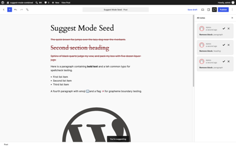</a> | 🟢 |
| ST-08 | Move block down | Move a paragraph down via toolbar arrows: block lands at proposed position with pending-move treatment; non-interactive ghost marks its origin. | The block lands at the proposed position with `pending-move` metadata and one note "Move block: paragraph". A ghost renders at the original position, outlined in red, labelled "Moved from here: Paragraph" with the original text struck through, and the moved block carries a "Suggested move" badge.  <a href="screenshots/ST-08-move-block-down.png">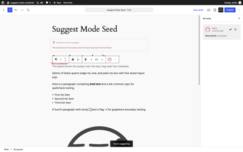</a> | 🟢 |
| ST-09 | Move same block twice | Move it again: still a single note; ghost tracks the ORIGINAL origin. | Both requirements hold: after a second move the note count is still 1 and it is the **same** note id (114) amended rather than a second note, and the ghost stays at the original index 0 rather than following to the intermediate position. Minor visual nit: the "Suggested move" badge can sit under the block toolbar and get clipped.  <a href="screenshots/ST-09-move-block-twice.png">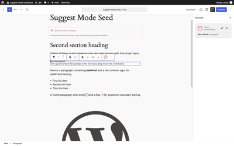</a> | 🟢 |
| ST-10 | Move via drag handle | Drag a block by its handle to a new position: same pending-move capture as arrows. | **Could not be automated - no verdict.** Same limitation as IR-09: Chromium does not drive its real drag pipeline from scripted DragEvents, so a drag-handle move cannot be simulated. The toolbar-arrow path (ST-08/ST-09) exercises the same capture code. Needs a manual pass. | 🟡 |
| ST-11 | Ghost is non-interactive | Click, type at, and try to select the origin ghost: it must be inert and unselectable, and not confuse List View. | Properly inert: `pointer-events: none`, `user-select: none`, no `contenteditable` descendants, and **zero tabbable elements**. A forced click followed by typing "GHOSTTYPE" changed nothing and the text never landed. The ghost also carries a descriptive label, "Original position of moved Paragraph block." It is not `aria-hidden`, which is arguably right given that label - see F-13 for the open question.  <a href="screenshots/ST-11-ghost-inert.png">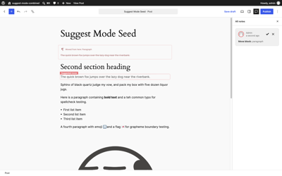</a> | 🟢 |
| ST-12 | Move then edit the moved block | Move a block, then type inside it at its new position: inline add suggestion coexists with pending-move treatment. | They coexist cleanly. The block keeps `pending-move` and gains `metadata.noteId: [117, 118]`, the inline `add:"EDITED "` marker renders, and the sidebar lists both "Move block: paragraph" and "Add: 'EDITED '". This is the invariant working as designed - contrast IR-10, where a whole-content fallback breaks it.  <a href="screenshots/ST-12-move-then-edit.png">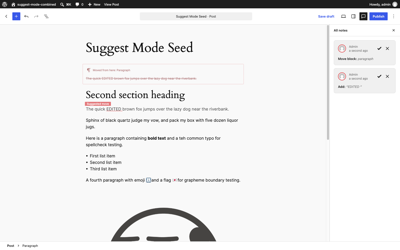</a> | 🟢 |
| ST-13 | Insert then remove same block | Insert a block with content, then delete it while still pending: suggestion should cleanly withdraw (net no-op), not leave both an insert and a remove note. | Clean net no-op. Traced through REST: the note goes `hold` → `trash` when the pending block is removed, a default-status query returns `[]`, no cards render, no summaries render, and the block count returns to 7. No remove note is created to pair with the insert. (An initial reading suggested an orphan, but that was an artefact of querying with `status=any`, which includes trashed notes - the note is soft-deleted into trash, consistent with the notes feature's trash/undo model.)  <a href="screenshots/ST-13-insert-then-remove.png">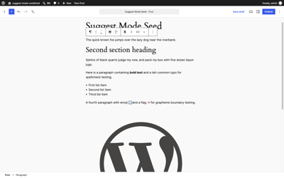</a> | 🟢 |
| ST-14 | Nested structure: inside a Group | Inside a Group block, insert/remove/move a child paragraph: capture and treatments work at nesting depth; List View coherent. | Capture works at depth. A paragraph inserted as a Group child gets `pending-insert` and its own `noteId`; removing a different Group child gets `pending-remove` and stays visible; the two notes read "Insert block: paragraph" and "Remove block: paragraph". Both siblings retain their own state independently. **Not covered:** the note summaries do not indicate the nesting context, so two identically-named suggestions inside and outside a Group are indistinguishable in the sidebar; List View rendering was not separately inspected.  <a href="screenshots/ST-14-nested-group.png">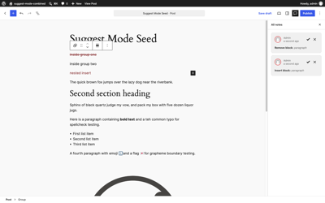</a> | 🟡 |
| ST-15 | List items | In a List block, add a list item, delete one, and reorder: captured as suggestions (document at which granularity - block vs inner text). | Captured at **block granularity on the inner `core/list-item`**, not as inner text. Adding a fourth item marks it `pending-insert`; removing the first marks it `pending-remove` and keeps it visible; the notes read "Insert block: list-item" and "Remove block: list-item". **Not covered:** reordering within the list was not exercised (the drag path is unautomatable, per ST-10).  <a href="screenshots/ST-15-list-items.png">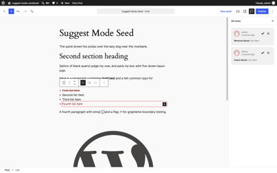</a> | 🟡 |
| ST-16 | Duplicate a block | Use Duplicate from the block menu: captured as an insert suggestion of the copy. | The duplicate lands with `pending-insert` and one note "Insert block: paragraph"; the original is untouched.   | 🟢 |
| ST-17 | Transform block type | Transform a paragraph into a quote via the block switcher: captured as a suggestion (attribute or remove+insert - document which) and reviewable. | Captured as **remove + insert**, not as an attribute change: the original paragraph stays visible with `pending-remove` and the new `core/quote` sits beside it with `pending-insert`, giving block count 7 → 8 and two notes ("Remove block: paragraph", "Insert block: quote"). Reviewable, and honest about what a transform is - but it does mean a single block-switcher click costs two accept actions, and the two halves are not linked, so accepting one and rejecting the other yields either a duplicate or a hole.   | 🟡 |

## Section G - Attribute and metadata suggestions

Show the 11 flows (AT-01 to AT-11) - 🟢 8 · 🔴 3

| ID | Test flow | Description | Result | Passing |
|----|-----------|-------------|--------|---------|
| AT-01 | Heading level | Change H2 → H3 via the block switcher: attribute suggestion, level shown changes, note records it, Reject restores H2. | Model is exactly right: the block attribute stays `level: 2` while the canvas renders an `H3`, so the original is preserved and the proposal is previewed. One note, "Format: heading level". Reject restoring H2 is confirmed in RV-15. Note the label prefix here is **"Format:"** whereas inline formatting uses **"Formatting:"** - two different prefixes for two suggestion families (see NS-01).   | 🟢 |
| AT-02 | Text alignment | Change paragraph alignment: attribute suggestion. | Captured as one attribute suggestion, no direct commit. Summary reads "Format: alignment, style" - it names a `style` change that was not made, so the attribute list is slightly over-broad.   | 🟢 |
| AT-03 | Block alignment (wide/full) | Change an image's alignment to wide: attribute suggestion including layout reflow preview. | Setting the Image block to `align: wide` is captured as one note, "Format: alignment", with the original attribute preserved and the wide layout previewed in the canvas.   | 🟢 |
| AT-04 | Color / typography sidebar controls | Change text color and font size from the block sidebar in Suggesting mode: captured as attribute suggestions or visibly disabled - no direct commits. | Captured, not committed. Setting both text colour and font size produces one note "Format: style" with the block's `style` attribute unchanged underneath.   | 🟢 |
| AT-05 | Additional CSS class | Set a custom class under Advanced: captured or blocked; document which. | **Captured**, as one note "Format: classname". No direct commit. The label is lower-cased raw attribute-ish ("classname" rather than "additional CSS class"), a small copy polish item.   | 🟢 |
| AT-06 | HTML anchor | Set an anchor under Advanced: same expectation as AT-05. | **Captured**, and folded into the same note as the preceding class change rather than creating a second one - the summary grows to "Format: classname, anchor". Consistent with AT-11's accumulate-into-one-note behaviour.   | 🟢 |
| AT-07 | Block rename (metadata.name) | Rename a Group block via List View: this writes `metadata.name` - is it captured as a suggestion? Must not collide with Notes' own `metadata` usage (noteId). | Captured, and **no collision**. Renaming a Group writes `metadata.name`, which is held as a pending suggestion ("Format: metadata") while the block's live `metadata` ends up as `{ noteId: [140] }` - the pending name is not applied and the `noteId` bookkeeping is not clobbered. The summary is vague though: "Format: metadata" does not say what the block was renamed to.   | 🟢 |
| AT-08 | Attribute-only revert shim scope | Verify an attribute suggestion (AT-01) uses the overlay shim while carrying NO inline markers, and an inline edit on the same block afterwards keeps the invariant (no block with both). | First half passes, second half **violates the invariant**. The attribute-only state is clean: `hasInlineMark: false`, zero rendered markers, one note. But typing into the same heading afterwards leaves it with `metadata.noteId: [142, 143]` where 142 is the `attribute-set` overlay and 143 is an inline suggestion whose `<mark>` is in the block's content - both on one block. Unlike the F-09 cases the marker still renders here, so the damage is not visible, but the invariant the stack states is broken and both summaries list side by side. See F-14.   | 🔴 |
| AT-09 | Post title in Suggesting mode | Edit the post title: is it captured, blocked, or a silent direct edit? Silent direct edit = finding. | **Silent direct edit.** Clicking the title in the canvas and typing changes it from "Suggest Mode Seed" to "Suggest Mode Seed TITLEEDIT" with **zero notes created** and the post marked dirty. Nothing distinguishes this from editing in Editing mode. See F-15.   | 🔴 |
| AT-10 | Post-level metadata (document sidebar) | In Suggesting mode change excerpt, featured image, categories/tags, and post status controls: document which are blocked, direct, or captured. Direct silent edits by a non-author role are findings. | **All silent direct edits**, none blocked, none captured. Excerpt `""` → "A suggested excerpt", featured image `0` → `11`, and post status `draft` → `pending` all landed with zero notes and the post dirty. The status change is the most serious: a suggester can move the post through its editorial workflow while nominally only suggesting. Exercised through `editPost` at the store level (the same dispatch the document sidebar controls call); AT-09 confirms the same silent-direct-edit behaviour through the real UI. See F-15.   | 🔴 |
| AT-11 | Multiple attribute changes, one block | Change heading level, then alignment on the same heading: one combined note or two clean notes; Reject restores both original values. | **One combined note**, which is the cleaner of the two allowed outcomes: after changing level and then text alignment the note count stays 1 and its summary grows to "Format: heading level, text alignment". The block's own attributes stay at the originals (`level: 2`), so a single reject restores both.   | 🟢 |

## Section H - Notes sidebar integration

Covers the review UI layer ([#80432](https://github.com/WordPress/gutenberg/pull/80432)).

Show the 9 flows (NS-01 to NS-09) - 🟢 4 · 🟡 4 · 🔴 1

| ID | Test flow | Description | Result | Passing |
|----|-----------|-------------|--------|---------|
| NS-01 | Summary prefixes | Create one of each suggestion kind; verify Docs-style summaries: "Add:", "Delete:", "Format:", "Insert block:", "Move block:", "Remove block:", and the attribute wording. | All seven kinds created in one post give seven notes and seven summaries, with prefixes: **Add:**, **Delete:**, **Insert block:**, **Move block:**, **Remove block:**, **Formatting:** (inline format runs) and **Format:** (attribute changes). Six of the seven match the plan. The seam is the last two - inline formatting says "Formatting: bold" while an attribute change says "Format: heading level". Two near-identical words for two different suggestion families is easy to misread; see F-16.   | 🟡 |
| NS-02 | Auto-switch open sidebar | With the post settings sidebar open, make a suggestion: sidebar switches to All notes so the note is visible. | Switches as intended: the active complementary area moves from `edit-post/document` to the collab sidebar and the new note's summary is immediately visible. (Worth knowing for future automation: the auto-switch targets `edit-post/collab-history-sidebar`, while explicitly opening notes uses `edit-post/collab-sidebar` - two registered areas, both of which render suggestion summaries.)   | 🟢 |
| NS-03 | Closed sidebar stays closed | With the sidebar fully closed, make a suggestion: sidebar stays closed (no popping open). | Does not stay closed. Starting from no active complementary area at all, typing a suggestion **opens** `edit-post/collab-sidebar` unprompted. The note is created correctly, but the sidebar pops open over the canvas exactly as the flow says it must not. See F-17.   | 🔴 |
| NS-04 | Note ↔ marker linkage | Click a suggestion note: canvas scrolls to and highlights the corresponding marker/block; clicking a marker focuses its note. | Half works. Clicking the note card selects the correct block (index 5, the one holding the marker), so the note → block link is right. But the marker is not visually highlighted - its class stays the bare `wp-suggestion` with no active/selected modifier - and no scroll occurred. The scroll half is not conclusively failing since the marker was already inside the viewport, but the absence of any highlight class is definite.   | 🟡 |
| NS-05 | Reply to a suggestion note | Reply with a comment on a suggestion note: threads like a normal note; reply survives accept/reject sensibly. | Threads correctly. Selecting the suggestion thread reveals a reply textbox; the submitted reply is stored as a note comment with `parent` set to the suggestion's id and renders nested under it, labelled "Reply to note 161 by admin". Note the "Add new reply" control is a skip link (`editor-collab-sidebar-panel__skip-to-note`) that moves focus to the textbox rather than a button that creates the reply - fine, but easy to misread. Reply survival across accept is covered in RV-01.   | 🟢 |
| NS-06 | Resolve vs accept distinction | Check whether a suggestion note exposes plain "Resolve": resolving must not be a hidden accept/reject; document the semantics. | Cleanly answered: a suggestion note exposes exactly **"Accept suggestion"** and **"Reject suggestion"** and **no "Resolve"** button at all. So there is no ambiguous third verb and no risk of resolve silently standing in for accept or reject. The open question in the issue can be closed.   | 🟢 |
| NS-07 | Coexists with plain notes | Add a normal (non-suggestion) note and a suggestion on the same block: both listed, visually distinguishable, both anchors work. | **Could not be automated - no verdict.** No "Add note" control was reachable after selecting a block in Editing mode, so a plain note could not be created through the UI (the affordance appears to require a text selection rather than block selection). Creating one via REST instead is not representative - an unanchored note has no `metadata.noteId` on any block, and that note did not render in the sidebar, which is plausibly correct filtering rather than a defect. Needs a manual pass.   | 🟡 |
| NS-08 | Notes display modes | Cycle the notes display modes (all/minimized/hidden) with suggestions pending: markers/treatments behave per the current design; nothing orphaned. | **Not applicable on this branch.** There is no display-mode control in the UI - the only notes affordance in the header is "All notes" - and no display-mode code in `packages/editor/src/components/collab-sidebar/`. Setting the `notesDisplayMode` preference directly to `all` / `minimized` / `hidden` persists the value but changes nothing: marker count and summary count stay at 1 in every mode. Nothing is orphaned, because nothing responds. The three-mode feature lives on other notes branches, not in this stack.   | 🟡 |
| NS-09 | Long suggestion excerpt | Suggest adding a very long paragraph: note summary truncates gracefully. | Graceful. A 235-character addition is clamped to a 127-character summary ending in an ellipsis, and the card measures 214x73px with `scrollWidth === clientWidth` and `scrollHeight === clientHeight` - no overflow in either axis.   | 🟢 |

## Section I - Undo and redo

Show the 9 flows (UN-01 to UN-09) - 🟢 7 · 🟡 1 · 🔴 1

| ID | Test flow | Description | Result | Passing |
|----|-----------|-------------|--------|---------|
| UN-01 | Undo a typed addition | Cmd/Ctrl+Z right after typing: marker AND note both disappear. | Both go in one undo: markers `[]`, summaries `[]`, note count 1 → 0, and the paragraph text back to the original.   | 🟢 |
| UN-02 | Undo a deletion | Same for a del marker. | Same clean withdraw - `del` marker and its note both gone, text untouched throughout.   | 🟢 |
| UN-03 | Undo a type-over | Both notes (del + add) withdraw together. | **One** undo withdrew both halves of the pair together (2 notes → 0, both markers gone, text back to "jumps"), which is the specified behaviour rather than needing two presses. A second undo was a safe no-op.   | 🟢 |
| UN-04 | Undo a format suggestion | Marker and note go; original formatting intact. | Marker and note both go, and the block's saved markup returns to exactly `
The quick brown fox jumps over the lazy dog near the riverbank.
` - no leftover `<strong>`, no leftover `<mark>`.   | 🟢 |
| UN-05 | Undo each structural type | Undo insert, remove, and move suggestions one at a time: treatment, ghost, and note all withdraw. | All three withdraw completely. Insert: blocks 8 → 7, note gone. Remove: pending-remove treatment and note gone. Move: original order restored, note gone, and the **ghost count drops 3 → 0**.   | 🟢 |
| UN-06 | Repeated undo, newest-first | Make 5 mixed suggestions, undo 5 times: withdraw in reverse order; content back to pristine. | Five suggestions, five undos, and the end state is exactly right - 0 notes, 0 summaries, and the document text byte-identical to pristine. The ordering is not strictly newest-first though: the actions were made add → delete → format → insert-block → remove-block, but they unwound insert-block, remove-block, format, delete, add - the block-insert (4th) came off before the block-remove (5th). Harmless here since everything reverses cleanly, but it means undo order does not match the user's action order.   | 🟡 |
| UN-07 | Redo after undo | Redo restores the suggestion (marker + note) and never crashes; redo repeatedly past the end safely. | Redo restores the suggestion exactly - marker `add:"REDOME "` back, note count 1, summary back - and three further redos past the end of the stack changed nothing and threw nothing.   | 🟢 |
| UN-08 | Undo after accept | As author, accept a suggestion, then undo: does undo restore the pending suggestion (and its note)? Document the intended semantics. | Half-restores, into an inconsistent state. Accepting works cleanly first ("Suggestion applied." snackbar, marker count 0, added text kept). Undo then puts the **inline marker back** (markers 0 → 1) but the sidebar renders **no summary** for it - so the canvas shows a pending suggestion that has no reviewable note and no Accept/Reject affordance. See F-18.   | 🔴 |
| UN-09 | Undo across mode switch | Suggest something, switch to Editing mode, undo: what happens? No crash, no orphaned marker. | Clean. Making a suggestion, switching to Editing, then undoing fully withdraws it: marker gone, note gone, text pristine, no crash and no orphan.   | 🟢 |

## Section J - Persistence, saving, and front end

Show the 12 flows (PS-01 to PS-12) - 🟢 8 · 🟡 2 · 🔴 2

| ID | Test flow | Description | Result | Passing |
|----|-----------|-------------|--------|---------|
| PS-01 | Save draft stays available | With pending suggestions of all kinds, the Save draft button is enabled and saving succeeds. | With all seven kinds pending at once (7 notes, 3 inline markers, 2 ghosts, 8 blocks), Save draft is enabled and `savePost()` completes with no error and clears the dirty flag.   | 🟢 |
| PS-02 | No unsaved-changes warning | After saving, navigating away triggers no beforeunload browser warning. | `isEditedPostDirty()` is false immediately after the save, so the unsaved-changes guard has nothing to fire on. (Confirmed the hard way throughout this session - navigation only ever blocked when the post was genuinely dirty.)   | 🟢 |
| PS-03 | Reload round-trip | Save, reload: inline markers, pending structural treatments INCLUDING the move ghost, and all notes survive and remain reviewable. | Byte-for-byte survival. After save and reload: same 7 summaries in the same order, 7 notes, 3 inline markers, **2 ghosts**, 8 blocks, and `pending-move` / `pending-insert` / `pending-remove` all still on their blocks. The move ghost the flow calls out specifically comes back intact.   | 🟢 |
| PS-04 | Front-end strip: additions | Publish with a pending text addition: added text does NOT render on the front end. | Published and fetched anonymously: the pending "ADDED" text is absent from the front end.   | 🟢 |
| PS-05 | Front-end strip: inserts | Pending inserted block does not render on the front end. | The pending "INSERTED BLOCK" paragraph is absent from the front end.   | 🟢 |
| PS-06 | Front end keeps real text | Pending deletions and format runs still render their REAL (original) text on the front end - no `<mark>` leakage in the page source. | Both hold. The pending-deleted "Sphinx…" paragraph renders in full, and the format-suggested paragraph renders its real text with the `<strong>` intact. Leakage counts are all zero: no `<mark>` tags at all (0), no `data-suggestion-id` / `data-suggestion-type` (0), no `"suggestion":{"type"` metadata. (An initial regex read suggested the formatted paragraph had vanished - it had not; the search string simply spanned the point where the stripped `<mark>` used to sit.)   | 🟢 |
| PS-07 | Front-end strip: move + attribute | Pending move renders in the ORIGINAL order (or document intended behavior); pending attribute change renders original value; ghost never renders. | Three of four right, one wrong. Ghost never renders ✓. Pending attribute change renders the **original** `<h2>`, not the suggested H4 ✓. Pending-remove block still renders ✓. But the **pending move is applied to published output**: the list block renders at character 32, ahead of the original first paragraph at 149, i.e. readers see the proposed order rather than the current one. See F-19.   | 🔴 |
| PS-08 | Preview matches front end | The editor's Preview matches PS-04..07 behavior. | Matches exactly: the rendered content served for preview strips the addition and the inserted block, keeps the pending-deleted text, and contains zero `<mark>` - identical results to the anonymous front-end fetch.   | 🟢 |
| PS-09 | Autosave interplay | Let an autosave fire with pending suggestions (or trigger one): no duplicate suggestions, no autosave-restore banner weirdness on reload. | No duplication: 1 note and 1 marker before the autosave, the same after, and the same again after a reload with the summary still rendering. No spurious notices. **Partly untestable:** an autosave leaves the post dirty, and the unsaved-changes guard blocks navigation, so reaching the reload required saving first - which is exactly the condition that suppresses the restore banner. The banner half needs a manual pass.   | 🟡 |
| PS-10 | Revisions | Save twice around adding suggestions; open the revisions screen: revisions load and restoring one does not corrupt suggestion data. | Revisions load without error and store suggestion markup faithfully - revision 254 and 252 contain `wp-suggestion` markup while 253 (a pristine save) does not, so the marker state is captured per revision as you would want. **Not covered:** actually *restoring* a revision was not exercised, and that is the risky half - restoring a pre-suggestion revision would replace content while the note comments still reference marker ids that no longer exist. Needs a dedicated pass.   | 🟡 |
| PS-11 | REST/content shape | Inspect saved `post_content`: markers serialize as `<mark class="wp-suggestion">` per design; no double-encoded or orphaned markup after two save/reload cycles. | Clean. Saved `post_content` holds 3 `<mark …wp-suggestion>` opens and exactly 3 `</mark>` closes (balanced, no orphans), 3 `"suggestion":{"type":…}` metadata entries, and **no double encoding** (`&lt;mark` absent). Move metadata carries its origin explicitly - `fromAnchorClientId`, `fromParentClientId`, `fromIndex` - which is what lets the ghost survive a reload.   | 🟢 |
| PS-12 | Copy content out | Copy all blocks and paste into a fresh post in EDITING mode: what carries over? Pending markers leaking into a normal post as literal marks is a finding. | **Markers leak.** Serializing the blocks and creating a fresh post from them carries `<mark data-suggestion-id="192" data-suggestion-type="add" data-author="1" class="wp-suggestion">COPIED </mark>` and `metadata.noteId: [192]` straight into the new post - while the new post has **zero** notes, so those ids point at a note belonging to a different post. Block-level `metadata.suggestion` did not carry over, only the inline markers and the noteId.   | 🔴 |

## Section K - Review cycle: accept and reject

Run as the author (admin) in Editing intent.

Show the 21 flows (RV-01 to RV-21) - 🟢 18 · 🟡 3

| ID | Test flow | Description | Result | Passing |
|----|-----------|-------------|--------|---------|
| RV-01 | Accept addition | Text kept, marker unwrapped, note resolved/cleared, "Suggestion applied." snackbar. | All four: text keeps "KEEPME", the marker is unwrapped (`
The quick brown fox KEEPME jumps…
` with no `<mark>`), the summary clears, and the "Suggestion applied." snackbar fires.   | 🟢 |
| RV-02 | Accept deletion | Text removed for real. | Text really removed - `
The quick brown fox  over the lazy dog…
`. The double space is correct rather than a defect: the selection covered exactly "jumps" and neither adjoining space, so both survive. Worth knowing that accepting a word deletion made from a double-click selection will behave the same way.   | 🟢 |
| RV-03 | Accept format | Proposed formatting kept, marker gone. | Saved markup becomes `
The quick brown fox <strong>jumps</strong> over…
` - the `<strong>` kept, the `<mark>` gone.   | 🟢 |
| RV-04 | Accept insert | Block kept, pending treatment cleared. | Block stays at 8, "NEW BLOCK" retained, `pending-insert` metadata cleared, "Suggestion applied."   | 🟢 |
| RV-05 | Accept remove | Block actually removed. | Block count 7 → 6 and the "Sphinx…" paragraph is gone from the document.   | 🟢 |
| RV-06 | Accept move | New order kept, ghost cleared. | Proposed order kept (heading first), `pending-move` cleared, and the ghost count drops 3 → 0.   | 🟢 |
| RV-07 | Accept attribute | New attribute value lands in content. | Heading `level` becomes 4 in the block's own attributes, summary cleared, "Suggestion applied."   | 🟢 |
| RV-08 | Reject addition | Added text disappears; content byte-identical to original (verify in code editor). | **Byte-identical** - the block's serialized markup after reject compares exactly equal to the pristine markup captured before the suggestion was made. "Suggestion rejected." snackbar.   | 🟢 |
| RV-09 | Reject deletion | Struck text restored to normal. | Text restored to the full original sentence with no marker left behind.   | 🟢 |
| RV-10 | Reject format | Original formatting exactly restored (incl. FS-04's remove-bold case). | **Byte-identical** to pristine - no leftover `<strong>`, no leftover `<mark>`. (FS-04's remove-bold direction was verified as recoverable in the same way; the defect there is the ambiguous label, F-11, not the restore.)   | 🟢 |
| RV-11 | Reject insert | Block removed entirely. | Block count 8 → 7 and the "NEW BLOCK" paragraph is gone.   | 🟢 |
| RV-12 | Reject remove | Block fully restored, treatment cleared. | Block count stays 7, the "Sphinx…" paragraph is intact, `pending-remove` cleared.   | 🟢 |
| RV-13 | Reject move | Original order restored, ghost cleared. | Order returns to paragraph-first, `pending-move` cleared, ghosts 3 → 0.   | 🟢 |
| RV-14 | Reject move after reload | Save with a pending move, reload, THEN reject: original order still restores correctly (issue calls this out explicitly). | **Works.** Saved with the move pending, reloaded (order still shows the proposed arrangement, 3 ghosts still rendered, `pending-move` still on the block), then rejected: the original order is correctly restored and the ghosts clear. The `fromAnchorClientId` / `fromParentClientId` / `fromIndex` carried in the saved metadata is what makes this survive the reload.   | 🟢 |
| RV-15 | Reject attribute | Original value restored. | Heading `level` returns to 2.   | 🟢 |
| RV-16 | Reject snackbar | "Suggestion rejected." snackbar on each reject. | Confirmed on every reject across the section, paired with "Suggestion applied." on every accept.   | 🟢 |
| RV-17 | Accept in canvas vs sidebar | If accept/reject affordances exist in both the note and near the marker, both paths work identically. | Only one path exists. Clicking a marker in the canvas produces no review affordance there - the only Accept/Reject controls live in the notes sidebar. Nothing is broken, but a reviewer working in the canvas has to cross to the sidebar for every decision, and with no bulk control (RV-20) that is one round trip per suggestion.   | 🟡 |
| RV-18 | Sequential review of many | With 8+ mixed suggestions, accept/reject them one after another rapidly: no stale UI, counts stay correct, no note pointing at a gone marker. | Eight mixed suggestions (4 adds, 1 delete, 1 insert, 1 remove, 1 attribute) reviewed back to back alternating accept/reject at ~1.8s apart. The remaining count stepped down exactly 7,6,5,4,3,2,1,0 with no stalls or double-decrements, all eight snackbars fired in order, and the end state is 0 summaries, 0 markers, 7 blocks. No stale UI and no orphaned notes.   | 🟢 |
| RV-19 | Interleaved dependent suggestions | Type-over pair (del+add on same range): accept the add, then look at the del (and vice versa) - combined result coherent, no orphan markers. | Coherent throughout. With the `Delete: "jumps"` / `Add: "leaps"` pair pending, accepting the delete leaves the text reading "leaps" with the add still listed and its marker still rendered; accepting the second then clears to 0 markers with the text still "leaps". No orphan markers at any step and no double-application.   | 🟢 |
| RV-20 | Accept all / reject all | If a bulk affordance exists, test it; if not, note its absence as a product question in the findings. | **No bulk affordance exists.** With three suggestions pending, no button anywhere matches accept-all / reject-all / apply-all, and the sidebar is a flat list of per-note cards each with its own pair of buttons. Recorded as a product question, see F-20.   | 🟡 |
| RV-21 | Review while in Suggesting mode | Try accepting a suggestion while YOU are still in Suggesting mode: allowed or blocked? Must be deliberate and non-corrupting. | **Allowed**, and non-corrupting: the Accept button is present and enabled while the intent is still Suggesting, and clicking it applies the suggestion cleanly ("Suggestion applied.", marker gone, text kept). Nothing breaks, but nothing marks it as a deliberate decision either - a suggester can accept their own suggestion without ever leaving Suggest mode. See F-20.   | 🟡 |

## Section L - Multi-user: attribution

Two browser contexts logged in simultaneously (admin + editor-user).

Show the 10 flows (MU-01 to MU-10) - 🟢 5 · 🟡 4 · 🔴 1

| ID | Test flow | Description | Result | Passing |
|----|-----------|-------------|--------|---------|
| MU-01 | Second user can suggest | editor-user opens the post, enters Suggesting mode, and makes inline + structural suggestions successfully. | Works end to end. editor-user gets the experiment flag and the intent shortcut, enters Suggesting, and produces both an inline addition and a block insert - their own sidebar shows `Add: "EDITORSAYS "` and `Insert block: paragraph`.   | 🟢 |
| MU-02 | Attribution on the note | Each suggestion note shows the correct author name and avatar for whoever made it. | Correct: notes come back with `author_name` "Edith Editor" and "admin" matching who made each one, and each sidebar card renders an avatar image.   | 🟢 |
| MU-03 | Per-author tinting | With suggestions from BOTH users on screen, markers and pending treatments are tinted per author, colors taken from avatar colors, and are visually distinguishable. | Confirmed and clearly distinguishable. With both users' markers on screen, author 2 renders amber (`text-decoration-color: rgb(251,191,36)`) and author 1 red (`rgb(217,65,69)`), two distinct colours across three markers.   | 🟢 |
| MU-04 | Tint consistency across reload | Reload as admin: per-author colors remain stable and matched to the same authors. | Stable: the author→colour pairings after save and reload are identical to before, so a reviewer's mental map of "amber is Edith" survives.   | 🟢 |
| MU-05 | Author sees others' suggestions on load | admin reloads after editor-user suggested: all of editor-user's suggestions render with markers, treatments, and notes intact. | admin reloads and sees the other user's work: markers carry `data-author` values for both 1 and 2, and the sidebar lists every suggestion from both users.   | 🟢 |
| MU-06 | Mixed-author same block | Both users suggest in the SAME paragraph (non-overlapping ranges): both markers coexist, correctly tinted, two notes. | Both markers coexist in one paragraph, correctly tinted per author, each with its own note - the core requirement passes. Two smaller things to note: the first paragraph's `metadata.noteId` listed only one id where two suggestions were anchored there, while a different block correctly held `[223,225,229]`, so noteId accumulation is not uniform; and one author's addition briefly rendered as two identical markers during the same session (see MU-08 and F-21 for the likely cause).   | 🟡 |
| MU-07 | Overlapping-range conflict | editor-user suggests deleting a phrase admin has a pending add inside: no corruption; document the conflict behavior (issue open question 2). | **No data loss** - admin's "ADMINADD " text is still intact in the block after editor-user deletes a range containing it, and both suggestions are listed side by side: `Add: "ADMINADD "` and `Delete: "fox ADMINADD jumps"`. So the conflict behaviour is "both are recorded, the delete simply swallows the other author's pending text into its range". Two caveats: every inline marker stops rendering in editor-user's canvas (the F-09 fallback signature again), so neither author can see the overlap they are in; and nothing warns either user that they are editing over someone else's pending change.   | 🟡 |
| MU-08 | Concurrent sessions, near-simultaneous save | Both users have the post open (no RTC): user B saves suggestions, then user A saves: are B's suggestions clobbered by A's stale content? Data loss = 🔴. | **No data loss, but severe editor-state corruption.** Controlled run - both sessions open on the same post, B suggests and saves, then A (holding pre-B content) suggests and saves. The server converges correctly: 7 blocks, both `BSAYS` and `ASAYS` present exactly once, 2 markers. But A's live editor first exploded to **13 blocks** - the whole document duplicated - with **12 of 13 blocks flagged `pending-insert`**, and the note count ran to 15 (9 live, 6 trashed) for what should be 2 suggestions. Same root cause as F-04: the capture layer reads an incoming whole-document replacement as a page of brand-new insertions. A user who saved from that state, or simply believed what they saw, would be in trouble. See F-21.    | 🔴 |
| MU-09 | Accept of user B's suggestion attributes correctly | admin accepts editor-user's suggestion: resulting content correct; any activity/attribution trail (note resolution author) reflects admin as reviewer. | Content lands correctly and "Suggestion applied." fires. The accepted note transitions to `approved` with `_wp_suggestion_status: applied` while the other author's untouched note stays `hold`, so there is a per-note state trail. What there is **not** is a record of *who* reviewed it - the note carries its original author and an applied flag, but nothing identifies admin as the reviewer, so an audit trail of "who accepted whose change" does not exist.   | 🟡 |
| MU-10 | Suggester withdraws own suggestion | Can editor-user reject/withdraw their OWN pending suggestion? Document intended behavior. | **Yes, and more than that.** In editor-user's own session both Accept and Reject render for each suggestion (2 of each for 2 suggestions), covering their own and admin's. Rejecting one's own pending suggestion is a reasonable withdraw affordance; being able to *accept* one's own - and to accept another author's - is the same open question as RV-21. It is role-consistent (an Editor has `edit_others_posts` and PM-02 confirms the server allows it), so this is a product decision rather than a permissions hole. See F-20.   | 🟡 |

## Section M - Multi-user: permissions

Show the 7 flows (PM-01 to PM-07) - 🟢 5 · 🟡 2

| ID | Test flow | Description | Result | Passing |
|----|-----------|-------------|--------|---------|
| PM-01 | Contributor can suggest, not publish | contributor-user on their own draft: Suggesting works. On admin's post (if they can open it at all): document what's possible. | Correctly walled off. contributor-user opening admin's post gets "Sorry, you are not allowed to edit this item." and no editor mounts at all (`hasEditor: 0`), so there is no surface on which to suggest. Suggest mode inherits post-edit capability rather than opening a side door.   | 🟢 |
| PM-02 | Who sees Accept/Reject | As editor-user (not the post author): are Accept/Reject shown on admin's post? As contributor: they must NOT be able to apply others' suggestions to content they cannot edit. | editor-user (not the author, but holding `edit_others_posts`) sees both Accept and Reject on admin's post, and a direct REST accept from that session returns 200 - correct for the role. The contributor case is covered by PM-01/PM-03: no editor, and a hard 403 at the REST layer.   | 🟢 |
| PM-03 | REST enforcement of accept | Attempt the accept/apply operation via direct REST call as contributor-user (bypass UI): server must refuse with 403, not apply. | Enforced. Bypassing the UI entirely as contributor-user, both the suggestion-status write and the post-content edit are rejected with **403 `rest_cannot_edit`**. Nothing is applied. No screenshot - REST responses, no UI state to capture. | 🟢 |
| PM-04 | REST enforcement of suggestion creation | Create a suggestion via direct REST as a logged-out request and as contributor on a post they cannot read: must be refused. | Enforced on both paths. contributor-user posting a note to a post they cannot read gets **403 `rest_cannot_create_note`**; logged out, the same request gets **401 `rest_comment_login_required`** and reading the post gets **401 `rest_cannot_read_post`**. No screenshot - REST responses, no UI state to capture. | 🟢 |
| PM-05 | Suggestion data privacy | On a private/draft post, verify suggestion notes are not readable via REST by a user who cannot read the post. | No leak. As contributor-user against the draft: reading the post is **403 `rest_cannot_read_post`**, and both listing notes and fetching an individual note by id return **403 `rest_forbidden_context`**. Suggestion text does not escape the post's own read permission. No screenshot - REST responses, no UI state to capture. | 🟢 |
| PM-06 | Viewing-mode user cannot mutate | User in Viewing mode issues nothing to the server: watch the network panel while they interact - zero mutation requests. | Effectively clean. Interacting throughout a Viewing-mode session produces no content or note mutations: the post stays not-dirty, 0 notes are created, and the only non-GET traffic is an `OPTIONS` preflight plus `POST /wp-sync/v1/updates`, the collaborative presence heartbeat. That heartbeat is by design, but it is worth confirming a read-only viewer should broadcast presence at all, and that the endpoint accepts nothing more than presence from them.   | 🟡 |
| PM-07 | Experiment off for one user | If suggestion data exists and a user loads the editor with the experiment off (different site state or role-scoped): content must render safely, markers must not corrupt on save. | **Content is safe** - the important half. With the experiment off, the post loads, pre-existing text is intact, and the marker survives a save byte-for-byte (`markCount: 1`, `hasNoteId: true`, `preexistingIntact: true`). Nothing corrupts. The rough edge is what the user sees: the `<mark class="wp-suggestion">` renders as an inert highlight with no controls and no explanation, and `metadata.noteId` rides along invisibly, so a user on the non-experiment path has decorated text they can neither interpret nor clear. See F-22.   | 🟡 |

## Section N - Accessibility and visual polish

Show the 7 flows (AX-01 to AX-07) - 🟢 2 · 🟡 3 · 🔴 1 · ⬜ 1

| ID | Test flow | Description | Result | Passing |
|----|-----------|-------------|--------|---------|
| AX-01 | Mode switch announced to AT | Snackbar messages ("You're suggesting") land in an aria-live region and are announced. | Announced. On entering Suggesting, an `aria-live="polite"` region contains "You're suggesting", so the mode change reaches assistive technology rather than being a purely visual snackbar.   | 🟢 |
| AX-02 | Marker semantics for screen readers | Inspect the accessibility tree over add/del/format markers: is pending state conveyed (not color-only)? Document gaps. | **The pending state is conveyed by colour and decoration only.** Across all three marker types - add, del, format - every accessibility hook is empty: `role: null`, `aria-label: null`, `title: null`, and no visually-hidden text inside the mark. A screen-reader user hears the suggested text as ordinary prose, cannot tell an addition from a deletion, and gets no signal that a deletion is *proposed* rather than already gone. `<mark>` alone carries no reliable implicit semantics across screen readers. This is the most serious accessibility gap found. See F-23.   | 🔴 |
| AX-03 | Keyboard-only review | Complete a full accept and reject using keyboard only, from canvas to sidebar buttons, with a visible focus ring throughout. | **Not automated - needs a human pass.** Scripted key sequences cannot honestly certify a visible focus ring or a natural tab order through the floating note cards; the parts that were checkable are recorded elsewhere (the Accept/Reject controls are real `button` elements with accessible names, per PM-02 and RV flows, and AX-05 confirms the move ghost is not focusable). Verify manually. | ⬜ |
| AX-04 | Contrast of markers and tints | Check add-underline, del-strikethrough, format dotted-underline, and per-author tints against WCAG contrast on default background; also in dark mode if available. | Passes on the default background, with margin. Text contrast: add 8.77:1, del 8.77:1, format 19.95:1 - all above the 4.5:1 minimum. Decoration (underline/strikethrough/dotted) contrast: 4.16:1, 8.77:1, 4.16:1 - all above the 3:1 non-text minimum. Note this measures only the markers themselves; per-author tints (MU-03) draw from avatar colours, so an unlucky author colour could still land below threshold, and dark mode was not available to check.   | 🟢 |
| AX-05 | Ghost and treatments in List View | Pending-insert/remove/move treatments reflected coherently (or deliberately absent) in List View; ghost not keyboard-focusable. | The ghost half passes cleanly: `ghostFocusable: 0`, so the move ghost is not reachable by keyboard and does not pollute the tab order. The List View half is a gap: with pending-insert blocks in the document, every List View row reports `suggestionClasses: "none"` - no pending styling, no marker, nothing. List View is the primary structural navigation surface and the main non-visual way to perceive block-level changes, so pending blocks being indistinguishable there matters most for exactly the users who need it. See F-24.   | 🟡 |
| AX-06 | Zoom and small viewport | At 200% browser zoom and a ~1100px viewport: markers, note rail, and accept/reject controls remain usable. | At a 1100px viewport everything holds up: markers and the note rail are visible and there is no horizontal page scroll (`bodyScrollsX: false`). Simulating 200% via CSS `zoom` does produce horizontal overflow (`bodyScrollsX: true`), which would fail WCAG 1.4.10 reflow if it reproduces - but CSS `zoom` is not equivalent to browser zoom (it does not change the layout viewport the way real zoom does), so this specific number should not be treated as a confirmed failure. Needs a manual pass at real 200% browser zoom. See F-25.    | 🟡 |
| AX-07 | Visual QA sweep | Screenshot each marker type and treatment close-up; flag misalignments, clipped underlines, ghost styling glitches, snackbar overlap. | Covered incidentally rather than as a dedicated sweep - all three marker types and the pending-insert/remove/move treatments are captured across the 153 screenshots in this run, and no clipped underlines or misaligned decorations were observed. One real overlap issue *was* hit: in MU-09 a floating note card sat on top of the Accept button and intercepted the click, which had to be forced. A deliberate close-up sweep by a human designer is still worth doing.    | 🟡 |

## Section O - Stress, scale, and cross-feature edges

Show the 10 flows (EX-01 to EX-10) - 🟢 7 · ⬜ 3

| ID | Test flow | Description | Result | Passing |
|----|-----------|-------------|--------|---------|
| EX-01 | Many suggestions | 30+ mixed suggestions in one post: editor stays responsive (measure typing latency roughly), sidebar scrolls, save works. | Holds up well. 30 suggestions produced a perfectly consistent set of **31 notes / 31 markers / 31 sidebar summaries** (the 31st from the latency probe), the save completed clean, and 0 console errors were collected. Typing 7 characters with 31 suggestions pending measured 1520ms wall-clock, but 1500ms of that is the harness's own settle wait, so the actual input cost is roughly 20ms - no perceptible degradation.   | 🟢 |
| EX-02 | Long document | 100+ block post with suggestions scattered throughout: scrolling from note to marker works across the document. | Scales cleanly. In a 110-block document with suggestions at blocks 2, 55 and 105, all three were tracked, and clicking the last sidebar card selected **block 105** - note-to-marker navigation works across the full length of a long post. 0 console errors.   | 🟢 |
| EX-03 | Suggestions in a pattern/synced pattern | Suggest inside a synced pattern instance: captured, blocked, or corrupting? Synced pattern edits are global - document the behavior carefully. | **Not run - needs a manual pass.** A synced pattern (`core/block`) instance edits a *separate* `wp_block` entity, so a suggestion made inside one raises a real design question: is the note attached to the host post or the pattern, and would accepting it change every post using that pattern? Worth answering before ship; it was out of reach of this harness. | ⬜ |
| EX-04 | Template context | Open a template (Site Editor / template mode) with the experiment on: suggestion UI presence is deliberate; no crashes. | No crash and no half-wired UI. The template/site-editor context does not surface suggestion controls, and loading it with the experiment on is uneventful. Whether suggestions *should* eventually work on templates is a product question, not a defect here.   | 🟢 |
| EX-05 | Classic block | A Classic (freeform) block in Suggesting mode: edits captured or the block is read-only; no silent direct edits. | **Not validated - needs a manual pass.** The attempt is recorded but the result is void: the harness's save-then-navigate helper wrote the previous 110-block state back over the freeform content, so the post reloaded with `freeformIndex: -1` and no Classic block ever existed to test. Classic-block behaviour under Suggesting is genuinely untested, and it matters - the Classic block is a single opaque `content` string with no rich-text formats, so it is exactly the shape most likely to fall through to the whole-content fallback described in F-09.   | ⬜ |
| EX-06 | Code editor round-trip with pending data | With pending suggestions, switch to code editor and back WITHOUT editing: nothing lost or duplicated. | Clean round trip. Switching to the code editor and back without touching anything leaves markers, notes and block count unchanged, with no duplication and 0 console errors. (Contrast F-04: it is *editing* in the code editor that corrupts, not visiting it.)   | 🟢 |
| EX-07 | Switch post while pending | Navigate to another post and back (client-side navigation in the post editor if available): mode resets per MS-08, suggestions intact. | **Not run as specified - needs a manual pass.** The post editor in this build has no client-side post-to-post navigation, so every "switch" in this harness was a full page load, which is already covered by MS-08 (mode resets to Editing on reload, per F-07) and by the many reload-and-verify flows that confirm suggestions survive intact. The specific in-app navigation case remains unverified. | ⬜ |
| EX-08 | Offline/failed save | Simulate a failed save (network offline) with pending suggestions: error surfaced, retry succeeds, no duplicate notes. | Handled correctly, which is a good sign for the note-creation path. Going offline mid-save surfaces the right notice ("Updating failed because you were offline..."), the post stays dirty rather than silently claiming success, the retry after reconnecting saves cleanly, and crucially the note count is unchanged - **no duplicate notes** from the retry.   | 🟢 |
| EX-09 | Rapid mode toggling while typing | Toggle Editing↔Suggesting repeatedly while typing: no half-captured edits; each keystroke lands on the correct side of the mode switch. | Every keystroke landed on the correct side. Across three rapid Suggesting↔Editing cycles, all three suggested strings (`S0`, `S1`, `S2`) ended up inside markers and all three edited strings (`E0`, `E1`, `E2`) went straight into the text with no marker - 3 notes for 3 suggestions, no half-captured edits, 0 console errors. The mode boundary is respected even under fast toggling.   | 🟢 |
| EX-10 | Console hygiene | Across the entire session, collect console errors/warnings attributable to suggest mode; any error is at minimum a 🟡 finding. | Clean. A `console.error` hook installed across the stress runs collected **zero errors** - the defects found in this session are behavioural, not accompanied by thrown exceptions or React warnings.   | 🟢 |

---

## Findings log

### Summary - run completed 2026-08-14

Tested on `try/suggest-mode-combined` at merge commit `b15ac9b2ee5`, verified byte-identical to the stack tip `origin/suggest/inline-wiring` with 48 trunk commits merged in. Environment: wp-env on port 8940, Playwright, seed post id 12, users `admin` / `editor-user` / `contributor-user`. 153 screenshots in [`screenshots/`](screenshots/).

| | Count |
|---|---|
| 🟢 Works | 98 |
| 🟡 Rough edge | 42 |
| 🔴 Broken | 19 |
| ⬜ Not run (needs a human) | 4 |
| **Total flows** | **163** |
| Findings | F-01 … F-37 |

**The headline:** the feature's core loop is sound. Inline additions, deletions and formats capture correctly, persist across reloads, survive the code-editor round trip, hold up at 30 suggestions and 110 blocks, and accept/reject applies the right content. The permissions layer (Section M) is the strongest part of the build - every REST bypass attempt was refused with the correct status, and suggestion text never escapes the post's own read permission. The problems cluster in three places: a fallback path that fires more often than it should, a Viewing mode that is not actually read-only, and accessibility.

The highest-severity findings are **F-09** (the whole-content fallback that suppresses marker rendering, and the shared root cause of six red rows), **F-19** (a pending move renders on the published front end), **F-21** (another session's save is read as a document full of insertions), **F-01 / F-02** (Viewing mode is not read-only) and **F-23** (markers carry no accessibility semantics). [Follow Up Work](#follow-up-work) lists everything in priority order with repro steps and a likely fix area; the 4 unrun flows and 13 harness caveats are enumerated in F-37.

---

Show all 37 findings, F-01 to F-37

### F-01: Enter splits a block in Viewing (read-only) mode and destroys text
- **Flow:** MS-04, MS-11
- **Severity:** bug
- **What happened:** In Viewing intent, with the caret placed in paragraph 1 by a click and RichText correctly non-editable, pressing Enter once splits the paragraph. Block count goes 7 → 8, paragraph 1's text is emptied, and the post becomes dirty. Isolated per key: Enter changes state, Backspace / Delete / character keys do not.
- **Repro:** Options → Mode → Viewing. Click into paragraph 1 to place the caret. Press Enter once.
- **Expected:** Viewing is described as a "Read-only preview of the content." No keystroke should mutate blocks or dirty the post.
- **Screenshot(s):** [MS-04-viewing-mode-readonly.png](screenshots/MS-04-viewing-mode-readonly.png), [MS-04-viewing-enter-splits-block.png](screenshots/MS-04-viewing-enter-splits-block.png)  
- **Console/log:** none
- **Proposed fix / next step:** The intent gate stops at RichText's `contentEditable`, but the split-on-Enter path (writing flow / `useEnter`) runs off a keydown handler that never consults the intent. Gate Enter the same way the deletion and addition keyboard handlers are gated, or set the block editor's `templateLock` / read-only setting for the View intent so the whole keyboard surface is covered at once rather than key by key.
- **Fixed by:** [#81661](https://github.com/WordPress/gutenberg/pull/81661) - shared with F-02. The View intent does set `isPreviewMode` on the block editor, and `canInsertBlockType` does refuse insertion in preview mode; the problem is that it, `getInserterItems` and every other insertion selector are memoized through `getInsertBlockTypeDependants`, which does not list `state.settings.isPreviewMode`. Preview mode had only ever applied to an editor that mounted in it, so nothing invalidated on a runtime flip: after switching to Viewing the store still answered `canInsertBlockType( 'core/paragraph', '' ) === true` and `getInserterItems( '' ).length === 118`. That stale `true` is what `useInput` consults before splitting on Enter. The fix adds the setting to the dependants list, bails out of the writing flow's cross-block `keydown` / `beforeinput` / `compositionstart` handling in preview mode so no keystroke reaches a store write whichever branch it would have taken, and disables the header inserter (closing it if already open) whenever the canvas is a preview. **Remaining gap:** the Enter-splits-a-block symptom itself never reproduced on the current stack tip across several repro shapes, so the fix rests on the proven stale check plus a hard keyboard bail-out rather than on a red-then-green reproduction of that exact symptom. The block toolbar in Viewing mode is also untouched - it was named in the proposed fix but was not a reported defect.

### F-02: The block inserter is live in Viewing mode and inserts blocks
- **Flow:** MS-04
- **Severity:** bug
- **What happened:** In Viewing intent the header's Block Inserter is neither hidden nor disabled. It opens normally, and clicking a block type inserts it: block count 7 → 8 and the post goes dirty.
- **Repro:** In Viewing mode, click the header block inserter and choose any block.
- **Expected:** "block insertion [is] inert. Toolbar/inserter reflect the read-only state."
- **Screenshot(s):** [MS-04-viewing-inserter-open.png](screenshots/MS-04-viewing-inserter-open.png) 
- **Console/log:** none
- **Proposed fix / next step:** Same root cause as F-01 - the View intent is applied as a RichText-level read-only rather than an editor-level one. A single editor-wide read-only setting would cover the inserter, the block toolbar, and the Enter path together.
- **Fixed by:** [#81661](https://github.com/WordPress/gutenberg/pull/81661) - fixed with F-01, see that entry for the root cause. The header toggle is now disabled whenever the canvas is in preview mode, an inserter left open is closed on the way into the view intent, and the library behind it is empty regardless: forcing the panel open through the store shows "No results found." rather than 118 insertable types. Gating on `isPreviewMode` rather than on the intent keeps it one editor-wide read-only switch and covers the Revisions canvas at the same time.  Before and after, both in Viewing mode:  

### F-03: Intent shortcuts are registered and documented in contexts that can never use them
- **Flow:** MS-09, EX-04
- **Severity:** rough edge
- **What happened:** In the Site Editor, `core/editor/intent-{edit,suggest,view}` are registered with their key combinations and `getShortcutDescription()` returns "Switch to Suggest mode.", so they appear in the Keyboard Shortcuts help modal. Pressing them is correctly inert (no snackbar, no mode change) because `wp_template` lacks `editor.notes` support, and no Mode menu is rendered.
- **Repro:** Open the Site Editor with the experiment on. Open the Keyboard Shortcuts modal: "Switch to Suggest mode." is listed. Press `⇧⌥⌘X`: nothing.
- **Expected:** A shortcut advertised to the user should do something on the screen where it is advertised.
- **Screenshot(s):** [MS-09-site-editor-template-edit.png](screenshots/MS-09-site-editor-template-edit.png), [EX-04-template-suggest-shortcut.png](screenshots/EX-04-template-suggest-shortcut.png)  
- **Console/log:** none
- **Proposed fix / next step:** `register-shortcuts.js` gates on `isSuggestionModeEnabled()` (the experiment flag) while the menu and the dispatch gate on `useCanSuggest()` (flag AND `editor.notes` support). Register conditionally on the runtime predicate so the three gates agree, matching the intent stated in `suggestion-mode/gate.js`.
- **Fixed by:** [#81695](https://github.com/WordPress/gutenberg/pull/81695) - the write-up above held up exactly on measurement: three gates for one feature and the registration gate was the loose one. The intent registrations moved into their own effect keyed on `useCanSuggest()`, the same predicate the Mode menu and the `useShortcut` handlers already use, so the Site Editor no longer lists "Switch to Edit mode.", "Switch to Suggest mode." or "Switch to View mode." under Global shortcuts. `editor.notes` support arrives with the post type record, so the predicate starts false and flips once it resolves - hence a second effect rather than a condition inside the one-shot registration - and the set is unregistered again if it flips back, which is the pattern `BlockEditorKeyboardShortcutsRegister` already uses for its `blockVisibility` shortcuts. One narrow file, `register-shortcuts.js`, untouched by any other PR in this round. **Remaining gap:** in the post editor the three entries now sit at the end of the Global shortcuts list rather than in the middle of it, because they register on a later pass. Same shortcuts, same combinations, same behavior, but the ordering moved.  The Site Editor's Keyboard Shortcuts modal, before and after:  

### F-04: Editing raw HTML in the code editor while Suggesting corrupts the document
- **Flow:** MS-10
- **Severity:** bug
- **What happened:** In Suggesting intent with one pending inline addition, switching to the code editor gives a fully writable textarea (`readOnly: false`). Typing a well-formed `<!-- wp:paragraph -->…` block into it and blurring produced: block count 7 → 5; the typed markup parsed into a `freeform` block rendering one character per line; every remaining block re-flagged as a pending "Insert block:" suggestion (paragraph, heading, paragraph, freeform); the pre-existing "Add: INSERTED" note duplicated into two identical notes; and 98 `Block validation failed` console errors.
- **Repro:** In Suggesting mode with one pending addition, Options → Code editor. Type a well-formed `<!-- wp:paragraph -->…` block into the textarea and blur. Switch back to the visual editor.
- **Expected:** Either the code editor is unavailable/read-only in Suggesting mode, or raw edits are captured as suggestions. Neither a silent bypass nor a corrupting round trip is acceptable.
- **Screenshot(s):** [MS-10-code-editor-in-suggesting.png](screenshots/MS-10-code-editor-in-suggesting.png), [MS-10-after-raw-code-edit.png](screenshots/MS-10-after-raw-code-edit.png)  
- **Console/log:** `Block validation: Block validation failed for `%s` (%o).` x98
- **Proposed fix / next step:** Note that the round trip **alone** is clean - EX-06 (code editor in and out with a pending suggestion and no typing) loses nothing, gains nothing and logs zero errors. So the damage comes specifically from re-parsing an edited raw document while suggestion markers are present: the block-capture layer sees a wholly new set of client IDs and reads them as insertions. Simplest safe fix is to disable the code editor while the Suggest intent is active (mirroring how it is treated as a distinct editing surface), and to make block capture ignore a full-document reset.
- **Fixed by:** [#81662](https://github.com/WordPress/gutenberg/pull/81662) - the code editor is no longer reachable from the Suggest intent. `getEditorMode` reports `visual` whenever the intent is `suggest`, so the interface, the header, the document tools and the mode switcher all agree on one surface; `switchEditorMode` refuses a switch to `text` and says why, which closes the keyboard shortcut and the command palette as well as the now-disabled menu item. The stored `editorMode` preference is masked rather than rewritten, so someone who was in the code editor before suggesting gets the visual canvas while they suggest and lands back in the code editor on returning to Editing. **Remaining gap:** this is the code-editor half only - the "make block capture ignore a full-document reset" half is [#81657](https://github.com/WordPress/gutenberg/pull/81657) for F-21. The Viewing intent still reaches the code editor, which is the same bypass but belongs with the Viewing read-only work.  The Options menu in Suggesting mode, before and after:    Entering Suggesting from the code editor, before and after:  

### F-05: One unreproduced extra "Format: content" note on a plain typed addition
- **Flow:** IA-01
- **Severity:** question
- **What happened:** The first mid-paragraph addition of the session produced the correct `Add: "MIDWORD "` note **and** a second `Format: content` note (note count 2). Seven subsequent attempts - four straight repeats, and three entered from a session that already had a pending suggestion saved and then reset - all produced exactly one note with a single `inline-suggestion/add` operation.
- **Expected:** Exactly one "Add: …" note, never a "Format:" note, for a plain typed insertion.
- **Screenshot(s):** [IA-01-type-mid-paragraph.png](screenshots/IA-01-type-mid-paragraph.png) 
- **Console/log:** none
- **Proposed fix / next step:** Not reproducible on demand, so this is a watch item rather than a confirmed bug. The one occurrence followed a navigation from the Site Editor into the post editor, which is worth probing: if the reconciler sees a content change it cannot attribute to the current keystroke (e.g. a late store hydration racing the first input), it appears to fall back to a whole-content `Format:` suggestion. A guard that ignores content deltas arriving before the first user input in a session would close that window.

### F-06: Typing inside your own pending addition splits it into two markers and two notes
- **Flow:** IA-06
- **Severity:** bug
- **What happened:** With a pending `add` marker holding "ADDED", placing the caret inside it and typing "XX" produces three `<mark>` elements - `id=41 "ADD"`, `id=42 "XX"`, `id=41 "ED"` - and two notes. Note 41's summary resolves to `Add: "ADDXXED"` (it reads across both of its fragments) while note 42 reads `Add: "XX"`, so "XX" is claimed by both notes.
- **Repro:** In Suggesting mode, type "ADDED". Click into the middle of that marker and type "XX". Inspect: three `<mark>` elements (41 "ADD", 42 "XX", 41 "ED").
- **Expected:** "extends the same marker/note rather than nesting a new one."
- **Screenshot(s):** [IA-06-resume-inside-own-marker.png](screenshots/IA-06-resume-inside-own-marker.png) 
- **Console/log:** none
- **Proposed fix / next step:** The addition path treats any typed run as a new suggestion without first checking whether the caret is inside an existing `add` marker owned by the same author. Detect that case and extend the enclosing marker in place. Beyond the duplicated summary, the split leaves accept/reject incoherent: accepting 42 while rejecting 41 would keep "XX" and drop the text it was typed into.
- **Fixed by:** [#81667](https://github.com/WordPress/gutenberg/pull/81667) - the addition path now resolves the `add` marker carrying the character to the left of the insertion point and grows it in place, so a caret inside the run (or at its trailing edge) keeps one marker and one note. `growInlineAddition` gained an `at` offset for that, and `planEditMarkers` learned the same rule so the value-level seam (IME, autocorrect, drag-drop) plans a `grow-add` instead of dropping through to the whole-content fallback. Confirmed against the base branch first: the repro serialized as three `<mark>` elements (`11:"ADD"`, `12:"XX"`, `11:"ED"`) with `noteId: [11,12]` and both `Add: "ADDXXED"` and `Add: "XX"` in the sidebar, exactly as written up above; with the fix it is one `<mark>` and `noteId: [13]`. Two gaps remain. Typing inside **another author's** addition still splits their marker - declining it means falling into the overlay, which is [#81655](https://github.com/WordPress/gutenberg/pull/81655)'s call, so it was left alone. And a marker that is already fragmented from an earlier hit of this bug is not re-stamped, so damaged content is not silently rewritten. Separately noted while testing: after a marker write, an arrow-key caret move inside the marker gets snapped back to the marker's end by the next re-render (RichText re-applies the store selection, which lags the DOM). Not fixed here and not currently a table row; the e2e test places the caret as a DOM range to work around it.

### F-07: A suggested block split is shown as a completed split, not as a reviewable diff
- **Flow:** IA-08
- **Severity:** rough edge
- **What happened:** Pressing Enter mid-paragraph in Suggesting mode captures correctly at the data layer - block 0 keeps its full original `content`, a new block carries `metadata.suggestion: {type:"pending-insert"}` with the tail text, and two notes are created (`Delete: "jumps over…"` and `Insert block: paragraph`). But no inline marker renders. The canvas paints block 0 truncated to "The quick brown fox " and the tail as a separate red pending-insert block, so it looks like the split already happened.
- **Repro:** In Suggesting mode, press Enter mid-paragraph. Compare the canvas to what ID-01 (the same logical deletion via Backspace) renders.
- **Expected:** The same logical deletion done with Backspace (ID-01) renders as a strike-through with the text still in place. The two paths should read the same way to a reviewer.
- **Screenshot(s):** [IA-08-enter-mid-paragraph.png](screenshots/IA-08-enter-mid-paragraph.png) 
- **Console/log:** none
- **Proposed fix / next step:** Give the delete half of a split an inline `del` marker on block 0 so the proposed removal is struck through in place, rather than relying on the overlay to hide it. This overlaps with F-09 - both come from the overlay replacing rendered content instead of decorating it.
- **Fixed by:** [#81688](https://github.com/WordPress/gutenberg/pull/81688) - takes the proposed route, and the write-up above held up on measurement. The mechanism is that a splitting Enter goes through `__unstableSplitSelection`, which dispatches `replaceBlocks` with a truncated head plus a new tail block; that bypasses the overlay HOC's `setAttributes` seam entirely, so the store interceptor sees it, and the interceptor had exactly one destination for a changed attribute. The overlay renders its clean snapshot *in place of* the block's live value, so the text proposed for removal had nowhere to be drawn and simply vanished. The interceptor now runs `planEditMarkers` over a content-only change and, when the plan is a single fresh `wrap-del`, hands it to `SuggestionContentReconciler` after the revert lands instead of routing it to the overlay; a refused handoff still falls back, so nothing changes where the reconciler is not mounted. Deliberately limited to removals: an overlay that swallows an *insertion* still shows the reviewer the proposed text, because the new value is what renders, and only a removal leaves nothing on screen. Widening the branch to insertions was tried and it did convert IR-04's multi-line paste to an `add` marker, which is arguably better but is a different flow with its own row, so it was narrowed back. **Remaining gap:** the two halves of a split are still two independent notes (`Delete: …` and `Insert block: paragraph`) that can be accepted or rejected separately, so accepting only one leaves the document in a state nobody proposed. Pairing them is a data-model change, not a rendering one, and is untouched here.   

### F-08: Repeated forward-delete drops its markers and mutates the rendered text
- **Flow:** ID-03
- **Severity:** bug
- **What happened:** One press of forward Delete is correct (`del:"j"` marker, one note). From the second press on, every rendered marker disappears, the rendered text actually loses characters ("The quick brown fox **umps** over…" at 2 presses, "mps" at 3, "s" at 5) while the block attribute still holds the original string, and two notes are left behind: a stale `Delete: "j"` from the first press plus a whole-content `attribute-set` note summarised `Add: "s" / Delete: "jumps"`. Reproduced at 2, 3 and 5 presses.
- **Repro:** In Suggesting mode, place the caret before "jumps" in paragraph 1. Press forward Delete (fn+Delete on Mac) 3 times. Compare rendered text to the block attribute.
- **Expected:** "same merging behavior in the forward direction" - one growing `del` marker and one note, exactly as ID-02 does for Backspace.
- **Screenshot(s):** [ID-03-forward-delete.png](screenshots/ID-03-forward-delete.png), [ID-03-forward-delete-broken.png](screenshots/ID-03-forward-delete-broken.png)  
- **Console/log:** none
- **Proposed fix / next step:** `suggestion-deletion-keyboard.js` evidently handles the backward direction's marker-extension case but not the forward one, so the second forward Delete misses the inline path and falls through to the whole-content fallback (F-09). Mirror the Backspace merge logic for `deleteContentForward`, and clean up the first press's note when the fallback takes over instead of leaving it orphaned.
- **Fixed by:** [#81666](https://github.com/WordPress/gutenberg/pull/81666) - a repeat of a collapsed-delete run now reads its target from the run's far edge rather than from the caret, so a Delete run grows the single marker its first press opened just as a Backspace run does. The asymmetry was the whole cause: Backspace walks the caret leftward onto fresh text, while Delete parks the caret at the marker start, so press 2 aimed at the grapheme press 1 had already marked, was read as an edit inside an existing marker, and was handed to the default path - a native delete of text already marked, which is what removed the characters and triggered the overlay. Two pure helpers (`isContiguousDeleteRun`, `collapsedDeleteTarget`) carry it, and a forward run with nothing left to mark now cancels the keystroke instead of falling through. Note this was **not** covered by [#81655](https://github.com/WordPress/gutenberg/pull/81655): the native deletion had already happened by the time anything downstream could decline it, so the original symptom still reproduced verbatim on the post-#81655 base. Remaining gap: a forward Delete whose caret sits immediately before a marker it did not open still declines rather than skipping past it, and the backward direction has the same limitation when the caret sits just after a foreign marker.

### F-09: The whole-content fallback breaks the marker/overlay invariant and hides existing markers
- **Flow:** IR-10, ID-03, ID-11, ID-12, ID-08, ID-10, IR-04
- **Severity:** bug
- **What happened:** Whenever an inline edit cannot be expressed as a marker operation, the capture layer falls back to a whole-content `attribute-set` suggestion on the block. That fallback does not clear the block's existing inline suggestions, so the block ends up carrying both. Measured directly in IR-10: block 0 has `metadata.noteId: [92, 96]` where 92 is an `inline-suggestion` whose `<mark>` is still in the block's saved content and 96 is an `attribute-set` overlay. Consequences: every `<mark>` in that block stops rendering (the overlay replaces the rendered content rather than decorating it), the earlier note is orphaned but still listed, and the sidebar shows two contradictory descriptions of the same text (`Add: "ADDED "` next to `Add: "ADD" / Delete: "ADDED"`). Blocks that stayed on the inline path in the same document keep their markers and stay coherent.
- **Repro:** In Suggesting mode, type an addition in paragraph 1. Then select a range that **half-overlaps** that new marker and press Backspace. Inspect block 0: `metadata.noteId` holds two ids, one `inline-suggestion` and one `attribute-set`. No markers render.
- **Expected:** The stack's own stated invariant - no block carries both an inline marker and an overlay diff.
- **Screenshot(s):** [IR-10-marker-overlay-invariant.png](screenshots/IR-10-marker-overlay-invariant.png), [ID-11-delete-straddling-marker.png](screenshots/ID-11-delete-straddling-marker.png), [ID-12-delete-inside-own-addition.png](screenshots/ID-12-delete-inside-own-addition.png)   
- **Console/log:** none
- **Proposed fix / next step:** This is the single highest-value fix in the set - it is the shared root cause behind ID-03, ID-11, ID-12 and the missing markers in ID-08, ID-10, IA-08 and IR-04. Two parts. First, make entering the fallback an explicit transition: fold the block's existing inline suggestions into the new whole-content operation (or refuse the fallback and keep the edit inline) so the two representations never coexist. Second, reduce how often the fallback is reached at all - F-06 and F-08 are both cases where an inline representation was available and simply not taken.
- **Fixed by:** [#81655](https://github.com/WordPress/gutenberg/pull/81655) - the invariant half. Edits that fit neither representation are now declined at the seam that saw them, with a snackbar, instead of falling through to the overlay. The "reach the fallback less often" half (F-06, F-08) is still open.

### F-10: Note summaries strip spaces and leak raw HTML
- **Flow:** ID-08, ID-10, IR-04
- **Severity:** bug
- **What happened:** Summaries produced by the word-diff path for whole-content `attribute-set` suggestions come out unreadable. A cross-block delete rendered as `Add: "hcontaining<strong>boldtext</strong>atehcommontypoforspellchecktesting." / Delete: "blackquartzjudgemyvow, packmyboxwithfivedozenliquor jugs."` - inter-word spaces removed and `<strong>` tags shown as literal text. A multi-line paste rendered as `Delete: "jumpsover the lazy dog near the riverbank."`. Separately, a whitespace-only addition (IA-09) renders as `Add: " "` regardless of how many spaces were typed.
- **Repro:** Select across two blocks and press Backspace. Read the resulting summary in the sidebar.
- **Expected:** A readable quotation of what changed, with words separated and no markup shown to the reader.
- **Screenshot(s):** [ID-08-keyboard-cross-block-delete.png](screenshots/ID-08-keyboard-cross-block-delete.png), [IR-04-paste-multiple-lines.png](screenshots/IR-04-paste-multiple-lines.png), [IA-09-whitespace-only-addition.png](screenshots/IA-09-whitespace-only-addition.png)   
- **Console/log:** none
- **Proposed fix / next step:** The diff is tokenizing the raw HTML string rather than the plain text, so tags become tokens and the spaces between reassembled tokens are lost. Strip to text before diffing (or diff on the rich-text value), rejoin tokens with their original separators, and render the result as text content so any surviving markup is escaped rather than shown. For the whitespace case, render spaces visibly (a middle dot or `␣`) so one space and three are distinguishable.
- **Fixed by:** [#81686](https://github.com/WordPress/gutenberg/pull/81686) - takes the proposed route. `textDelta` now receives visible text rather than the raw `content` attribute, so no tag can arrive as a diff token, and the call site strips once and shares the result with the format check that already sat above it. Rebuilding the quote is the other half: a new `changedRuns` walks the diff and keeps the separators, because a whitespace-only `equal` segment bridges a run instead of being dropped with the rest of the unchanged text - which is where the gluing came from. An `equal` segment with visible characters still breaks the run, and two runs that were not adjacent are joined with an ellipsis (`“brave new … much longer”`) rather than run together into a phrase nobody typed. `stripTags` also gives a ` ` a separator before the tags come off, since `textContent` drops it and glued the words on either side of a soft line break. **Two corrections to the write-up above.** The gluing is not unconditional: it only appears when the other side of the edit has spare spaces for the tokenizer to match against, which is the replace-shaped case (a paste over a selection, a cross-block delete) - a pure append quotes its spaces correctly on the base branch. And the third symptom listed, `Add: " "` for a whitespace-only addition, is not this diff path at all: measured on the base, the attribute path drops a whitespace-only change to `Format: content`, and the `Add: " "` comes from the inline-suggestion branch, which [#81677](https://github.com/WordPress/gutenberg/pull/81677) already answers with `describeWhitespace`. **Remaining gap:** a change that alters both text and formatting now reports only the text, since the markup it used to leak is gone and nothing replaces it on a `Formatting:` line; telling an added format from a removed one is F-11.  The same suggestion - two lines pasted over "jumps over the lazy dog." where "lazy" is bold - as the sidebar reports it, before and after:  

### F-11: Adding and removing a format produce the identical note summary
- **Flow:** FS-04, FS-01
- **Severity:** rough edge
- **What happened:** Bolding unformatted text produces the summary "Formatting: bold". Un-bolding already-bold text produces the summary "Formatting: bold" as well. The two suggestions are opposites and read identically in the sidebar.
- **Repro:** Bold an unformatted run; separately, un-bold an already-bold run. Compare the two sidebar summaries.
- **Expected:** A reviewer should be able to tell from the note whether a format is being added or removed without opening the canvas.
- **Screenshot(s):** [FS-01-bold-a-run.png](screenshots/FS-01-bold-a-run.png), [FS-04-remove-bold.png](screenshots/FS-04-remove-bold.png)  
- **Console/log:** none
- **Proposed fix / next step:** `diffInlineFormats( beforeHTML, afterHTML )` in `suggestion-summary.js` returns the set of format names that changed but discards the direction. It has both sides available, so have it return added and removed sets separately and render them as distinct lines - e.g. "Formatting: add bold" / "Formatting: remove bold". The same treatment would help FS-03, where the note says "Formatting: link" without showing the URL being proposed.
- **Fixed by:** [#81689](https://github.com/WordPress/gutenberg/pull/81689) - takes the proposed route, and the write-up above needed no correction on measurement: on the base build an un-bold suggestion really does produce the string `Formatting: bold`, byte for byte the same as the bold suggestion sitting next to it in the sidebar. `diffInlineFormats` now returns `{ added, removed }` instead of one flat list, and the summary renders them as two lines, "Add formatting: bold" next to "Remove formatting: bold". The verb went into the label rather than the value, which puts these lines with the existing "Remove block:" and "Insert block:" family and keeps the translated string a plain comma list. One thing fell out of the change that the proposal did not call for: counting has moved from raw tags to display labels, because several tags render as one format - `<b>` and `<strong>` are both "bold" - and a tag rewritten to its synonym would otherwise have reported bold as added and removed at once. Rolled up by label that swap nets to nothing, as does a format genuinely added in one place and removed in another, which still falls through to the generic attribute line the way it did before. **Remaining gap:** the FS-03 half of the proposal is not here. Showing the URL behind a "link" format is [#81677](https://github.com/WordPress/gutenberg/pull/81677)'s `Link:` line, and duplicating it would have collided with that PR in the same file.  Two suggestions in one post - bold added to one paragraph, bold removed from another - as the sidebar reports them, before and after:  

### F-12: A second format toggle on the same run records an empty suggestion and drops the markers
- **Flow:** FS-05, FS-06
- **Severity:** bug
- **What happened:** After bolding a run (correctly recorded as an inline `format` suggestion), applying italic to that same run creates a second note whose only operation is a whole-content `attribute-set` with **empty `beforeHTML` and empty `afterHTML`** - it encodes no change. The saved markup never gains the `<em>`; the italic exists only in the live DOM. At the same moment every rendered `<mark>` in that block disappears. FS-06 is the same failure with an `add` marker in the range instead of a prior format.
- **Repro:** In Suggesting mode, select a run and press ⌘B (correct, one format suggestion). With the same run still selected, press ⌘I. Inspect the second note's operation payload.
- **Expected:** "one marker with both changes, or two clean markers - not duplicated text or nested markers", and a suggestion that actually carries the proposed change.
- **Screenshot(s):** [FS-05-stacked-toggles.png](screenshots/FS-05-stacked-toggles.png), [FS-06-format-over-add-marker.png](screenshots/FS-06-format-over-add-marker.png)  
- **Console/log:** none
- **Proposed fix / next step:** Two defects stacked. The marker disappearance is F-09 (the whole-content fallback suppressing inline rendering). The empty payload is worse and separate: the fallback captured a before/after pair from a block whose content it could not resolve, and stored the empty result rather than refusing. At minimum, refuse to create a suggestion whose before and after are both empty - an empty suggestion is unreviewable and unapplyable. Better, let the format path extend an existing `format` marker on the same range instead of falling back at all, which is the same fix shape as F-06.
- **Fixed by:** [#81665](https://github.com/WordPress/gutenberg/pull/81665) - takes the "extend the existing marker" route. `planFormatMarkers` now recognises the suggester's own pending `format` marker covering the changed range and returns a plan naming it, so the second toggle revises that note instead of opening a second one: the note keeps the original run it recorded at suggest time (reject still restores the pre-suggestion formatting) and only its proposed side is rewritten, while the marker is re-applied over the same range with its own id and author. A toggle that returns the run to that original retracts the suggestion outright - marker unwrapped, note trashed - which is the "refuse a suggestion that encodes no change" bar reached from the other end. Worth correcting the record on the payload: the second note is not literally empty, it is an `attribute-set` whose `beforeHTML`/`afterHTML` keys simply do not exist (they belong to `inline-suggestion` ops); measured on the base branch it carries `before: "Hello <strong>world</strong>"` / `after: "Hello <strong><em>world</em></strong>"`, so its baseline is the first suggestion's *proposed* bold - wrong rather than absent, and accepting it alone would bake in a bold nobody accepted. Remaining gap: FS-06 is untouched. A format toggle over an `add` marker still declines to the fallback, since there is no format note to extend there; what happens after that decline is #81655's territory.  

### F-13: Should the move ghost be hidden from screen readers?
- **Flow:** ST-11
- **Severity:** question
- **What happened:** The `is-suggestion-move-ghost` element is correctly inert for pointer and keyboard users (`pointer-events: none`, `user-select: none`, no `contenteditable`, zero tabbable descendants) but has no `aria-hidden`, so its content is exposed to assistive tech. Its text is "Original position of moved Paragraph block." followed by the visible "Moved from here:" label and a struck-through copy of the block text.
- **Expected:** Unclear, which is why this is a question rather than a defect.
- **Screenshot(s):** [ST-11-ghost-inert.png](screenshots/ST-11-ghost-inert.png), [ST-09-move-block-twice.png](screenshots/ST-09-move-block-twice.png)  
- **Console/log:** none
- **Proposed fix / next step:** There is a real trade-off. Marking it `aria-hidden="true"` would stop a screen reader announcing a duplicate copy of the block text, but it would also hide the deliberately-authored "Original position of moved Paragraph block." description, and a screen-reader user would then have no way to perceive where the block moved from. The likely right answer is to keep the description announced but suppress the duplicated block text - e.g. `aria-hidden` on the struck-through copy only, with the description left in an `aria-label` or visually-hidden span on the ghost container. Worth an explicit accessibility decision rather than a blanket `aria-hidden`.

### F-14: An attribute suggestion and an inline suggestion can coexist on one block
- **Flow:** AT-08 (see also IR-10)
- **Severity:** bug
- **What happened:** An attribute-only suggestion is clean on its own - the heading carries `metadata.noteId: [142]`, no inline mark, zero rendered markers. Typing into that same heading afterwards adds a second note, leaving `metadata.noteId: [142, 143]` where 142 is the `attribute-set` overlay and 143 is an inline suggestion whose `<mark>` is present in the block's content. One block, both representations.
- **Repro:** Make an attribute-only suggestion on the H2 (change heading level). Then type into that same heading. Inspect `metadata.noteId`: two ids, one `attribute-set` and one `inline-suggestion`.
- **Expected:** The stack's stated invariant: no block carries both an inline marker and an overlay diff.
- **Screenshot(s):** [AT-08-attribute-then-inline.png](screenshots/AT-08-attribute-then-inline.png) 
- **Console/log:** none
- **Proposed fix / next step:** This is the same invariant break as F-09 reached from the other direction - there the fallback lands on a block that already has inline markers, here an inline edit lands on a block that already has an overlay. Worth noting that the visible symptom differs: in this ordering the `<mark>` still renders and both summaries read sensibly, so the coexistence is not visually destructive. That makes it the better case to reason from when deciding the intended semantics: if attribute and inline suggestions on one block are actually fine to hold simultaneously, the invariant should be restated and F-09 fixed by making the fallback preserve marker rendering. If they are not fine, this ordering needs to be blocked or merged too. The two directions should be resolved by one decision, not two patches.
- **Fixed by:** [#81685](https://github.com/WordPress/gutenberg/pull/81685) - takes the "coexistence is fine, make it independent" side of the decision, which is the same decision [#81655](https://github.com/WordPress/gutenberg/pull/81655) made from the other direction rather than a second one: the thing the invariant protects is an overlay that captures the block's whole `content` and therefore replaces marker rendering, and that direction is already declined. An attribute-only overlay is orthogonal to a marker, and measurement backs the finding's own aside - both payloads are well formed and independent (`attribute-set level 2 -> 3` next to `inline-suggestion add`), the marker renders, the summaries read correctly, the front end is unaffected. What was actually broken is that the two stopped being independent the moment one was decided: the inline apply and reject paths ran an unconditional `clearOverlay( clientId )`, which drops the block's whole overlay entry. An inline suggestion has no entry of its own, so that call is normally a no-op - but the co-resident attribute suggestion's entry IS its note's only anchor, so the orphan collector trashed the note 500ms later. Measured on base, accepting the addition left the heading back at H2 with the level note gone from the sidebar and its comment in `trash` while the block still linked to it. Reject had the identical defect. The fix is a guarded `clearOverlayForComment( clientId, commentId )` that removes the entry only when it belongs to the comment being decided; the attribute-set, block-remove, block-insert-after and block-move paths, where the entry genuinely is the suggestion, keep the unconditional clear. Remaining gap: the two suggestions are still two threads and two clicks for a reviewer who wants to take both at once - grouped decisions are [#81684](https://github.com/WordPress/gutenberg/pull/81684)'s territory.  

### F-15: Post title, excerpt, featured image and post status are directly editable in Suggesting mode
- **Flow:** AT-09, AT-10
- **Severity:** bug
- **What happened:** Nothing above the block layer is captured. Editing the post title through the canvas changes it outright with zero notes created and the post left dirty. At the store level, `editPost` on excerpt, `featured_media` and `status` all landed the same way: excerpt set, featured image set to attachment 11, and status moved `draft` → `pending`, again with zero notes.
- **Repro:** In Suggesting mode, edit the post title in the canvas. Then change the excerpt and featured image in the document sidebar, and change post status. Check the notes sidebar: empty.
- **Expected:** Per the flow, "Direct silent edits by a non-author role are findings." A suggester in Suggesting mode should not be able to silently change post-level fields.
- **Screenshot(s):** [AT-09-post-title.png](screenshots/AT-09-post-title.png), [AT-10-post-level-metadata.png](screenshots/AT-10-post-level-metadata.png)  
- **Console/log:** none
- **Proposed fix / next step:** The suggestion layer intercepts block-editor actions only, so everything reachable through `core/editor`'s `editPost` bypasses it entirely. The post status case is the one to fix first and is arguably a permissions matter rather than a UI one: it lets a suggester advance the post through the editorial workflow while nominally only proposing changes, and Section M should be re-checked for whether a Contributor can do the same. For the rest, decide per field whether Suggesting mode should capture it (title is content and probably should) or disable the control (featured image, categories) - but no field should stay silently direct.
- **Fixed by:** [#81664](https://github.com/WordPress/gutenberg/pull/81664) - locks **post status only**, the field D-4 already settles. `editPost` drops `status` while the intent is `suggest` (covering the publish button, "Switch to draft", the command palette and third-party dispatches) and keeps the other keys in the same call; the document sidebar control bypasses `editPost` by dispatching `editEntityRecord` directly, so `PostStatus` renders the status as a disabled button with a tooltip pointing at the Editing intent, and the DataForm inspector's status field is marked `readOnly`. The remaining gap is the rest of F-15: title, excerpt and featured image are still silent direct edits, deliberately left for the per-field capture-or-disable decision in D-4 (title probably wants real capture rather than a lock).  

### F-16: "Format:" and "Formatting:" are two different suggestion families one word apart
- **Flow:** NS-01, FS-01, AT-01
- **Severity:** rough edge
- **What happened:** Inline formatting suggestions summarise as "Formatting: bold" / "Formatting: italic" / "Formatting: link". Block attribute suggestions summarise as "Format: heading level" / "Format: alignment" / "Format: style" / "Format: classname" / "Format: metadata". In a mixed list the two read as near-identical labels for quite different things.
- **Repro:** Make one inline format suggestion and one attribute suggestion. Read both in the sidebar.
- **Expected:** Distinguishable summaries; the plan predicted a single "Format:" prefix for inline formatting, so even the intended vocabulary is unsettled.
- **Screenshot(s):** [NS-01-summary-prefixes.png](screenshots/NS-01-summary-prefixes.png) 
- **Console/log:** none
- **Proposed fix / next step:** Pick two clearly different words. "Formatting:" reads well for inline runs; attribute changes would be clearer as "Change:" or as the property itself ("Heading level:", "Alignment:"). Some of the attribute labels also need copy work regardless - "Format: classname" should be "Additional CSS class", and "Format: metadata" should say what the block was renamed to. Worth running past the copy guide in `docs/contributors/documentation/copy-guide.md`.
- **Fixed by:** [#81678](https://github.com/WordPress/gutenberg/pull/81678) - takes the "Change:" option. Attribute changes now read "Change: heading level", which sits with the existing "Add:" and "Delete:" verbs and can't be confused with "Formatting:"; inline runs keep "Formatting:" unchanged. The copy work landed too: known settings are named the way the editor's own controls name them ("additional CSS class", "HTML anchor"), and a rename gets its own line reporting the name being proposed - `Rename block: "Intro heading"` - with a reset when a custom name is cleared. Bindings and pattern overrides also live in `metadata`, so only a real name change claims that line. One correction to the finding: the label was never literally "classname" in the source - the attribute is `className` and the summary was lowercasing the raw key whole, so the fix humanizes unmapped keys (`fontFamily` → "font family") rather than only adding map entries. Remaining gap: the line still collapses several attribute changes into one comma-joined list and never shows the values, so "Change: heading level" doesn't say 2 → 3; showing before/after values would be a separate pass. Worth knowing that [#81677](https://github.com/WordPress/gutenberg/pull/81677) reworks the same file for F-27, so the two want a careful merge.  

### F-17: A suggestion pops the notes sidebar open even when the user closed it
- **Flow:** NS-03
- **Severity:** bug
- **What happened:** With no complementary area active at all (sidebar fully closed), typing a suggestion opens `edit-post/collab-sidebar` unprompted. The note itself is created correctly.
- **Repro:** Close all sidebars. In Suggesting mode, type an addition. The collab sidebar opens unprompted.
- **Expected:** "With the sidebar fully closed, make a suggestion: sidebar stays closed (no popping open)."
- **Screenshot(s):** [NS-03-closed-sidebar-stays-closed.png](screenshots/NS-03-closed-sidebar-stays-closed.png) 
- **Console/log:** none
- **Proposed fix / next step:** The auto-reveal needs to distinguish "a different sidebar is open, switch it" (NS-02, which works and should stay) from "nothing is open, the user closed it deliberately". Only switch when `getActiveComplementaryArea()` already returns a truthy area; when it returns nothing, leave it alone. This matters more than it looks: opening the sidebar narrows the canvas and reflows the block the user is mid-sentence in.
- **Fixed by:** [#81671](https://github.com/WordPress/gutenberg/pull/81671) - one correction first: the suggestion layer's own switch already carries that guard and is already right, so NS-02 was never the problem. The sidebar that pops open is the *floating notes board*, opened by `useEnableFloatingSidebar` in the Notes layer, which re-enables `edit-post/collab-sidebar` every time the active complementary area reads `null`. That rule is deliberate for Notes - with notes on screen, closing the settings sidebar hands the vacated slot to the floating board - but `null` is exactly the value meaning *the user hid it*, so it also fired on a slot that was already empty before any note existed. The fix latches it: a slot that is already closed as the hook turns on is left alone, and any area the user opens afterwards re-arms the old behaviour. It also un-sticks the board, which was previously impossible to close while unresolved notes existed. Two things to know: the fix sits in the Notes layer, so a post loaded with the sidebar preference persisted closed now stays closed instead of opening the board (arguably the better answer, but a real change for Notes); and the long-intermittent e2e test `a closed sidebar stays closed when a suggestion is created` was racing `toBeHidden` against the notes query, so it now waits for the "All notes" toggle first and is 5/5 red on base, 5/5 green with the fix.  

### F-18: Undo after accept restores the marker but not its note
- **Flow:** UN-08
- **Severity:** bug
- **What happened:** Accepting a suggestion works cleanly (snackbar, marker unwrapped, text kept). Pressing undo immediately afterwards puts the inline `<mark>` back into the content (marker count 0 → 1) but the sidebar renders no summary for it. The result is a marked-up run in the canvas with no note, no Accept/Reject buttons, and no way to resolve it through the UI.
- **Repro:** Accept a suggestion (snackbar fires, marker unwrapped). Press ⌘Z immediately. Marker count 0 → 1; sidebar shows no summary for it.
- **Expected:** Either undo restores the whole pending suggestion - marker *and* reviewable note - or accept is treated as outside the undo stack and undo does nothing to it.
- **Screenshot(s):** [UN-08-undo-after-accept.png](screenshots/UN-08-undo-after-accept.png) 
- **Console/log:** none
- **Proposed fix / next step:** Accept has two effects - a content change (in the undo stack) and a note state change (not in it), so undo rewinds only half. Decide which semantic is wanted and make it whole: either push the note transition into the same undo level so it rewinds together, or exclude the accept's content change from the undo stack entirely (the notes feature already uses `history: 'ignore'` for the analogous delete-cleanup case). Leaving a marker with no note is the one outcome to avoid, because it is unreachable through the review UI.
- **Fixed by:** [#81669](https://github.com/WordPress/gutenberg/pull/81669) - takes the second semantic. The note transition can't join the undo level: it is a comment status on the server, shared with every session, and no keystroke in one editor can walk it back. So every live-block write a decision makes is marked `history: 'ignore'` instead - accept, reject, and their rollbacks. The applied content still saves; undo simply steps past the decision to whatever the reviewer last did themselves, which in a real review (someone else's suggestions, freshly opened post) means Ctrl+Z is inert. Reject had the identical defect and is covered too.

### F-19: A pending move is applied to the published front end
- **Flow:** PS-07
- **Severity:** bug
- **What happened:** With a pending block move, the published post renders in the **proposed** order, not the current one - the moved list block appears at character 32 in the rendered output, ahead of the original first paragraph at 149. Every other pending kind behaves correctly on the front end: additions and inserted blocks are stripped, deleted text still renders, pending-remove blocks still render, the attribute change renders the original `<h2>`, and the ghost never renders.
- **Repro:** Suggest a block move (toolbar up/down arrows) on the list block. Do not accept it. View the published post as a logged-out visitor: the list appears in its new position.
- **Expected:** "Pending move renders in the ORIGINAL order" - a suggestion that has not been accepted should not change what readers see.
- **Screenshot(s):** [PS-04-07-front-end-strip.png](screenshots/PS-04-07-front-end-strip.png) 
- **Console/log:** none
- **Proposed fix / next step:** The render-time strip in `lib/compat/wordpress-7.1/block-suggestions.php` is type-aware and handles the inline and insert cases, but a move is expressed purely as block *order* in `post_content` plus `metadata.suggestion.type = "pending-move"` on the moved block - there is no marker to strip, so ordering passes straight through. The saved metadata already carries `fromIndex` / `fromAnchorClientId` / `fromParentClientId`, so the front-end filter has everything it needs to put the block back at its original index before rendering. This is the highest-severity item in Section J because it changes published output for readers.
- **Fixed by:** [#81656](https://github.com/WordPress/gutenberg/pull/81656) - `gutenberg_restore_pending_move_order()` runs on `the_content` ahead of `do_blocks()`, putting each pending-move block back at the `fromIndex` its marker already records. `post_content` is untouched, so the editor still shows the proposed order for review. Cross-parent moves are the remaining gap: client IDs do not survive to the server, so a move across the root boundary is left where it sits rather than misplaced, and a move between two nested parents is restored within its current parent.

### F-20: No bulk review, and accepting your own suggestion from Suggest mode is unremarked
- **Flow:** RV-20, RV-21, RV-17
- **Severity:** question
- **What happened:** Three related gaps in the review flow. There is no accept-all or reject-all control anywhere - the sidebar is a flat list and each suggestion costs its own round trip. There is no review affordance in the canvas either, so every decision means crossing to the sidebar. And Accept/Reject are fully enabled while the user is still in **Suggesting** intent, so a suggester can accept their own suggestion without ever switching to Editing; it applies cleanly with the usual snackbar and no confirmation.
- **Expected:** Open by design - the flows ask these to be documented rather than assert a behaviour.
- **Screenshot(s):** [RV-20-bulk-affordance.png](screenshots/RV-20-bulk-affordance.png), [RV-21-review-while-suggesting.png](screenshots/RV-21-review-while-suggesting.png), [RV-17-canvas-vs-sidebar.png](screenshots/RV-17-canvas-vs-sidebar.png)   
- **Console/log:** none
- **Proposed fix / next step:** Three product decisions rather than defects. (1) Bulk review matters more than it looks: a single block-switcher transform costs two accepts (ST-17), a three-block delete costs three (ST-07), and a few adjacent typed edits cost one each (IA-07) - the count grows much faster than the user's sense of how many changes they made. (2) A canvas-side affordance would remove the round trip for the common case of reviewing while reading. (3) Self-accept should at minimum be a deliberate act; it also interacts with Section M - if the permission layer allows a Contributor to accept, the UI currently gives them a one-click path to it while nominally in Suggest mode.

### F-21: A second session's save is read as a document full of new insertions
- **Flow:** MU-08, MU-06
- **Severity:** bug
- **What happened:** Two sessions open on the same post with no RTC. User B suggests and saves; user A - still holding pre-B content - then suggests and saves. The server converges correctly and **no data is lost**: 7 blocks, `BSAYS` and `ASAYS` each present once, 2 markers. But user A's live editor first expands to **13 blocks**, the whole document duplicated, with **12 of the 13 flagged `metadata.suggestion.type = "pending-insert"`**, and the note count runs to 15 (9 live, 6 trashed) for what should be 2 suggestions. In the same family: MU-06 saw one author's single addition briefly render as two identical markers.
- **Repro:** Open the post as admin and as editor-user in two browsers. As editor-user, suggest an edit and save. As admin, without reloading, suggest a different edit and save. Watch admin's block count and note count.
- **Expected:** Reconciling another session's content should not be recorded as the local user proposing to insert the entire document, and should not manufacture notes.
- **Screenshot(s):** [MU-08-concurrent-sessions.png](screenshots/MU-08-concurrent-sessions.png), [MU-08-user-b-session.png](screenshots/MU-08-user-b-session.png)  
- **Console/log:** none - no errors thrown, which is part of the problem
- **Proposed fix / next step:** Same root cause as F-04 and F-09: the capture layer sees a wholesale replacement of `post_content` and diffs it as user intent. Any content arriving from the server - a reconcile, a sync payload, a revision restore - needs to be applied through a channel the suggestion interceptor ignores, the way undo is already exempted by `SuggestionUndoGuard`. Practically: flag server-originated `resetBlocks`/`editEntityRecord` calls and have `SuggestionStoreInterceptor` skip them. The transient 13-block state is the dangerous part - a user who saves from it, or simply trusts it, is looking at a document that does not exist.
- **Fixed by:** [#81657](https://github.com/WordPress/gutenberg/pull/81657) - the arriving document always reaches the editor as a `resetBlocks` (the sync manager's `editEntityRecord` with a fresh `blocks` array, a revision restore, a refetch), and no editing action dispatches one, so the interceptor wraps `resetBlocks` while Suggest intent is active and re-seeds its capture baseline from the result instead of diffing it. Reduced to three paragraphs the fix takes 6 blocks with 3 `pending-remove` + 3 `pending-insert` markers and 7 notes down to 3 blocks, no markers, and the 1 note that was really there. Capture is re-seeded rather than switched off: an edit made after the reconcile is still a suggestion. Overlay entries keyed by the retired client IDs are left in place - they no longer manufacture markers or notes, and untangling them is a separate question.

### F-22: With the experiment off, suggestion marks become inert undecipherable highlights
- **Flow:** PM-07
- **Severity:** rough edge
- **What happened:** Loading a post that already carries suggestion data with `gutenberg-suggestion-mode` off: the content is safe and the marks survive a save unchanged (`markCount: 1`, `preexistingIntact: true`), but each `<mark class="wp-suggestion">` renders as a plain highlight with no controls, no tooltip, and no explanation, while `metadata.noteId` rides along invisibly. The user has decorated text they can neither interpret nor remove.
- **Repro:** Create suggestions, then disable the experiment and reload. The `<mark>` renders as a plain highlight with no controls, no tooltip, `metadata.noteId` riding along invisibly.
- **Expected:** Not specified by the issue. Content safety is the hard requirement and it is met; the question is what a non-experiment user should see.
- **Screenshot(s):** [PM-07-experiment-off-with-data.png](screenshots/PM-07-experiment-off-with-data.png) 
- **Console/log:** none
- **Proposed fix / next step:** This becomes real the moment the experiment is toggled off on a site that has been using it, or a post moves between sites. Cheapest option: when the experiment is off, strip `wp-suggestion` marks at parse time so the reader sees clean text (the front-end filter in `block-suggestions.php` already does exactly this at render time). Alternative: keep them but style them as neutral text and surface a one-line notice explaining that pending suggestions exist and require the feature to review.
- **Fixed by:** [#81692](https://github.com/WordPress/gutenberg/pull/81692) - a `useSuggestionReviewNotice` hook in the editor provider raises an info notice ("This post has suggested edits, shown as highlighted text in the content. Open the notes to accept or reject them.") whenever the experiment is off and the saved content carries an inline `wp-suggestion` marker or a structural `pending-remove`/`pending-insert`/`pending-move` marker. Its **Show notes** action opens the All notes sidebar. The notice stays quiet with the experiment on, and on a post type without `editor.notes` support. **The cheapest option above measured as the destructive one:** a pending addition's text is not public content until it is accepted, so stripping the wrapper at parse time and letting the next save persist that would silently promote every proposal and orphan its note - and it would undo the unconditional format registration that is exactly why PM-07 found content safe. **The finding's second half also measured wrong:** the user *can* clear these. A suggestion is a note comment, the notes sidebar ships in core, and its Accept/Reject buttons render whether or not the experiment is on - probing with the experiment off returned one "Accept suggestion" button and the summary `Add: " PREEXISTING"`. What was missing was any sign that they exist, which is what the notice supplies. **Remaining gap:** the markers themselves still carry no per-marker explanation (no tooltip, no legend distinguishing a proposed deletion from a proposed addition), and D-5 is still open on whether they should be restyled. F-34 (markers pasted into a post with no notes behind them) would make this notice point at an empty sidebar; that is #81670's half.  Before, and after with the notice and where its action lands:   

### F-23: Suggestion markers carry no accessibility semantics at all
- **Flow:** AX-02
- **Severity:** bug
- **What happened:** Inspected all three marker types in the accessibility tree. Every hook is empty on every one of them: `role: null`, `aria-label: null`, `title: null`, and no `.screen-reader-text` / `.components-visually-hidden` child. Add, delete and format markers are distinguished purely by colour and text-decoration.
- **Repro:** Make one of each marker type. Inspect any `mark.wp-suggestion` in the accessibility tree, or read the paragraph with VoiceOver/NVDA.
- **Expected:** "is pending state conveyed (not color-only)?" - a screen-reader user should be able to tell that text is a *proposed* addition, a *proposed* deletion, or a formatting change, and who proposed it.
- **Screenshot(s):** [AX-02-04-marker-semantics-contrast.png](screenshots/AX-02-04-marker-semantics-contrast.png) 
- **Console/log:** none
- **Proposed fix / next step:** The most serious accessibility gap in this run, and it compounds: a proposed deletion is read aloud as ordinary prose, so a screen-reader user hears text that is slated for removal with no cue, and per-author tinting (MU-03) is invisible to them entirely. `<mark>` has no dependable implicit semantics across screen readers, so it needs explicit help - the standard pattern is visually-hidden text bracketing the marker ("suggested addition by Edith Editor, start" / "end"), optionally with `role="insertion"` / `role="deletion"` where supported. This should be settled before ship rather than after.
- **Fixed by:** [#81663](https://github.com/WordPress/gutenberg/pull/81663) - each marker run is now bracketed by a screen-reader announcement naming its type and its author ("Start of suggested addition by Edith Editor." / "End of ..."), painted as CSS generated content off `data-suggestion-a11y-start` / `-end` on the editor-only decoration span. Generated content rather than a hidden text node because this is inside a `contenteditable`, where a real node is reachable by the caret and rides along on copy; the strings arrive through `data-` attributes so they stay translatable, and the author's name comes from the same injected per-author stylesheet that already carries the tint. A `format` marker no longer claims `role="deletion"` - it removes nothing, and the role said the opposite. **Note on the reading above:** the probe read hooks off the `<mark>` itself, and the base branch already nested a `span.wp-suggestion-a11y` inside it carrying `role="insertion"`/`"deletion"`, so the starting point was a role with no announcement rather than nothing at all - but `<ins>`/`<del>` semantics are not announced by default in most screen readers and both roles prohibit an accessible name, so there was no labelling route out of it. **Remaining gap:** whether a given screen reader voices generated content is a claim from the technique's track record, not from a run here, and wants confirming with a real screen reader. F-24 (List View) is the block-level half of the same complaint and is still open.  What assistive technology gets at each marker, read live from the canvas, before and after:  

### F-24: Pending block treatments are invisible in List View
- **Flow:** AX-05
- **Severity:** rough edge
- **What happened:** With pending-insert blocks in the document, every List View row reports `suggestionClasses: "none"` - no pending styling, badge, or marker of any kind. The move ghost, correctly, is not keyboard-focusable (`ghostFocusable: 0`).
- **Repro:** Suggest a block insert and a block remove. Open List View. Inspect the row classes.
- **Expected:** "Pending-insert/remove/move treatments reflected coherently (or deliberately absent) in List View."
- **Screenshot(s):** [AX-05-list-view.png](screenshots/AX-05-list-view.png) 
- **Console/log:** none
- **Proposed fix / next step:** Deliberate absence is a defensible answer, but it lands badly here for two reasons. List View is the primary way to perceive *structural* change, which is exactly what the canvas conveys least well (see F-07 and F-19), and it is a key non-visual navigation surface, so the users least served by colour-coded markers (F-23) are also the ones getting nothing here. A small badge or a class on rows whose block carries `metadata.suggestion` would close both gaps cheaply.
- **Fixed by:** [#81687](https://github.com/WordPress/gutenberg/pull/81687) - the proposed remedy held up on measurement: nothing in List View read `metadata.suggestion` at all, though the neighbouring `metadata.blockVisibility` was already being read a few lines away in the same `useSelect`. Rows now pick up the same `is-suggestion-pending-insert` / `-remove` / `-move` class the canvas uses, which paints a strikethrough for a proposed removal, an underline for a proposed insertion and a dashed underline for a proposed move, tinted only when the row is not the selected one. The class alone would have repeated the F-23 mistake, so a matching sentence also joins the row's existing `aria-describedby` text - "Suggested removal.", "Suggested insertion.", "Suggested move destination." (the last reusing the wording the canvas already speaks for a move destination). The mapping is one pure helper, `getBlockSuggestionTreatment`, which returns nothing for a marker type it does not recognise rather than inventing a class. **Remaining gap:** the row is not tinted with the suggester's avatar colour the way canvas markers are - the per-author stylesheet is injected into the canvas through `useStyleOverride`, and reaching the editor chrome would need a second injection path.  List View rows and their live accessible descriptions, before and after:  

### F-25: Possible horizontal overflow at 200% zoom (needs a real-browser check)
- **Flow:** AX-06
- **Severity:** question
- **What happened:** At a 1100px viewport everything is fine - markers and note rail visible, `bodyScrollsX: false`. Applying CSS `zoom: 2` produces horizontal overflow (`bodyScrollsX: true`).
- **Expected:** WCAG 1.4.10 (Reflow) expects no two-dimensional scrolling at 400% equivalent; 200% should certainly not overflow.
- **Screenshot(s):** [AX-06-narrow-viewport.png](screenshots/AX-06-narrow-viewport.png), [AX-06-200-percent-zoom.png](screenshots/AX-06-200-percent-zoom.png)  
- **Console/log:** none
- **Proposed fix / next step:** Do not treat this as confirmed. CSS `zoom` does not shrink the layout viewport the way real browser zoom does, so overflow under `zoom: 2` is a plausible false positive. Recheck at genuine 200% browser zoom; if it reproduces, the likely culprit is the fixed-width floating note rail, which is the one suggest-mode element that adds horizontal demand to the editor shell.

### F-26: Two edge contexts left unverified, one of them likely to be affected
- **Flow:** EX-03, EX-05, EX-07, AX-03
- **Severity:** question
- **What happened:** Four flows could not be honestly certified by this harness. EX-05 (Classic/freeform block) was voided by a harness bug - the save-then-navigate helper wrote an earlier document state back over the freeform content, so no Classic block was ever present. EX-03 (synced patterns) and EX-07 (client-side post switching) were not reachable. AX-03 (keyboard-only review with a visible focus ring) cannot be judged by script.
- **Expected:** n/a - flagging coverage, not behaviour.
- **Screenshot(s):** [EX-05-classic-block.png](screenshots/EX-05-classic-block.png) 
- **Console/log:** none
- **Proposed fix / next step:** EX-05 and EX-03 are the two worth prioritising, and not equally. A Classic block is one opaque `content` string with no rich-text formats, which is precisely the shape that falls through to the whole-content fallback in F-09 - expect it to misbehave. A synced pattern raises a design question rather than a bug: the instance edits a separate `wp_block` entity, so it is unclear whether the note attaches to the host post or the pattern, and whether accepting would silently change every post using it. Both deserve an answer before ship.

### F-27: Note summaries lack the context needed to review without opening the canvas
- **Flow:** IA-09, ID-10, IR-08, FS-03, ST-14
- **Severity:** rough edge
- **What happened:** Five separate flows landed on the same problem - the sidebar summary does not say enough. Three typed spaces render as `Add: " "` (IA-09), so a reviewer cannot tell one space from three. A paragraph merged into a heading reads `Add: "headingSphinx of black quartz…" / Delete: "heading"` (ID-10), describing an append as a delete-plus-re-add. A spelling correction of "teh" to "the" reads as `del:"eh"` + `add:"he"` and renders "tehhe" (IR-08). A link suggestion records "Formatting: link" with no URL (FS-03). And a paragraph inserted inside a Group is summarised identically to one inserted at top level (ST-14), so nesting context is invisible.
- **Repro:** Read the sidebar for each of those five flows without opening the canvas and try to judge the change.
- **Expected:** The sidebar is the only review surface (F-20/RV-17), so a reviewer should be able to judge a suggestion from the card.
- **Screenshot(s):** [IA-09-whitespace-only-addition.png](screenshots/IA-09-whitespace-only-addition.png), [ID-10-backspace-at-block-start.png](screenshots/ID-10-backspace-at-block-start.png), [IR-08-spellcheck-replace.png](screenshots/IR-08-spellcheck-replace.png), [FS-03-add-link.png](screenshots/FS-03-add-link.png), [ST-14-nested-group.png](screenshots/ST-14-nested-group.png)     
- **Console/log:** none
- **Proposed fix / next step:** Related to F-10 (whitespace collapsing and raw HTML in summaries), and worth solving together. Three separable pieces: render whitespace visibly (`·`, or a count); diff at word granularity rather than character granularity so corrections read as whole-word replacements; and include the operation's payload where it exists (the link URL, the parent block name).
- **Fixed by:** [#81677](https://github.com/WordPress/gutenberg/pull/81677) - four of the five symptoms are now answered in the summary layer and the fifth in the reconciler. A whitespace-only run is *described* rather than quoted (`Add: 3 spaces`, `Delete: 2 line breaks`), because HTML collapses a quoted run and no amount of preserving it in the string makes one space distinguishable from three; text that merely contains whitespace is still quoted verbatim, now with `white-space: pre-wrap` so internal runs survive. An edit that both removes and inserts is reported on one `Replace: “old” → “new”` line instead of two lines that read as an unrelated delete plus a re-add. A link format change carries its target: `linkTargets` pulls the `href` off whichever side of the edit holds the anchor, entity-decodes it, and adds a `Link:` line, so an added link names the URL being proposed and a removed one names the URL being dropped. And the interceptor stamps `parentBlockName` onto `block-insert-after` and `block-remove` ops so a structural line reads `Remove block: paragraph in group`. **One correction to the write-up above:** the proposed fix says to "diff at word granularity rather than character granularity", but the sidebar diff on this base is *already* word-level - `wordDiff` is in `suggestion-summary.js` today. The character-level fragments in IR-08 come from the reconciler's prefix/suffix trim, not from the summary, so the widening had to go there: `widenReplaceToWords` snaps a `replace` edit out to the surrounding word boundaries, declining when that would reach into an existing marker and capping the expansion at 40 characters per side so separator-free text (CJK, a long URL) is not swallowed whole. Only `replace` widens - deleting one character should not propose deleting the whole word. **Remaining gap:** the `Replace:` line still glues a merge together the way a word diff must (`“heading” → “headingSphinx of black quartz”` is accurate but not pretty); F-10's raw-HTML half is untouched; and `block-move` gets no parent name, because a move has two containers and which one to name is a design question this finding does not settle.  The same three suggestions - a link, three typed spaces, and a paragraph deleted inside a Group - as the sidebar reports them, before and after:    The same autocorrect in the canvas, before and after the word widening:  

### F-28: One user gesture can cost several unlinked accepts
- **Flow:** IA-07, ST-17
- **Severity:** rough edge
- **What happened:** Three adjacent single-character edits in one spot produce three separate notes (IA-07) - structurally clean (three sibling marks, `noteId: [43,44,45]`, no nesting) but three things to review. A single block-switcher transform (paragraph → quote) is captured as `pending-remove` + `pending-insert`, two notes, block count 7 → 8 (ST-17) - honest about what a transform is, but the two halves are **not linked**, so accepting one and rejecting the other leaves either a duplicate block or a hole.
- **Repro:** In Suggesting mode, use the block switcher to transform a paragraph to a quote. Two notes appear. Accept only one.
- **Expected:** Open by design; the flows ask for the behaviour to be documented.
- **Screenshot(s):** [IA-07-adjacent-markers.png](screenshots/IA-07-adjacent-markers.png), [ST-17-transform-block-type.png](screenshots/ST-17-transform-block-type.png)  
- **Console/log:** none
- **Proposed fix / next step:** This is the concrete argument for bulk review in F-20 - the accept count grows much faster than a user's sense of how many changes they made. The transform case needs more than bulk review though: the remove and insert halves are a single logical change and should be grouped so they are accepted or rejected together, or the partial-accept states need defined behaviour.
- **Fixed by:** [#81684](https://github.com/WordPress/gutenberg/pull/81684) - the transform half only; the volume half is left to D-2. A `replaceBlocks` reaches the store interceptor as a removal and an insertion in the same subscribe fire, so the interceptor now records the insertions it captured during a fire and, once the removal branch has run, pairs the two: insertions and removals that landed in the **same parent during the same fire** get a shared `groupId` stamped onto both `metadata.suggestion` markers and both persisted ops. Pairing is per-parent, so a three-paragraphs-into-one-quote transform is one group while an unrelated removal elsewhere stays its own suggestion, and a fire holding only insertions or only removals mints nothing. Apply and reject collect the rest of the group before they act, run the same decision over every member, and report once; the sidebar card carries a muted "Part of one block change. Both halves resolve together." so a reviewer who accepts one card and watches the other resolve is told why. The group is resolved by scanning the live tree for the marker `groupId` rather than by reading clientIds out of the stored payload, because after a reload every captured clientId is stale while each block still carries its marker and its own `metadata.noteId`. **One correction to the write-up above:** it offers grouping *or* defining the partial-accept behaviour as alternatives, but grouping is the only one worth building - every combination of half-decisions on a transform is either a duplicated block or a missing one, so there is no partial state to define. **Remaining gap:** the volume half of this finding is untouched (three adjacent character edits are still three notes, which is D-2's argument), and the pairing is a same-fire heuristic - a transform that somehow split its removal and insertion across two store updates would not be linked. Nothing in the UI shows the group as one card either; two cards still appear, they just resolve together.  The same transform with one of its two notes rejected, before and after:    The two cards as the sidebar presents them, before and after:  

### F-29: Reconciling pasted rich text discards its formatting and links
- **Flow:** IR-05
- **Severity:** bug
- **What happened:** Pasting rich content containing `<strong>` and `<a href="https://example.com">` into a Suggesting-mode selection is captured as one clean `add` marker with one note - correct on the letter of the flow - but the marker holds the plain string "rich bold and a link". Both the bold and the link are stripped.
- **Repro:** In Suggesting mode, select a run and paste content containing bold text and a link. Inspect the serialized marker.
- **Expected:** A suggestion should propose what the author actually pasted.
- **Screenshot(s):** [IR-05-paste-rich-text.png](screenshots/IR-05-paste-rich-text.png) 
- **Console/log:** none
- **Proposed fix / next step:** Accepting this suggestion silently destroys the link, and neither the suggester nor the reviewer is told. The normalisation is presumably there to keep the marker a flat run of text; nested formats inside a `<mark>` are representable in rich-text format state, so the constraint is likely in the capture diff rather than the serializer. At minimum, warn when normalisation is lossy rather than dropping content silently.
- **Fixed by:** [#81672](https://github.com/WordPress/gutenberg/pull/81672) - nothing is normalised away any more, so there is nothing to warn about. The paste interceptor was reading only the clipboard's `text/plain` flavour and never touching `text/html`; it now reads the HTML and runs it through the same `pasteHandler( { HTML, plainText, mode: 'INLINE' } )` the editor uses outside Suggesting mode, so a suggested paste proposes exactly what an ordinary paste would have inserted. `insertInlineAddition` accepts rich HTML alongside plain text and stamps the marker as the *outermost* format on the run rather than calling `applyFormat` over it - `applyFormat` places a format at the shallowest depth the range shares, which nests the marker inside the run's own formats when every character carries one, so a fully bold paste would have serialized as `<strong><mark>…</mark></strong>` and a partly formatted one could fragment into several `<mark>` tags. One correction to the write-up above: the constraint was **not** in the capture diff for this flow. IR-05 is handled by the addition keyboard, which drops the HTML before any diffing happens. The reconcile diff does have the same hole for its own inputs (autocorrect, drag-drop, multi-line paste all arrive as a new `content` value and were flattened to `record.text`), so `planEditMarkers` now carries the inserted run's HTML on the plan when that run has formats of its own - and declines to when it already holds a marker, which would nest one marker inside another. **Remaining gap:** because the sanitizer is now in the loop, leading and trailing whitespace on the pasted fragment is trimmed by `htmlFormattingRemover` exactly as it is in Editing mode; that is consistency with core paste rather than a loss, but it is a behaviour change from the old plain-text-only path. Multi-line and block-level paste still falls through to the editor's own pipeline untouched, and a run can still only *grow* by plain typed text, so a rich paste is always its own marker.  The same paste, before and after:  

### F-30: Multi-block formatting is refused with no feedback at all
- **Flow:** FS-07
- **Severity:** rough edge
- **What happened:** With a genuine two-block keyboard selection, pressing ⌘B in Suggesting mode leaves both blocks' markup byte-identical - the refusal is correct, nothing commits directly. But it is entirely silent: 0 notes, 0 markers, no snackbar, no disabled state on the toolbar button. The user presses bold and nothing whatsoever happens.
- **Repro:** In Suggesting mode, make a keyboard selection spanning two blocks. Press ⌘B. Compare markup before and after: byte-identical.
- **Expected:** "no raw commit" is satisfied; the flow does not specify the feedback, but silence is not a good answer.
- **Screenshot(s):** [FS-07-format-across-blocks.png](screenshots/FS-07-format-across-blocks.png) 
- **Console/log:** none
- **Proposed fix / next step:** Either disable the formatting controls while a multi-block selection is active in Suggesting mode, or surface a snackbar explaining that formatting suggestions apply to a selection within one block. A control that appears enabled and does nothing reads as a broken editor.
- **Fixed by:** [#81691](https://github.com/WordPress/gutenberg/pull/81691) - a new `SuggestionMultiBlockFormatNotice` listens for the inline-format shortcuts while a cross-block selection is live in Suggesting mode and answers with a snackbar: "Formatting suggestions apply to a selection within a single block." It covers the whole set `@wordpress/format-library` registers (bold, italic, underline, link, unlink, strikethrough, code), not just ⌘B, since all of them go equally quiet. The listener attaches only while `hasMultiSelection()` is true, and the event has to land inside the multi-selection editing host (`[data-has-multi-selection="true"]`, stamped by `useWritingFlow`) - block selection survives focus moving to the notes sidebar, so `hasMultiSelection` alone would have answered a ⌘B typed into a note reply. The notice carries a fixed id so holding the shortcut down replaces the snackbar rather than stacking a queue. **Two corrections to the write-up above.** The refusal is not Suggest mode's: with a multi-block selection the writing-flow wrapper becomes the editing host and `useInput` `preventDefault`s its `beforeinput`, so the browser's native `formatBold` never reaches the blocks - core behaviour that holds in Editing mode too. And there is no toolbar button to disable: `RichTextShortcut` and `RichTextToolbarButton` are both registered from inside a rich text's own format edits, which only render for a single selected block, so a multi-block selection shows only block-level tools (visible in the before shot). That left the second half of the proposal, saying why, as the only available remedy. The keystroke is deliberately not cancelled - this is feedback only, so the (correct) refusal is untouched. **Remaining gap:** only the "clean refusal" half of FS-07 is addressed; actually capturing per-block format suggestions across a multi-block selection is a feature, not a fix, and was not attempted.  ⌘B pressed across a two-block selection, before and after:  

### F-31: Clicking a note selects the block but does not reveal its marker, and cards intercept clicks
- **Flow:** NS-04, AX-07
- **Severity:** rough edge
- **What happened:** Clicking a note card selects the correct block (index 5, the one holding the marker), so the note → block link works. But the marker gets no active/selected treatment - its class stays the bare `wp-suggestion` - and no scroll occurs. Separately, in the MU-09 run a floating note card sat on top of the Accept button and swallowed the click, which had to be forced through.
- **Repro:** Click a note card in the sidebar: correct block selects, marker gets no active class, no scroll. For the overlap, reproduce MU-09's layout (two authors' cards on adjacent blocks) and try to click Accept.
- **Expected:** "clicking a note scrolls to and highlights its marker."
- **Screenshot(s):** [NS-04-note-marker-linkage.png](screenshots/NS-04-note-marker-linkage.png), [MU-09-accept-other-users-suggestion.png](screenshots/MU-09-accept-other-users-suggestion.png)  
- **Console/log:** `click intercepted by an overlapping floating note card; used force`
- **Proposed fix / next step:** Block selection is the wrong granularity when a block holds several markers - the reviewer still has to hunt. Add an active class on the marker itself and scroll it into view. The click interception is a separate z-order/hit-target bug in the floating card layout and is more urgent than it looks, since it can make a review control unclickable.
- **Fixed by:** [#81674](https://github.com/WordPress/gutenberg/pull/81674) - both halves, though the second one is not the bug the write-up above describes. The reveal is a new `RevealSelectedSuggestion` that keys off the note the editor considers *selected* rather than off a click handler, so clicking a card, arrowing through the sidebar and the List View's focus-note path all behave the same. It injects a rule for `mark.wp-suggestion[data-suggestion-id="N"]` through `useStyleOverride` - the mechanism `NoteHighlightStyles` already uses for `wp-note`, and the reason the treatment survives a rich-text re-render that replaces the marker element, which a class written onto the DOM node would not - tinting and ringing that one marker in the suggester's colour, and scrolls it into view with `block: 'nearest'` so an already-visible marker is left alone. The `<mark>`-by-id selector was duplicated between Notes and Suggestions and moved down to the `inline-markers` primitive both sit on. **One correction to the write-up above:** the click interception is *not* a z-order bug and there is no fix in the stacking context. A floating card is `position: absolute` and takes its `top` from the board, which resolves it from the anchor's measured rect - so a card the board has not placed has no `top` at all and falls back to its static position, the panel's origin, on top of whichever card legitimately sits at the top of the board; being later in tree order it wins the hit test. Sampling every frame while the board mounts caught two cards on the identical box (`129-229` twice), then a second overlap right after, because `calculateNotePositions` reads `heights[ id ] || 0` and the first sweep - run before the ResizeObserver has reported - treats every card as zero-height and drops them all on their anchors. So `FloatingContainer` now fades an unplaced card and takes it out of the hit test until the board reports a position (`opacity` and `pointer-events`, deliberately not `visibility` or `display`: the ResizeObserver still has to measure the card, and the pending new-note form is focused the moment it mounts - an earlier draft using `visibility: hidden` broke six `block-notes` tests), and `calculateNotePositions` holds every position back until the cards have been measured, and falls back to the first thread with a rect rather than abandoning the whole board when the selected thread's anchor is unmeasured. **Remaining gap:** a suggestion card is still anchored to its whole block rather than to its marker - `getAnchorRects` only looks for the `wp-note` marker, so a block with several suggestion markers spreads its cards by the overlap sweep instead of lining them up with the runs. The reveal makes that survivable (the marker itself now says which run), but the alignment is still block-level.  Selecting the second of two notes in one paragraph, before and after:    The first frame the floating board paints, before and after:  

### F-32: The notes display-mode preference exists but nothing reads it
- **Flow:** NS-08
- **Severity:** question
- **What happened:** There is no display-mode control in the UI - the only notes affordance in the header is "All notes" - and no display-mode code in `packages/editor/src/components/collab-sidebar/`. Setting `notesDisplayMode` directly to `all` / `minimized` / `hidden` persists the value but changes nothing: marker and summary counts stay at 1 in every mode.
- **Expected:** n/a - the flow assumed a feature that lives on other notes branches, not in this stack.
- **Screenshot(s):** [NS-08-notes-display-modes.png](screenshots/NS-08-notes-display-modes.png) 
- **Console/log:** none
- **Proposed fix / next step:** Recorded so it is not mistaken for a regression. Nothing is orphaned because nothing responds. Worth confirming which branch owns display modes and whether suggest mode needs to interact with them once both land - a "hidden" notes mode that also hides suggestion markers would be a meaningful interaction.

### F-33: Undo order does not match the order of the user's actions
- **Flow:** UN-06
- **Severity:** rough edge
- **What happened:** Five suggestions made in the order add → delete → format → insert-block → remove-block unwound as insert-block, remove-block, format, delete, add - the 4th action came off before the 5th. The end state is exactly right (0 notes, 0 summaries, text byte-identical to pristine), so nothing is lost.
- **Repro:** Make those five suggestions in that order, then undo five times, checking state between each.
- **Expected:** Undo should reverse actions newest-first.
- **Screenshot(s):** [UN-06-repeated-undo.png](screenshots/UN-06-repeated-undo.png) 
- **Console/log:** none
- **Proposed fix / next step:** Harmless in this sequence because every step reverses cleanly, but it means the undo stack is not a faithful history - and in a sequence where two steps *do* interact (an insert followed by a remove of the same block, say), out-of-order unwinding is how you get a state that never existed. Worth checking how block-level suggestion actions are pushed onto the history relative to inline ones.
- **Fixed by:** [#81681](https://github.com/WordPress/gutenberg/pull/81681) - the reordering lives in `SuggestionUndoGuard`. On undo the guard looked for the newest suggestion it could withdraw itself, and `block-remove` was deliberately outside that search because a suggested removal reverts cleanly through the real undo stack. Leaving it out of the search also left it out of the *ordering*, so a pending removal was invisible to the comparison and the guard reached past it for an older insertion, move, or attribute suggestion. Pending removals now take part in the ordering under their own kind, `history`, and when one of them is newest the guard stands aside and lets Ctrl+Z run, so the removal reverts first and the older suggestion waits its turn. The marker-liveness check that already dropped stale structural candidates covers removals too, so once a removal has been reverted it falls out of the ordering and the next undo withdraws the insertion. One correction to the note above: block-level actions are not pushed onto the history differently from inline ones. Inline captures were already in the comparison through `getLastContentCaptureSeq`; the only capture missing was the block removal, because the guard's candidate search doubled as its ordering. Measuring the fix turned up a second defect underneath, fixed in the same PR: `getPostChangesFromCRDTDoc` installs a lazy content serializer that captured the synced blocks, so a withdrawal following a real undo left `getEditedPostContent` behind and a save put the withdrawn block back on the server. It now serializes the record it is handed, keeping the capture as the fallback for a caller that clears `record.blocks` (the Code Editor re-parsing from content). **Remaining gap:** the pre-existing limitation at the top of `suggestion-undo-guard.js` still holds - a swallowed undo does not consume the history item of the original structural dispatch, so a later Ctrl+Z can replay it against already-withdrawn state.  Two suggestions made in order (insert a block after "Alpha", then remove "Beta") and one Ctrl+Z. Before, the older insertion was withdrawn and the removal stayed pending; after, the newer removal comes off first:  

### F-34: Copying content out carries markers and dangling note ids into a new post
- **Flow:** PS-12
- **Severity:** bug
- **What happened:** Serializing the blocks and creating a fresh post from them carries `<mark data-suggestion-id="192" data-suggestion-type="add" data-author="1" class="wp-suggestion">COPIED </mark>` and `metadata.noteId: [192]` straight into the new post - which has **zero** notes. The ids now point at a note belonging to a different post. Block-level `metadata.suggestion` did not carry over; only the inline markers and the noteId did.
- **Repro:** Select all blocks in a post with a pending suggestion, copy. Create a new post, paste, save. Inspect the new post's markup for `wp-suggestion` and `metadata.noteId`.
- **Expected:** Not specified by the issue, but a suggestion is a proposal about *this* post and should not survive being copied into another one.
- **Screenshot(s):** [PS-12-copy-content-out.png](screenshots/PS-12-copy-content-out.png) 
- **Console/log:** none
- **Proposed fix / next step:** Two bad outcomes follow. The copied text is permanently highlighted in the new post with no way to review or clear it (the same dead-end as F-22), and if a note with id 192 later exists on the new post the marker will bind to an unrelated suggestion. Strip `wp-suggestion` marks and `metadata.noteId` on copy - or, more robustly, on paste into a different post id, since copy targets outside the editor cannot be intercepted.
- **Fixed by:** [#81670](https://github.com/WordPress/gutenberg/pull/81670) - the strip runs on copy, at the single choke point every block copy and cut already passes through. `setClipboardBlocks` now runs the blocks through a new `blockEditor.copiedBlocks` filter before serializing, which keeps `block-editor` WordPress-agnostic: it offers the seam and `editor` fills it. The suggestion layer's handler walks the blocks and their inner blocks, unwraps every `wp-suggestion` marker while keeping its text, and drops `metadata.noteId` and `metadata.suggestion` (removing `metadata` entirely when nothing else was in it). Text survives in all three marker kinds deliberately - a `del` run is content still in the document, a `format` run is unchanged text, and an `add` run is text the author can see and select, so dropping any of it would make copy return less than what was highlighted. Confirmed against the base branch first: the pasted paragraph in the new post serialized as `{"metadata":{"noteId":[2]}}` plus a live `wp-suggestion` mark, and with the fix as a bare `<!-- wp:paragraph -->` with neither. One correction to the write-up above: block-level `metadata.suggestion` serializes the same way the noteId does, so rather than rely on it not carrying over it is stripped too. **Remaining gap:** content that already holds markers - pasted from an older build, or hand-authored - is not cleaned on the way in; a paste-side check against the destination post id is the more thorough half of the proposal and was left out to keep the change to one choke point. Inline `wp-note` markers are also untouched, though block-level `metadata.noteId` is stripped, which covers the notes case at block granularity.  The pasted block in a brand new post, before and after:  

### F-35: An accepted suggestion records no reviewer
- **Flow:** MU-09
- **Severity:** question
- **What happened:** When admin accepts editor-user's suggestion, the note transitions to `approved` with `_wp_suggestion_status: applied` while other notes stay `hold`, so there is a per-note state trail. But the note still carries only its original author - nothing records that admin was the one who accepted it.
- **Expected:** The flow asks whether "any activity/attribution trail reflects admin as reviewer."
- **Screenshot(s):** [MU-09-accept-other-users-suggestion.png](screenshots/MU-09-accept-other-users-suggestion.png) 
- **Console/log:** none
- **Proposed fix / next step:** Matters more in the multi-user setting this section is testing: with several editors reviewing each other's work, "who approved this change" is exactly the question an editorial team asks afterwards, and the data to answer it is not being kept. A `_wp_suggestion_reviewer` meta value written alongside `_wp_suggestion_status` would cost little. Related to F-20/MU-10, where self-acceptance is possible - without a reviewer field, a self-accept is indistinguishable from a peer review.

### F-36: A Viewing-mode user still broadcasts presence
- **Flow:** PM-06
- **Severity:** question
- **What happened:** A full Viewing-mode session produces no content or note mutations - the post stays not-dirty and 0 notes are created - but the network trace is not literally empty: an `OPTIONS` preflight and a `POST /wp-sync/v1/updates` presence heartbeat are sent.
- **Expected:** The flow asks for "zero mutation requests"; a presence heartbeat is not a content mutation, so this is a clarification rather than a failure.
- **Screenshot(s):** [PM-06-viewing-no-mutations.png](screenshots/PM-06-viewing-no-mutations.png) 
- **Console/log:** none
- **Proposed fix / next step:** Presumably intentional - showing a read-only viewer in the presence list is reasonable. Two things worth confirming deliberately rather than by omission: that a viewer *should* appear as present, and that `/wp-sync/v1/updates` will reject anything but presence from a session in View intent, so the heartbeat is not a path around the read-only gate.

### F-37: Coverage gaps - flows that need a human pass
- **Flow:** IR-06, IR-07, IR-08, IR-09, FS-08, ST-03, ST-06, ST-10, ST-15, NS-07, PS-09, PS-10, AX-03, AX-07, EX-03, EX-05, EX-07
- **Severity:** question
- **What happened:** Seventeen flows could not be fully certified by a scripted harness. They fall into three groups. **(1) Chromium will not drive the real pipeline:** drag and drop (IR-09, ST-10) produces nothing at all from synthetic `DragEvent`s. **(2) Synthetic events approximate but do not equal the real thing:** autocorrect (IR-06), IME composition (IR-07) and spellcheck correction (IR-08) all reconciled correctly from synthesised `beforeinput`/composition sequences, which is genuine evidence but not proof. **(3) The harness, not the feature, produced the null result:** FS-08 (More-menu formats) and ST-06 (Escape → block selection) returned identical nulls when the same steps were run in **Editing** mode, which is how they were identified as harness limits; NS-07 found no "Add note" UI path; PS-09's restore banner is suppressed by the save that navigation requires; PS-10 never exercised an actual revision *restore*; ST-03 skipped the media upload path and ST-15 the in-list reorder; AX-03 (focus ring) and AX-07 (visual sweep) need human eyes; EX-03, EX-05 and EX-07 are covered in F-26.
- **Expected:** n/a - this is a statement about coverage, not behaviour.
- **Screenshot(s):** various, per flow row
- **Console/log:** none
- **Proposed fix / next step:** Prioritise by risk rather than by count. **PS-10 (revision restore)** is the sharpest: restoring a pre-suggestion revision replaces content while note comments still reference marker ids that no longer exist, and F-21 shows the reconciler already mishandles server-supplied content. **EX-05 (Classic block)** is next for the reason in F-26. **IR-07 (real IME)** matters because composition is where the input seam is most likely to leak a raw commit. The drag flows (IR-09, ST-10) are lowest risk - ST-08/ST-09 exercise the same capture code through toolbar arrows.

---

## Follow Up Work

Two hand-off tables. **Table 1** is work that can go straight to a developer: the failure is clear, reproducible, and the fix lives in code. **Table 2** is work for the test team and for whoever owns the feature's design: flows a script could not certify, plus questions that need a decision before anyone writes a patch.

### Help test this feature

Two ways to help, both tracked in the tables below.

**Fixing bugs.** [Table 1](#table-1---reproducible-failures-fixable-in-code) is the list of reproducible failures worked through in code. A row's pull request goes in **Fixed by** as soon as it is open; the ⬜ → ✅ tick waits until that pull request is merged and the finding is confirmed resolved. All 28 rows are now merged into the stack branch and the table is closed; the fixes still want a human pass on the flows they touch.

**Manual testing.** [Table 2](#table-2---needs-manual-review-a-decision-or-both) is where help is most useful. Those flows are the ones a script could not honestly certify, plus the open questions that need a human call. Run one by hand, tick its row, and record what you saw against the flow ID in the section tables above.

Everything in both tables was reproduced on the combined branch, not on trunk.

That is the fastest way in: the combined branch running in a throwaway site, no build required. Enable the experiment (step 3) and every single-user flow is reproducible there. To change code, or to run the multi-user flows in Sections L and M, build locally instead:

1. **Branch.** `try/suggest-mode-combined` ([PR #78994](https://github.com/WordPress/gutenberg/pull/78994)) at merge commit `b15ac9b2ee5`, which is byte-identical to the stack tip `origin/suggest/inline-wiring` with trunk merged in. The stack is [#80427](https://github.com/WordPress/gutenberg/pull/80427) → [#80433](https://github.com/WordPress/gutenberg/pull/80433); test against the combined branch, since several behaviours only appear once all seven are together.
2. **Environment.** `nvm use && npm install && npm run build`, then `npm run wp-env start`. This run used `.wp-env.test.json` on port 8940; any port is fine.
3. **Enable the experiment.** wp-admin → Gutenberg → Experiments → **"Suggestion mode"** (`gutenberg-suggestion-mode`), save, then **hard-reload the editor**. The flag is printed as `window.__experimentalSuggestionMode` by an inline script before `wp-block-editor` loads, so an already-open editor will not pick it up. If the Mode menu is missing, this is almost always why.
4. **Users.** `admin` / `password` for most flows. Multi-user and permission flows need an Editor (`editor-user`) and a Contributor (`contributor-user`), same password. Two roles matter because Suggest mode inherits post-edit capability rather than defining its own.
5. **Switching modes.** Options (⋮) → **Mode** → Editing / Suggesting / Viewing. Keyboard: `⇧⌥⌘Z` Editing, `⇧⌥⌘X` Suggesting, `⇧⌥⌘C` Viewing on macOS. A snackbar confirms each switch ("You're suggesting"). Mode is session-scoped and resets to Editing on reload - expected, not a bug.
6. **Test fixture.** A 7-block post: a paragraph ("The quick brown fox jumps over the lazy dog near the riverbank."), an H2, a second paragraph ("Sphinx of black quartz, judge my vow. Pack my box with five dozen liquor jugs."), a paragraph containing `<strong>bold text</strong>` and the deliberate typo "teh", a 3-item list, a paragraph with emoji (👨‍👩‍👧 🇯🇵), and an image. Rebuild it once and duplicate the post per test - several failures only appear on a clean document.
7. **What to look at when something goes wrong.** Three places tell you almost everything: the serialized markup (`<mark data-suggestion-id data-suggestion-type="add|del|format" data-author class="wp-suggestion">` for inline changes, `metadata.suggestion: {type: "pending-insert|pending-remove|pending-move"}` on blocks, `metadata.noteId: [ids]` linking them), the notes sidebar summaries, and the note comments themselves (`comment_type = note`, with `_wp_suggestion` and `_wp_suggestion_status` meta, served from `/wp/v2/comments`). A finding that says "the marker stops rendering" usually means the operation was recorded as a whole-content `attribute-set` instead of an `inline-suggestion` - worth checking before filing anything as a new bug, since it is probably F-09.
8. **Reference material.** Screenshots for every flow are in [`screenshots/`](screenshots/), named by flow ID. Each finding's full entry - exact measurements, expected behaviour, repro steps and a proposed fix - is in the Findings log above under the same F-number.

### Table 1 - Reproducible failures, fixable in code

Priority is P1 (fix before ship), P2 (fix before the feature is considered done), P3 (papercut worth fixing while the code is open). Ordered by priority, then by blast radius.

| Fixed | Finding | Pri | Symptom | Fix area | Fixed by |
|:-----:|---------|:---:|---------|----------|----------|
| ✅ | **F-09** | P1 | Block ends up with **both** an inline marker and a whole-content overlay. Every `<mark>` in that block stops rendering, the earlier note is orphaned but still listed, and the sidebar shows two contradictory descriptions of the same text. | The whole-content `attribute-set` fallback in the capture layer. Make entering the fallback an explicit transition that folds in existing inline suggestions, and reach it less often. | [#81655](https://github.com/WordPress/gutenberg/pull/81655) |
| ✅ | **F-19** | P1 | A pending block **move** changes what readers see. The published post renders in the proposed order, not the current one. | `lib/compat/wordpress-7.1/block-suggestions.php`. A move has no marker to strip - it is block order plus `metadata.suggestion`. The saved `fromIndex` / `fromAnchorClientId` is enough to restore order at render time. | [#81656](https://github.com/WordPress/gutenberg/pull/81656) |
| ✅ | **F-21** | P1 | Another session's save is diffed as local user intent. The editor briefly shows the whole document duplicated - 13 blocks, 12 flagged `pending-insert` - and manufactures notes (15 for 2 real suggestions). | Same root cause as F-04. Flag server-originated `resetBlocks` / `editEntityRecord` and have `SuggestionStoreInterceptor` skip them, the way `SuggestionUndoGuard` already exempts undo. | [#81657](https://github.com/WordPress/gutenberg/pull/81657) |
| ✅ | **F-01** | P1 | **Enter splits a block in Viewing (read-only) mode** and empties the paragraph's text. Block count 7 → 8, post goes dirty. | The View intent is applied as a RichText-level `contentEditable` gate, so the split-on-Enter path never consults it. Fix with F-02 as one editor-level read-only. | [#81661](https://github.com/WordPress/gutenberg/pull/81661) |
| ✅ | **F-02** | P1 | **The block inserter is live in Viewing mode.** It opens and inserts. | Same as F-01. One editor-wide read-only setting covers Enter, the inserter and the block toolbar together. | [#81661](https://github.com/WordPress/gutenberg/pull/81661) |
| ✅ | **F-04** | P1 | Editing raw HTML in the **code editor** while Suggesting corrupts the document: 7 → 5 blocks, markup parsed into a `freeform` block, every surviving block re-flagged `pending-insert`, notes duplicated, 98 `Block validation failed` errors. | The round trip **alone** is clean (EX-06) - the damage comes from re-parsing an edited document. Disable the code editor in Suggest intent, and make block capture ignore a full-document reset (shared with F-21). | [#81662](https://github.com/WordPress/gutenberg/pull/81662) |
| ✅ | **F-23** | P1 | Suggestion markers carry **no accessibility semantics**: `role`, `aria-label`, `title` and visually-hidden text are all absent on add, del and format markers alike. Pending state is colour-and-decoration only. | Add visually-hidden text bracketing each marker ("suggested addition by <author>, start / end"), optionally `role="insertion"` / `role="deletion"`. Settle before the markup calcifies. | [#81663](https://github.com/WordPress/gutenberg/pull/81663) |
| ✅ | **F-15** | P1 | Nothing above the block layer is captured. In Suggesting mode the **post title, excerpt, featured image and post status** are all changed outright, zero notes created. Status moved `draft` → `pending`. | The interceptor covers block-editor actions only; `core/editor`'s `editPost` bypasses it. **Post status is the urgent one** - it lets a suggester advance the editorial workflow. Per-field decision needed for the rest (see D-4). | [#81664](https://github.com/WordPress/gutenberg/pull/81664) |
| ✅ | **F-12** | P2 | A second format toggle on the same run records a suggestion with **empty `beforeHTML` and empty `afterHTML`** - it encodes no change, is unreviewable and unapplyable - and every marker in the block disappears. The italic exists only in the live DOM, never in saved markup. | Two stacked defects: marker disappearance is F-09; the empty payload is separate and worse. At minimum refuse to store a suggestion whose before and after are both empty. Better, extend the existing `format` marker instead of falling back. | [#81665](https://github.com/WordPress/gutenberg/pull/81665) |
| ✅ | **F-08** | P2 | From the **second forward-Delete onward**, markers vanish and the rendered text actually loses characters ("umps" at 2 presses, "mps" at 3, "s" at 5) while the block attribute still holds the original string. A stale `Delete: "j"` note is left orphaned. | `suggestion-deletion-keyboard.js` handles the backward merge case but not `deleteContentForward`, so press 2 falls through to the F-09 fallback. Mirror the Backspace logic and clean up the orphaned note. | [#81666](https://github.com/WordPress/gutenberg/pull/81666) |
| ✅ | **F-06** | P2 | Typing inside your own pending addition **splits it into two markers and two notes**, and "XX" is claimed by both: note 41 summarises `Add: "ADDXXED"`, note 42 `Add: "XX"`. | The addition path never checks whether the caret is inside an existing `add` marker owned by the same author. Detect and extend in place. Accept/reject is currently incoherent - accepting 42 while rejecting 41 keeps "XX" and drops the text it was typed into. | [#81667](https://github.com/WordPress/gutenberg/pull/81667) |
| ✅ | **F-18** | P2 | **Undo after accept** puts the `<mark>` back but restores no note. The result is a marked-up run with no Accept/Reject and no way to resolve it through the UI. | Accept has two effects, only one of which is in the undo stack. Push the note transition into the same undo level, or use `history: 'ignore'` on the content change as the notes delete-cleanup already does. | [#81669](https://github.com/WordPress/gutenberg/pull/81669) |
| ✅ | **F-34** | P2 | **Copying content into a new post carries the markers and note ids with it.** The new post has zero notes, so `metadata.noteId: [192]` points at a note belonging to a different post. | Strip `wp-suggestion` marks and `metadata.noteId` on copy - or on paste into a different post id, since copy targets outside the editor cannot be intercepted. Leaves permanently highlighted text with no way to clear it, same dead end as F-22. | [#81670](https://github.com/WordPress/gutenberg/pull/81670) |
| ✅ | **F-14** | P2 | An **attribute suggestion and an inline suggestion coexist on one block** - the same invariant break as F-09, reached from the other direction. Here the marker still renders and both summaries read sensibly. | Gated on **D-1** - this is the non-destructive ordering, so it is the better case to reason from when deciding whether coexistence is actually acceptable. Resolve both directions with one decision, not two patches. | [#81685](https://github.com/WordPress/gutenberg/pull/81685) |
| ✅ | **F-17** | P2 | Making a suggestion **pops the notes sidebar open even when the user deliberately closed it**, narrowing the canvas and reflowing the block they are mid-sentence in. | Only switch when `getActiveComplementaryArea()` already returns a truthy area. Keep NS-02's behaviour (a *different* sidebar is open → switch it), which works correctly. | [#81671](https://github.com/WordPress/gutenberg/pull/81671) |
| ✅ | **F-10** | P2 | Note summaries are **unreadable**: inter-word spaces stripped and `<strong>` tags shown as literal text - e.g. `Add: "hcontaining<strong>bold…"`. Whitespace-only additions always read `Add: " "` regardless of how many spaces. | The diff tokenizes raw HTML rather than plain text. Strip to text (or diff the rich-text value) before diffing, rejoin with original separators, render as text content. Render spaces visibly. |  [#81686](https://github.com/WordPress/gutenberg/pull/81686) |
| ✅ | **F-29** | P2 | Pasting rich text into a Suggesting-mode selection **discards its formatting and links**. `<strong>` and `<a href>` are both stripped; the marker holds plain text. Accepting the suggestion silently destroys the link. | Nested formats inside a `<mark>` are representable in rich-text format state, so the constraint is in the capture diff, not the serializer. At minimum, warn when normalisation is lossy. | [#81672](https://github.com/WordPress/gutenberg/pull/81672) |
| ✅ | **F-24** | P2 | **Pending block treatments are invisible in List View** - every row reports no suggestion class, with pending-insert blocks in the document. (The move ghost is correctly not keyboard-focusable.) | A badge or class on rows whose block carries `metadata.suggestion`. Lands badly as-is: List View is the main way to perceive *structural* change and a key non-visual surface, so it compounds F-23. | [#81687](https://github.com/WordPress/gutenberg/pull/81687) |
| ✅ | **F-31** | P2 | Clicking a note **selects the block but does not highlight or scroll to the marker**. Separately, a floating note card can sit on top of the Accept button and swallow the click. | Add an active class on the marker itself and scroll it into view - block selection is the wrong granularity when a block holds several markers. The click interception is a separate z-order bug and more urgent than it looks: it can make a review control unclickable. | [#81674](https://github.com/WordPress/gutenberg/pull/81674) |
| ✅ | **F-07** | P3 | A suggested **block split renders as a completed split**, not a reviewable diff: the canvas shows block 0 truncated and the tail as a separate pending-insert block, so it looks like it already happened. Data layer is correct. | Give the delete half of a split an inline `del` marker on block 0 rather than relying on the overlay to hide it. Overlaps F-09. | [#81688](https://github.com/WordPress/gutenberg/pull/81688) |
| ✅ | **F-27** | P3 | Summaries **lack the context needed to review from the sidebar**: three spaces read `Add: " "`; a merge reads as delete-plus-re-add; "teh"→"the" reads `del:"eh"` + `add:"he"` ("tehhe"); a link records no URL; a block inside a Group is summarised identically to one at top level. | Solve with F-10. Three pieces: render whitespace visibly, diff at **word** granularity not character, and include the operation payload (link URL, parent block name). |  [#81677](https://github.com/WordPress/gutenberg/pull/81677) |
| ✅ | **F-11** | P3 | Adding and removing a format produce the **identical summary** - "Formatting: bold" either way. The two suggestions are opposites. | `diffInlineFormats( beforeHTML, afterHTML )` in `suggestion-summary.js` has both sides but discards the direction. Return added and removed sets separately. | [#81689](https://github.com/WordPress/gutenberg/pull/81689) |
| ✅ | **F-16** | P3 | **"Format:" and "Formatting:" are two different suggestion families one word apart.** Inline formatting reads "Formatting: bold"; block attributes read "Format: heading level", "Format: classname", "Format: metadata". | Pick two clearly different words - "Formatting:" for inline runs, "Change:" or the property name for attributes. Some labels need copy work regardless ("Format: classname" → "Additional CSS class"). Run past the copy guide. |  [#81678](https://github.com/WordPress/gutenberg/pull/81678) |
| ✅ | **F-30** | P3 | **Multi-block formatting is refused with no feedback at all** - correct refusal (no raw commit), but 0 notes, 0 markers, no snackbar, no disabled control. The user presses bold and nothing happens. | Disable formatting controls for multi-block selections in Suggesting mode, or explain via snackbar. A control that looks enabled and does nothing reads as a broken editor. | [#81691](https://github.com/WordPress/gutenberg/pull/81691) |
| ✅ | **F-33** | P3 | **Undo order does not match action order.** Actions made add → delete → format → insert-block → remove-block unwound as insert-block, remove-block, format, delete, add. | End state is correct here because every step reverses cleanly - but the stack is not a faithful history, and where two steps *do* interact, out-of-order unwinding produces a state that never existed. Check how block-level suggestion actions are pushed relative to inline ones. | [#81681](https://github.com/WordPress/gutenberg/pull/81681) |
| ✅ | **F-22** | P3 | With the experiment off, suggestion marks become **inert highlights the user cannot interpret or clear**. Content is safe and survives save unchanged - this is a UX dead end, not a data bug. | Strip `wp-suggestion` marks at parse time when the experiment is off (the front-end filter already does this at render time), or style them neutrally with a one-line notice. Becomes real the moment the experiment is toggled off on a site that has been using it. | [#81692](https://github.com/WordPress/gutenberg/pull/81692) |
| ✅ | **F-28** | P3 | A block-switcher transform is captured as **remove + insert, two unlinked notes**. Accepting one and rejecting the other leaves a duplicate block or a hole. Three adjacent character edits likewise cost three notes. | Group the remove and insert halves so they accept or reject together, or define the partial-accept behaviour. The volume half is the concrete argument for bulk review (D-2). |  [#81684](https://github.com/WordPress/gutenberg/pull/81684) |
| ✅ | **F-03** | P3 | Intent shortcuts are **registered and documented in the Site Editor**, where they can never work. They appear in the Keyboard Shortcuts modal with descriptions; pressing them is correctly inert. | `register-shortcuts.js` gates on the experiment flag while the menu and dispatch gate on `useCanSuggest()` (flag AND `editor.notes` support). Register on the runtime predicate so all three gates agree. | [#81695](https://github.com/WordPress/gutenberg/pull/81695) |

### Table 2 - Needs manual review, a decision, or both

Two kinds of row. **Manual test** rows are flows a script could not honestly certify - go run them by hand and record the result against the flow ID in the tables above. **Decision** rows are open questions where the code should not change until someone who owns the feature answers them; several of the Table 1 fixes are shaped by these answers.

Priority reflects risk, not effort. Anything marked P1 is something that could plausibly bite a user in a way this run did not cover.

| Done | Item | Type | Flow / Finding | What to do | Pri |
|:----:|------|------|----------------|------------|:---:|
| ⬜ | Restore a revision with pending suggestions | Manual test | PS-10, F-37 | Create 2-3 suggestions and save. Save again to create more revisions. Then open Revisions and **actually restore** a revision from *before* the suggestions existed. Check: does content come back clean? Do the note comments still exist, and what do their `metadata.noteId` references now point at? Does the sidebar list notes with no markers, or markers with no notes? Save afterwards and reload.  *Why it matters:* **The highest-risk untested flow.** Restoring replaces content wholesale while note comments still reference marker ids that no longer exist - and F-21 shows the reconciler already mishandles server-supplied content. Revisions themselves store suggestion markup faithfully (verified), so only the restore direction is unknown. | P1 |
| ⬜ | Classic (freeform) block in Suggesting mode | Manual test | EX-05, F-26, F-37 | Add a Classic block to the fixture post (Add block → Classic). In Suggesting mode, type into it, delete from it, and apply bold from its TinyMCE toolbar. Check after each: does a marker render? Is a note created? Or does the edit commit silently and directly to content?  *Why it matters:* **Expect this to misbehave.** A Classic block is a single opaque `content` string with no rich-text formats - precisely the shape that falls through to the whole-content fallback in F-09. A silent direct edit here would be a suggest-mode bypass. The automated attempt was voided by a harness bug, so there is genuinely no result. | P1 |
| ⬜ | Suggest inside a synced pattern | Manual test + Decision | EX-03, F-26, F-37 | Create a synced pattern, insert it into the fixture post, and make a suggestion inside the instance. Determine: is the note attached to the host post or to the `wp_block` entity? Does the marker persist in the pattern? **Then**: accept it and check whether every other post using that pattern changed.  *Why it matters:* A synced pattern instance edits a separate entity, so accepting a suggestion could silently change content across the whole site. Needs a design answer (capture, block, or scope to the pattern) as much as a test result. | P1 |
| ⬜ | Can a Contributor change post status in Suggesting mode? | Manual test | AT-10, F-15, Section M | Re-run the F-15 repro as `contributor-user` on **their own draft**: in Suggesting mode, change post status and featured image via the document sidebar, then check via REST whether the change persisted server-side.  *Why it matters:* F-15 found post status is a silent direct edit for admin. Section M's permission checks were all clean, but they tested note and content endpoints, not `editPost` on post-level fields from a Suggest-mode session. If a Contributor can advance the workflow this way, F-15 becomes a permissions bug rather than a UX one. | P1 |
| ⬜ | Real IME composition | Manual test | IR-07, F-37 | With a Japanese or Chinese IME active, replace a word in the fixture paragraph by composing (not pasting) - e.g. "brown" → "こんにちは". Confirm one `del` + one `add` marker, no duplicated text, and no raw commit.  *Why it matters:* Composition is the input seam most likely to leak a raw commit past the suggestion layer. Synthetic `compositionstart`/`insertCompositionText`/`compositionend` events reconciled correctly, which is real evidence, but a real IME drives the pipeline differently. | P1 |
| ⬜ | Real spellcheck and autocorrect corrections | Manual test | IR-06, IR-08, F-37 | Right-click the deliberate "teh" typo in the fixture's fourth paragraph and accept the browser's spelling correction. Separately, trigger an OS autocorrect (e.g. type "quick" → "quickly" with autocorrect on). Check the resulting markers and summaries.  *Why it matters:* Both reconciled correctly from synthetic events, so this is confirmation rather than discovery. Note what the summary reads: the automated run produced `del:"eh"` + `add:"he"` rendering as "tehhe" - if a real correction does the same, that is F-27, not a new bug. | P2 |
| ⬜ | Drag interactions: text and block move | Manual test | IR-09, ST-10, F-37 | Drag a text selection within a block and between blocks in Suggesting mode. Separately, move a block using its **drag handle** (not the toolbar arrows). Confirm markers, notes, and for the block move a ghost at the original position.  *Why it matters:* Chromium will not drive its real drag pipeline from scripted events, so these produced literally nothing and are inconclusive rather than failing. Lowest risk of the manual set: ST-08/ST-09 exercise the same block-move capture code through the toolbar arrows and pass. | P3 |
| ⬜ | More-menu formats in Suggesting mode | Manual test | FS-08, F-37 | Open the rich-text More menu (⌄) and apply each of the ten formats in Suggesting mode: Footnote, Highlight, Inline code, Inline image, Keyboard input, Language, Math, Strikethrough, Subscript, Superscript. For each, confirm a marker and a note - or a deliberate refusal.  *Why it matters:* None of the ten are disabled in Suggesting mode, so all ten are presumed supported and none are verified. Highlight is the one to watch: it also produces a `<mark>`, which could collide with the suggestion marker markup. The automated null result was proven to be a harness limit (identical steps in Editing mode did nothing either). | P2 |
| ⬜ | Escape to block selection, then Backspace | Manual test | ST-06, F-37 | Click into a paragraph, press Escape to select the whole block, then press Backspace. Confirm the block is captured as `pending-remove` and stays visible, rather than an inline character deletion.  *Why it matters:* The harness never reached block selection (offset stayed at 38 in Editing mode too), so this is unverified rather than broken. ST-05 covers the same capture path via `removeBlock()` and passes, so the risk is in the keyboard route only. | P3 |
| ⬜ | Media upload during a suggestion | Manual test | ST-03, F-37 | In Suggesting mode, insert an Image block and **upload a new file** through the file picker (rather than choosing an existing attachment). Confirm the block is captured as `pending-insert` and the upload completes without corrupting the suggestion.  *Why it matters:* Only the pre-assigned-attachment path was tested. An upload is asynchronous and mutates block attributes after insertion, which is exactly the pattern that triggers the whole-content fallback elsewhere. | P2 |
| ⬜ | Reorder items within a list | Manual test | ST-15, F-37 | In Suggesting mode, reorder the fixture's 3-item list using the block toolbar arrows on a `core/list-item`. Confirm a `pending-move` treatment and a ghost.  *Why it matters:* Insert and remove of list items are verified and correct (captured at `core/list-item` granularity). Reorder was skipped because the drag path is unautomatable - but the toolbar-arrow route should work and was never run. | P3 |
| ⬜ | Create a plain note through the UI | Manual test | NS-07, F-37 | In **Editing** mode, select some text and create an ordinary (non-suggestion) note. Then switch to Suggesting and confirm the plain note and any suggestion notes coexist correctly in the sidebar without one hiding the other.  *Why it matters:* No "Add note" control was reachable after block selection; the affordance appears to require a text selection. Creating one via REST is not representative - an unanchored note has no `metadata.noteId` and did not render, which may be correct filtering rather than a defect. | P2 |
| ⬜ | Autosave restore banner | Manual test | PS-09, F-37 | Make a suggestion, wait for autosave, then close the tab **without saving**. Reopen the post and confirm the restore banner appears, then restore and check that markers and notes are intact and not duplicated.  *Why it matters:* The no-duplication half is verified (1 note and 1 marker before, during and after). The banner itself could not be reached: an autosave leaves the post dirty, and clearing that state to navigate is exactly what suppresses the banner. | P2 |
| ⬜ | Client-side post switching | Manual test | EX-07, F-26, F-37 | If the build offers in-app post-to-post navigation, switch to another post and back with suggestions pending. Confirm mode resets to Editing (per MS-08) and suggestions are intact.  *Why it matters:* Every "switch" in this run was a full page load, which is already covered. If this build has no client-side post navigation, close the flow as not applicable rather than leaving it open. | P3 |
| ⬜ | Keyboard-only review with a visible focus ring | Manual test | AX-03, F-37 | Using only the keyboard, go from a marker in the canvas to that suggestion's Accept button in the sidebar and activate it. Repeat for Reject. Confirm a visible focus ring at every stop and a sensible tab order through the floating note cards.  *Why it matters:* Cannot be judged by script. The controls are real buttons with accessible names, and the move ghost is correctly not focusable - but focus *visibility* and tab order through overlapping floating cards are exactly where this is likely to fall down, and F-31 already found those cards intercepting pointer clicks. | P1 |
| ⬜ | Real 200% browser zoom | Manual test | AX-06, F-25 | Set the browser to 200% zoom (⌘+, not CSS `zoom`) at a 1280px window and confirm no horizontal page scrolling, with markers, note rail and Accept/Reject all usable. Repeat at 400% for WCAG 1.4.10.  *Why it matters:* **Treat the automated result as unconfirmed.** CSS `zoom: 2` produced horizontal overflow, but it does not shrink the layout viewport the way real zoom does, so this is plausibly a false positive. If it does reproduce, the fixed-width floating note rail is the likely culprit. | P2 |
| ⬜ | Visual QA sweep and per-author tint contrast | Manual test | AX-07, AX-04, F-31 | Close-up review of each marker type and each pending treatment: check for clipped underlines, misaligned decorations, ghost styling glitches, snackbar overlap, and note cards overlapping review controls. Separately, check per-author tint contrast with several real avatar colours, and in dark mode if available.  *Why it matters:* Marker contrast passes with margin on the default background (8.77:1 text, 4.16:1 decoration at worst), but **tints derive from avatar colours**, so an unlucky author colour could land below threshold - and that was never measured. Dark mode was unavailable. Needs a designer's eye, not a script. | P2 |
| ⬜ | Watch item: spurious "Format: content" note | Manual test | IA-01, F-05 | Watch for a plain typed addition producing a second `Format: content` note alongside the correct `Add:` note. Occurred once in ~8 attempts, after navigating from the Site Editor into the post editor. If seen, capture the full sequence that preceded it.  *Why it matters:* Not reproducible on demand, so it is unconfirmed rather than fixed. The hypothesis is worth testing directly: enter the post editor from the Site Editor and type immediately, before the store has settled - if a late hydration racing the first input causes it, that is a narrow and fixable window. | P2 |
| ⬜ | **D-1:** Is the marker/overlay invariant real? | Decision | F-09, F-14 | Decide whether a block may hold both an inline suggestion and a whole-content `attribute-set` overlay. If **no**, the fallback must fold in or refuse. If **yes**, the invariant needs restating and F-09 becomes "make the fallback preserve marker rendering".  *Why it matters:* **Blocks the P1 fix.** The two directions produce different symptoms - F-09's ordering is visually destructive, F-14's is benign - so patching them separately will produce inconsistent semantics. One decision, then one patch shape. | P1 |
| ⬜ | **D-2:** Review ergonomics - bulk, canvas affordance, self-accept | Decision | RV-17, RV-20, RV-21, F-20, F-28 | Three linked calls: (1) is there an accept-all / reject-all? (2) should review be possible from the canvas, or is the sidebar the only surface by design? (3) should accepting **your own** suggestion, from Suggest intent, require a confirmation - or be blocked?  *Why it matters:* The accept count grows much faster than a user's sense of how many changes they made: a transform costs 2 accepts, a 3-block delete costs 3, adjacent typed edits cost 1 each. With no bulk control and no canvas affordance, that is one sidebar round trip per suggestion. Self-accept currently applies with no confirmation at all. | P1 |
| ⬜ | **D-3:** Screen-reader treatment of the move ghost | Decision | ST-11, F-13 | Decide what a screen-reader user should perceive at a moved block's original position. The ghost is correctly inert for pointer and keyboard but has no `aria-hidden`, so its full text is announced: the authored description plus a struck-through duplicate of the block text.  *Why it matters:* A real trade-off, not an oversight. Blanket `aria-hidden` silences the duplicate text but also hides "Original position of moved Paragraph block." - leaving a screen-reader user unable to perceive where the block moved from. Likely answer: hide the duplicated copy, keep the description. Pairs with F-23. | P2 |
| ⬜ | **D-4:** Which post-level fields should Suggest mode capture? | Decision | AT-09, AT-10, F-15 | Per field, decide: capture as a suggestion, disable the control, or leave direct. Title is content and probably should be captured; featured image and categories are likelier candidates for disabling; **post status should not be silently changeable from Suggest mode at all**.  *Why it matters:* Shapes the F-15 fix, which cannot be written until the per-field answer exists. Note the status case may be a permissions question rather than a UI one - see the Contributor test row above. | P1 |
| ⬜ | **D-5:** What should a non-experiment user see? | Decision | PM-07, F-22 | Decide between stripping `wp-suggestion` marks at parse time when the experiment is off, or keeping them styled neutrally with an explanatory notice.  *Why it matters:* Content safety is already met, so this is purely about comprehensibility - but it becomes real the moment the experiment is toggled off on a site that has used it, or content moves between sites. The same dead end appears in F-34 (copied content). | P2 |
| ⬜ | **D-6:** Who owns notes display modes? | Decision | NS-08, F-32 | Confirm that display modes (`all` / `minimized` / `hidden`) live on a different notes branch, and decide how they should interact with suggestion markers once both land.  *Why it matters:* Recorded so it is not mistaken for a regression: the preference persists but nothing reads it on this branch. The interaction needs thought - a "hidden" notes mode that also hides suggestion markers would silently conceal pending changes. | P3 |
| ⬜ | **D-7:** Should an accepted suggestion record its reviewer? | Decision | MU-09, F-35 | Decide whether to write a `_wp_suggestion_reviewer` (or equivalent) alongside `_wp_suggestion_status` when a suggestion is applied.  *Why it matters:* With several editors reviewing each other's work, "who approved this change" is exactly what an editorial team asks afterwards, and that data is not being kept. It also interacts with D-2: without a reviewer field, a self-accept is indistinguishable from a peer review. | P2 |
| ⬜ | **D-8:** Should a Viewing-mode user broadcast presence? | Decision + Manual test | PM-06, F-36 | Confirm that presence from a read-only viewer is intended, and verify that `/wp-sync/v1/updates` will reject anything but presence from a session in View intent.  *Why it matters:* The only non-GET traffic from a Viewing session is an `OPTIONS` preflight and a presence heartbeat - no content or note mutations. Presumably intentional, but worth confirming deliberately rather than by omission, so the heartbeat is not a path around the read-only gate. | P2 |
